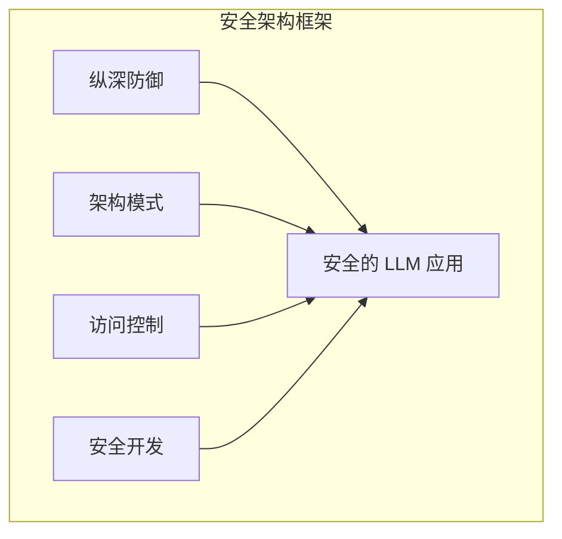

# 第八章 安全架构设计

安全架构是 LLM 应用安全的基石。良好的架构设计可以从根本上降低安全风险，架构缺陷则可能使系统无论如何加固都仍存在漏洞。本章主要内容包括：

- **[8.1](8.1_defense_depth.md) 纵深防御原则**：构建多层次的安全防护体系
- **[8.2](8.2_architecture_patterns.md) 大语言模型安全架构模式**：介绍经过验证的架构模式
- **[8.3](8.3_access_control.md) 权限与访问控制**：设计细粒度的权限管理机制
- **[8.4](8.4_security_sdlc.md) 安全开发生命周期**：将安全融入开发全过程
- **[8.5](8.5_privacy_enhancing.md) 隐私增强技术与数据保护**：探讨联邦学习、机密计算等 PETs 在 LLM 中的应用
- **[8.6](8.6_supply_chain.md) 供应链与基础设施安全**：管控上下游大模型组件供应链风险

> **本章定位**：本章讨论宏观架构与系统性原则，包括纵深防御如何分层、架构模式如何选型、权限如何切分。具体的输入/输出技术控制（验证、过滤、审核、水印、Constitutional Classifier）见[第九章](../09_io_protection/README.md)。两章是“架构原则 → 战术控制”的递进关系。
>
> **与攻击章的对应**：本章的架构模式（[§8.2](8.2_architecture_patterns.md)）需结合 [§4 提示注入](../04_prompt_injection/README.md)、[§5 越狱](../05_jailbreak/README.md)、[§7 RAG 安全](../07_rag_security/README.md)、[第十一至十四章 智能体安全](../11_agent_foundations/README.md) 的威胁模型进行选型。

```mermaid
flowchart TB
    subgraph "安全架构框架"
    A["纵深防御"] --> E["安全的 LLM 应用"]
    B["架构模式"] --> E
    C["访问控制"] --> E
    D["安全开发"] --> E
    end
```

---

> **📚 延伸阅读**：关于 ClawHub 技能生态的供应链安全风险（Leaky Skills、ClawHavoc 事件），参见 [《OpenClaw 从入门到精通》第 5.3 节和第 14.3 节](https://yeasy.gitbook.io/openclaw_guide)。
