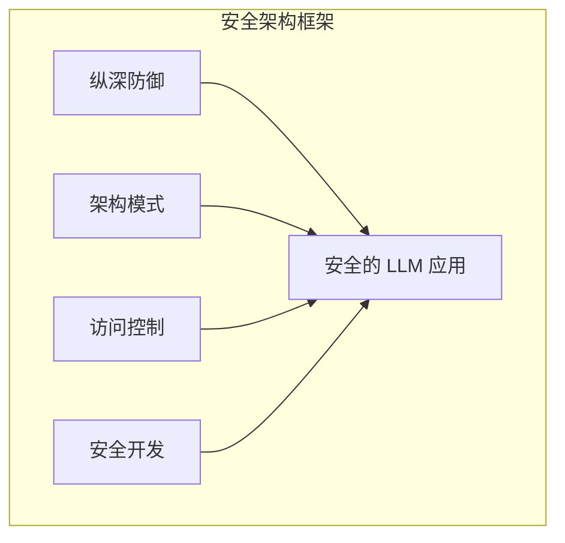

# 第八章 安全架构设计

第四至七章分析了攻击手法，本章转入防御篇，讨论 LLM 应用的安全架构：防御如何分层、架构模式如何选型、权限如何切分，以及开发流程、隐私保护和供应链如何纳入架构。架构是 LLM 应用安全的基石：良好的架构设计可以从根本上降低安全风险，架构缺陷则可能使系统无论如何加固都仍存在漏洞。具体的输入/输出技术控制（验证、过滤、审核、水印、Constitutional Classifier）见[第九章](../09_io_protection/README.md)，两章是“架构原则 → 战术控制”的递进关系。

## 学习目标

读完本章，读者应能：

1. 说明纵深防御为什么要求每层独立提供保障并假设任一层可能被突破，并为典型攻击类别列出由高到低的关键防线。
2. 根据应用形态在网关、三明治、代理、隔离、零信任、多模型检查等模式中选型，并判断何时须改用把控制流与数据流分开的智能体设计。
3. 为 LLM 应用设计能力、工具与数据三类权限，并按可逆性与影响面确定智能体动作的确认级别。
4. 列出需求、设计、开发、测试、部署、运营各阶段应执行的安全活动。
5. 按数据敏感度选择隐私增强技术组合，并为模型、依赖与插件建立来源与完整性校验。

## 本章结构

- [8.1](8.1_defense_depth.md) 纵深防御原则：LLM 应用的防御应如何分层，各层如何组合，防御投入如何与风险匹配。
- [8.2](8.2_architecture_patterns.md) 大语言模型安全架构模式：有哪些经过验证的架构模式，各自适用于什么场景，资源有限时应先做什么。
- [8.3](8.3_access_control.md) 权限与访问控制：谁在什么条件下可以对什么资源做什么操作，LLM 与智能体在传统访问控制之外还需要哪些权限控制。
- [8.4](8.4_security_sdlc.md) 安全开发生命周期：从需求到运营的每个阶段应执行哪些安全活动。
- [8.5](8.5_privacy_enhancing.md) 隐私增强技术与数据保护：联邦学习、差分隐私、机密计算等 PETs 在 LLM 中如何应用，如何选型。
- [8.6](8.6_supply_chain.md) 供应链与基础设施安全：模型、数据、依赖库、插件与第三方服务会引入哪些风险，如何管控。

各节的先后逻辑是：8.1、8.2 讲运行时的架构，先给分层原则，再给可选的架构模式；8.3 讲贯穿各层的权限控制；8.4 讲如何把安全活动嵌入开发流程；8.5、8.6 分别讨论数据保护与供应链两个专题。前四节的关系如下：

```mermaid
flowchart TB
    subgraph "安全架构框架"
    A["纵深防御"] --> E["安全的 LLM 应用"]
    B["架构模式"] --> E
    C["访问控制"] --> E
    D["安全开发"] --> E
    end
```

> **与攻击章的对应**：本章的架构模式（[§8.2](8.2_architecture_patterns.md)）需结合 [§4 提示注入](../04_prompt_injection/README.md)、[§5 越狱](../05_jailbreak/README.md)、[§7 RAG 安全](../07_rag_security/README.md)、[第十一至十四章 智能体安全](../11_agent_foundations/README.md) 的威胁模型进行选型。

---

> **📚 延伸阅读**：关于 ClawHub 技能生态的供应链安全风险（Leaky Skills、ClawHavoc 事件），参见 [《OpenClaw 从入门到精通》第 5.3 节和第 14.3 节](https://yeasy.gitbook.io/openclaw_guide)。
