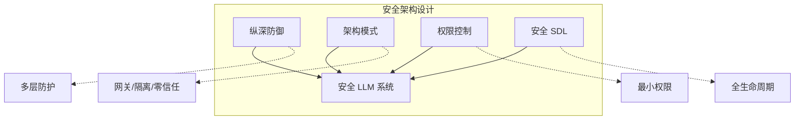

## 本章小结

本章介绍了 LLM 安全架构设计的核心原则和方法，为构建安全的 LLM 系统奠定基础。

### 核心要点回顾

**纵深防御**：通过多层独立的安全措施确保单一防护失效时整体安全不被突破。LLM 纵深防御包括边界防护、输入安全、上下文安全、模型安全、工具安全、输出安全和运营安全等层次。

**架构模式**：介绍了网关模式、三明治模式、代理模式、隔离模式、零信任模式和多模型检查模式等经过验证的安全架构模式，适用于不同场景。

**权限控制**：细粒度的权限控制包括身份认证、RBAC/ABAC 授权、能力权限、工具权限、数据权限等，上下文相关的动态权限和 Agent 权限设计尤为重要。

**安全开发生命周期**：将安全融入需求、设计、开发、测试、部署、运营各阶段，包括威胁建模、安全编码、安全测试、安全部署和持续运营。

### 架构设计要点

图 8-1：架构设计要点架构图

### 设计原则速查

| 原则 | 描述 |
|------|------|
| 纵深防御 | 多层独立防护 |
| 最小权限 | 仅授予必要权限 |
| 默认安全 | 安全配置为默认 |
| 故障安全 | 失败时保持安全 |
| 简单设计 | 避免不必要的复杂性 |
| 假设失败 | 任何层都可能被突破 |

### 延伸思考

1. 如何在安全与用户体验之间取得平衡？
2. 零信任架构在 LLM 场景下有哪些特殊考虑？
3. 如何评估安全架构的有效性？

### 下章预告

第九章将介绍输入输出安全防护，详细讲解输入验证、输出过滤、内容安全审核等实操技术，是纵深防御中关键层次的具体实现。
