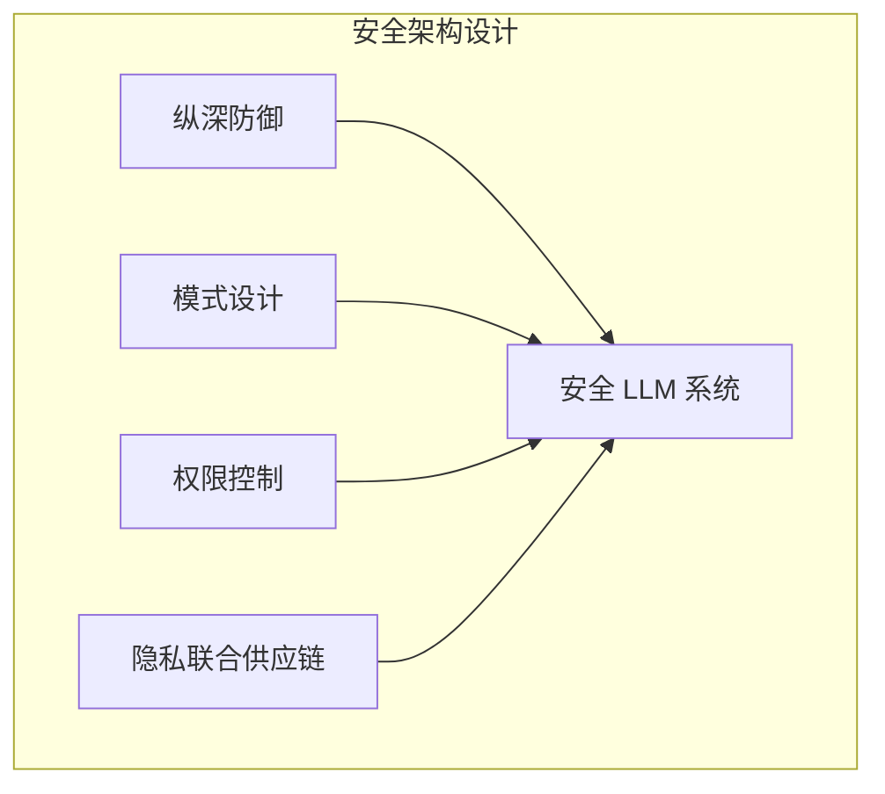

## 本章小结

本章介绍了 LLM 安全架构设计的核心原则和方法，为构建安全的 LLM 系统奠定基础。

### 核心要点回顾

**纵深防御**：通过多层独立的安全措施确保单一防护失效时整体安全不被突破。

**架构模式**：介绍了网关模式、三明治模式、隔离模式和多模型检查模式等。

**权限控制**：细粒度的权限控制包括身份认证、数据权限及智能体权限设计。

**安全开发生命周期**：将安全融入需求、设计、开发、测试、运营各阶段。

**隐私增强技术与数据保护**：探讨联邦学习、差分隐私、机密计算等 PETs。

**供应链与基础设施安全**：预训练模型、数据集、依赖库、第三方服务等可能引入风险。需要建立可信供应商清单、实施版本锁定、漏洞扫描和 SBOM 管理。

### 架构设计要点

```mermaid
graph TB
    subgraph "安全架构设计"
    A["纵深防御"] --> E["安全 LLM 系统"]
    B["模式设计"] --> E
    C["权限控制"] --> E
    D["隐私联合供应链"] --> E
    end
```

图 8-31：架构设计要点架构图

### 设计原则速查

| 原则 | 描述 |
|------|------|
| 纵深防御 | 多层独立防护 |
| 最小权限 | 仅授予必要权限 |
| 默认安全 | 安全配置为默认 |
| 供应链可信 | 验证一切上游组件 |
| 假设失败 | 任何层都可能被突破 |

### 延伸思考

1. 如何在安全与用户体验之间取得平衡？
2. 隐私增强技术如何兼顾性能？
3. 大模型供应链由于黑盒特性，如何解决 SBOM 的有效可见度问题？

## 与其他章节的关联

- **攻击知识指导**：第 4-7 章的攻击知识指导本章架构设计，威胁驱动防御
- **防护实现**：第 9 章将本章架构要求转化为具体防护实现，从设计到编码
- **运营验证**：第 10 章提供架构运营验证，确保架构防御有效性

### 下章预告

[第九章](../09_io_protection/README.md)将介绍输入输出安全防护，详细讲解输入验证、输出过滤、内容安全审核等实操技术。
---

> 📝 **发现错误或有改进建议？** 欢迎提交 [Issue](https://github.com/yeasy/ai_security_guide/issues) 或 [PR](https://github.com/yeasy/ai_security_guide/pulls)。
