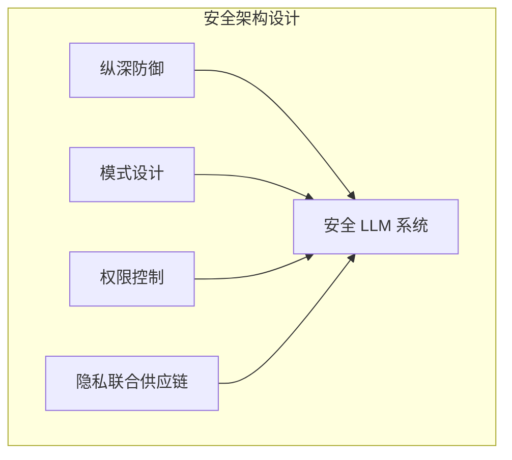

## 本章小结

本章从运行时的分层与模式、贯穿各层的权限、开发流程、数据保护和供应链五个方面，介绍了 LLM 安全架构设计的原则和方法。

### 1. 核心要点

- 安全控制必须按层解耦，多层组合能大幅提高整体安全性，但不能保证没有攻击漏过。
- 防御投入应与业务风险匹配，资源有限时从最小可行安全集开始分阶段增加。
- 在模型输入输出两侧加检查的模式适用于以生成内容为主的应用，能调用工具的智能体需改用把控制流与数据流分开的设计。
- 安全要嵌入从需求到运营的开发全过程，数据保护与供应链同样是架构的一部分。

### 2. 各节要点

- [8.1 纵深防御原则](8.1_defense_depth.md)：多层独立的安全措施使单一防护失效时整体安全不被突破；防御措施的选择由业务风险、延迟预算、组织能力和实际监控数据共同驱动。
- [8.2 大语言模型安全架构模式](8.2_architecture_patterns.md)：网关、三明治、代理、隔离、零信任和多模型检查等模式各有适用场景，实际系统通常组合使用。
- [8.3 权限与访问控制](8.3_access_control.md)：细粒度的权限控制包括身份认证、数据权限及智能体权限设计，智能体动作按可逆性与影响面分级确认。
- [8.4 安全开发生命周期](8.4_security_sdlc.md)：将安全融入需求、设计、开发、测试、部署、运营各阶段。
- [8.5 隐私增强技术与数据保护](8.5_privacy_enhancing.md)：联邦学习、差分隐私、机密计算等 PETs 应按数据敏感度组合使用，不是单选题。
- [8.6 供应链与基础设施安全](8.6_supply_chain.md)：预训练模型、数据集、依赖库、第三方服务等可能引入风险，需要建立可信供应商清单、实施版本锁定、漏洞扫描和 SBOM 管理。

### 3. 架构设计要点

纵深防御、模式设计、权限控制以及隐私与供应链共同支撑安全的 LLM 系统（图 8-31）。

```mermaid
graph TB
    subgraph "安全架构设计"
    A["纵深防御"] --> E["安全 LLM 系统"]
    B["模式设计"] --> E
    C["权限控制"] --> E
    D["隐私联合供应链"] --> E
    end
```

图 8-31：架构设计要点架构图

### 4. 设计原则速查

| 原则 | 描述 |
|------|------|
| 纵深防御 | 多层独立防护 |
| 最小权限 | 仅授予必要权限 |
| 默认安全 | 安全配置为默认 |
| 供应链可信 | 验证一切上游组件 |
| 假设失败 | 任何层都可能被突破 |

### 5. 延伸思考

1. 如何在安全与用户体验之间取得平衡？
2. 隐私增强技术如何兼顾性能？
3. 大模型供应链由于黑盒特性，如何解决 SBOM 的有效可见度问题？

## 与后续章节的关联

- **攻击知识指导**：第 4-7 章的攻击知识指导本章架构设计，威胁驱动防御
- **防护实现**：[第 9 章](../09_io_protection/README.md)将本章架构要求转化为具体防护实现，从设计到编码
- **运营验证**：[第 10 章](../10_operations/README.md)提供架构运营验证，确保架构防御有效性

[第九章](../09_io_protection/README.md)介绍输入输出安全防护，包括输入验证、输出过滤、内容安全审核等实操技术。

---

> 📝 **发现错误或有改进建议？** 欢迎提交 [Issue](https://github.com/yeasy/ai_security_guide/issues) 或 [PR](https://github.com/yeasy/ai_security_guide/pulls)。
