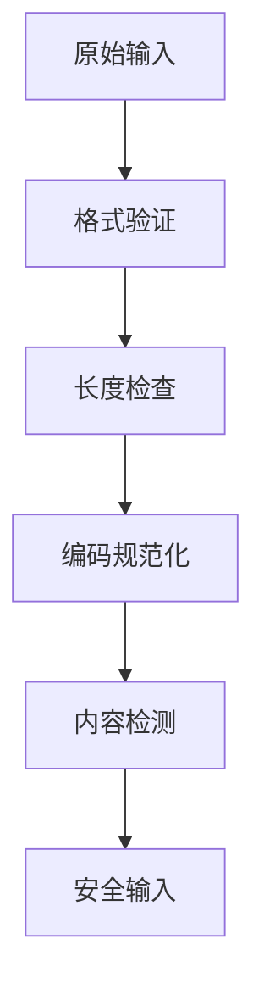
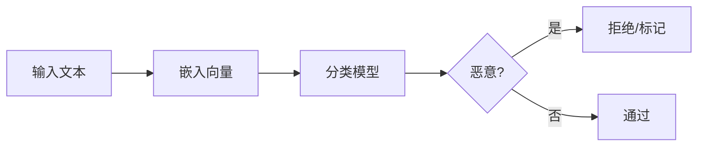

## 9.1 输入验证与过滤

输入验证是抵御攻击的第一道防线。本节介绍 LLM 应用的输入安全策略。

### 9.1.1 输入安全原则

**不信任任何输入**：

假设所有输入都可能包含恶意内容，包括：
- 用户直接输入
- 上传的文件内容
- API 参数
- 外部数据源

**验证流程**：



图 9-1：输入安全原则流程图

### 9.1.2 格式验证

确保输入符合预期格式：

```python
def validate_input(input_text: str) -> ValidationResult:
    # 1. 类型检查

    if not isinstance(input_text, str):
        return ValidationResult(False, "输入必须是字符串")
    
    # 2. 编码检查

    try:
        input_text.encode('utf-8')
    except UnicodeEncodeError:
        return ValidationResult(False, "包含无效字符")
    
    # 3. 格式规范化

    normalized = normalize_input(input_text)
    
    return ValidationResult(True, normalized)
```

### 9.1.3 长度限制

防止过长输入带来的风险：

| 风险 | 说明 |
|------|------|
| 资源消耗 | 过长输入消耗计算资源 |
| 上下文操纵 | 利用长输入冲淡系统提示 |
| 注入隐藏 | 在长文本中隐藏恶意内容 |

**长度策略**：

```python
MAX_INPUT_LENGTH = 4096
MAX_TOKENS = 1024

def check_length(input_text: str) -> bool:
    # 字符长度检查

    if len(input_text) > MAX_INPUT_LENGTH:
        return False
    
    # Token 数量检查

    token_count = count_tokens(input_text)
    if token_count > MAX_TOKENS:
        return False
    
    return True
```

### 9.1.4 编码与规范化

处理各种编码和格式变体：

```python
def normalize_input(input_text: str) -> str:
    # Unicode 规范化

    normalized = unicodedata.normalize('NFC', input_text)
    
    # 移除零宽字符

    normalized = re.sub(r'[\u200b-\u200f\u2028-\u202f]', '', normalized)
    
    # 规范化空白字符

    normalized = ' '.join(normalized.split())
    
    # 移除控制字符

    normalized = ''.join(c for c in normalized if not unicodedata.category(c).startswith('C') or c in '\n\t')
    
    return normalized
```

**需要处理的特殊情况**：

| 情况 | 说明 |
|------|------|
| Unicode 变体 | 使用视觉相似的字符绕过关键词过滤 |
| 零宽字符 | 隐藏的分隔符 |
| 混合编码 | 不同编码混合使用 |
| Base64 等 | 编码后的恶意内容 |

### 9.1.5 关键词与模式检测

检测已知的恶意模式：

```python
# 可疑模式列表

SUSPICIOUS_PATTERNS = [
    r'ignore\s+(all\s+)?(previous|above)\s+instructions?',
    r'forget\s+(everything|all)',
    r'you\s+are\s+now\s+(a|an)',
    r'new\s+instructions?:',
    r'system\s*[:\-]',
]

def check_suspicious_patterns(input_text: str) -> list:
    detected = []
    text_lower = input_text.lower()
    
    for pattern in SUSPICIOUS_PATTERNS:
        if re.search(pattern, text_lower):
            detected.append(pattern)
    
    return detected
```

**注意**：关键词检测容易被绕过，应作为多层防御的一部分，而非唯一防护。

### 9.1.6 语义分析

使用 ML 模型进行更智能的检测：



图 9-2：语义分析流程图

**实现示例**：

```python
class SemanticInputChecker:
    def __init__(self, model):
        self.classifier = model
    
    def check(self, input_text: str) -> CheckResult:
        # 获取输入的语义表示

        embedding = self.get_embedding(input_text)
        
        # 分类判断

        score = self.classifier.predict(embedding)
        
        if score > THRESHOLD:
            return CheckResult(blocked=True, reason="检测到可疑意图")
        
        return CheckResult(blocked=False)
```

### 9.1.7 输入清洗

对检测到的可疑内容进行处理：

**策略选择**：

| 策略 | 说明 | 适用场景 |
|------|------|----------|
| 拒绝 | 直接拒绝请求 | 高置信度恶意 |
| 净化 | 移除可疑部分 | 可分离的恶意内容 |
| 标记 | 标记但继续处理 | 低置信度 |
| 告警 | 处理但触发告警 | 需要调查 |

**实现示例**：

```python
def sanitize_input(input_text: str, detections: list) -> str:
    if is_high_confidence_malicious(detections):
        raise BlockedInputError("检测到恶意输入")
    
    # 移除可疑内容

    sanitized = input_text
    for detection in detections:
        sanitized = remove_suspicious_content(sanitized, detection)
    
    # 添加安全边界标记

    sanitized = f"[USER_INPUT_START]\n{sanitized}\n[USER_INPUT_END]"
    
    return sanitized
```

### 9.1.8 多语言处理

处理多语言输入的安全挑战：

```python
def multilingual_check(input_text: str) -> CheckResult:
    # 检测语言

    languages = detect_languages(input_text)
    
    # 多语言混合可能是绕过尝试

    if len(languages) > 2:
        return CheckResult(flagged=True, reason="异常的语言混合")
    
    # 对每种语言应用相应的检测规则

    for lang in languages:
        result = check_by_language(input_text, lang)
        if result.flagged:
            return result
    
    return CheckResult(flagged=False)
```

输入验证是安全防护的第一步。下一节将介绍针对提示注入的专门防护措施。
