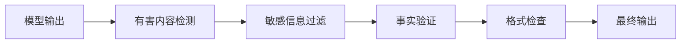
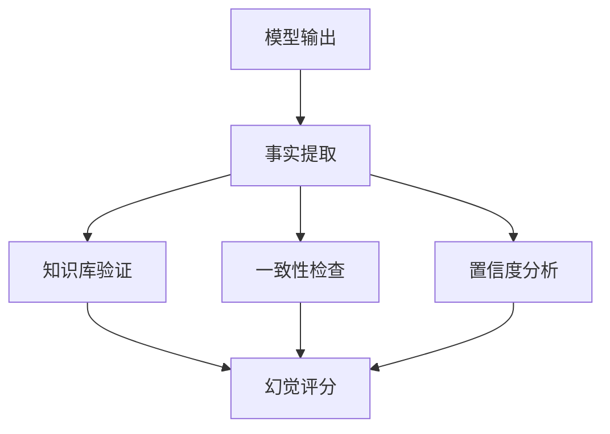

## 9.2 输出内容安全审核

输出层是防止有害内容泄露的最后屏障。本节介绍输出安全审核的实践方法。

### 9.2.1 输出安全的重要性

即使输入防护完善，输出仍可能包含问题：

- 模型生成有害内容
- 泄露敏感信息
- 产生误导性内容
- 违反合规要求

**输出审核流程**


图 9-3：输出安全的重要性流程图

### 9.2.2 有害内容检测

检测并过滤有害内容：

**内容分类**
| 类别 | 示例 | 处理方式 |
|------|------|----------|
| 违法内容 | 犯罪指南 | 完全拒绝 |
| 仇恨言论 | 歧视性言语 | 完全拒绝 |
| 暴力内容 | 暴力描写 | 根据上下文 |
| 成人内容 | 不适宜内容 | 年龄限制 |
| 误导信息 | 虚假声明 | 警告标记 |

**检测实现**
```python
class ContentModerator:
    def __init__(self):
        self.classifier = load_moderation_model()
        self.rules = load_moderation_rules()

    def check(self, content: str) -> ModerationResult:
        # ML 模型检测

        scores = self.classifier.predict(content)

        # 规则检测

        rule_matches = self.check_rules(content)

        # 综合判断

        if self.should_block(scores, rule_matches):
            return ModerationResult(blocked=True,
                                    reason=self.get_reason(scores, rule_matches))

        return ModerationResult(blocked=False)

    def should_block(self, scores: dict, rules: list) -> bool:
        for category, score in scores.items():
            if score > self.thresholds[category]:
                return True
        return len(rules) > 0
```

### 9.2.3 输出过滤器

对检测到的问题内容进行处理：

```python
class OutputFilter:
    def filter(self, content: str, issues: list) -> str:
        if self.should_completely_block(issues):
            return self.get_rejection_message()

        filtered = content
        for issue in issues:
            if issue.type == "sensitive_info":
                filtered = self.redact(filtered, issue)
            elif issue.type == "harmful_content":
                filtered = self.remove_section(filtered, issue)
            elif issue.type == "uncertain_claim":
                filtered = self.add_disclaimer(filtered, issue)

        return filtered

    def redact(self, content: str, issue: Issue) -> str:
        # 用占位符替换敏感信息

        return content.replace(issue.match, "[已过滤]")

    def add_disclaimer(self, content: str, issue: Issue) -> str:
        # 添加免责声明

        disclaimer = "\n\n[注意：以上内容可能包含不确定信息，请自行验证]"
        return content + disclaimer
```

### 9.2.4 幻觉检测

检测模型编造的虚假信息：



图 9-4：幻觉检测流程图

**检测方法**
| 方法 | 描述 |
|------|------|
| 知识库验证 | 与可信知识源对比 |
| 自我一致性 | 多次生成对比 |
| 溯源检查 | 验证引用的来源 |
| 置信度分析 | 模型输出的不确定性 |

**幻觉检测的局限与实践建议**

各种幻觉检测方法在实际应用中都存在固有的局限，企业不应依赖任何单一检测手段：

- **知识库验证的局限**：知识库本身可能不完整、过时或存在偏差，导致将真实但罕见的信息误判为幻觉。例如，最新发生的时事、小众领域的专业知识或新兴技术可能不在知识库中，但模型的输出仍然是准确的。这种“基准漂移”使得基于知识库的验证容易产生误报。

- **一致性检查的局限**：LLM 的输出具有内在的随机性，受 `temperature`、`top-k`、`top-p` 等采样参数的影响。同一输入在不同推理运行下的多次输出可能存在合理的差异，而非都是错误。此外，对于创意类、开放式的任务，“多次输出有分歧”本身是正常现象，不应视为幻觉信号。

- **置信度分析的局限**：许多模型的置信度评分存在“校准问题”（calibration issue），即模型报告的置信度与实际准确度不匹配。高置信度分数不等于高准确度，低置信度也不一定意味着答案是错误的。这种校准偏差使得单纯依赖置信度得分来判定幻觉往往不可靠。

**推荐的务实方案**
1. **多方法融合**：结合多种检测方法（知识库验证、自我一致性、来源溯源等），而不是依赖单一手段，通过多维信号的交叉验证提高可信度。

2. **分级审核阈值**：根据输出内容的风险等级设置不同的审核触发点。对于医疗、法律、金融等高风险领域，设置更激进的疑似幻觉阈值，主动触发人工复核；对于低风险的信息类查询，可以设置更宽松的阈值。

3. **与下游业务集成**：不要将幻觉检测结果作为“通过/失败”的二值决策，而是作为“可信度评分”注入到应用流程中，让业务逻辑根据不同场景灵活处理（例如在金融建议前添加免责声明、在医疗诊断建议中触发医生审核）。

4. **持续的标注与改进**：收集真实业务场景中被标注为幻觉或准确的输出样本，定期重新训练或调整检测模型的阈值，使其逐步适应特定领域的实际情况。

### 9.2.5 多级审核

根据内容敏感度实施分级审核：

```python
class MultiLevelReviewer:
    def review(self, content: str, context: dict) -> ReviewResult:
        # 第一级：自动审核

        auto_result = self.auto_review(content)
        if auto_result.decision == "pass":
            return auto_result
        if auto_result.decision == "block":
            return auto_result

        # 第二级：增强审核

        if auto_result.decision == "escalate":
            enhanced_result = self.enhanced_review(content, context)
            if enhanced_result.decision in ["pass", "block"]:
                return enhanced_result

        # 第三级：人工审核队列

        return self.queue_for_human_review(content, context)
```

**分级策略**
| 级别 | 方法 | 延迟 | 成本 |
|------|------|------|------|
| L1 | 规则匹配 | 低 | 低 |
| L2 | ML 模型 | 中 | 中 |
| L3 | 增强模型 | 中高 | 中高 |
| L4 | 人工审核 | 高 | 高 |

> 与上方代码的对应关系：`auto_review` 合并了表中的 L1（规则匹配）+ L2（ML 模型），`enhanced_review` 对应 L3（增强模型），`queue_for_human_review` 对应 L4（人工审核）。

### 9.2.6 实时与异步审核

**实时审核**
```python

# 同步模式：等待审核完成

def generate_with_moderation(prompt: str) -> str:
    response = model.generate(prompt)
    moderation = moderator.check(response)

    if moderation.blocked:
        return "抱歉，我无法提供这个请求的回答。"

    return moderation.filtered_content
```

**异步生成、审核后放行**

流式生成与异步审核是两件事。若先展示内容、再等待审核信号，命中后也无法撤销用户已经看到的内容；[Azure OpenAI 的流式审核说明](https://learn.microsoft.com/en-us/azure/foundry/openai/concepts/content-streaming)明确区分了缓冲后放行与延迟返回过滤信号的模式。下面只展示审核后放行的控制流。

检测器必须声明契约：`max_context_chars = L` 表示任一违规片段的判定最多需要连续的 `L` 个字符，而且检测器能可靠识别完整落在审核窗口内的违规片段。此时必须暂留末尾 `L - 1` 个字符，防止下一块补齐违规片段时其前缀已经外泄。固定字符串检测可以给出这个上界；不能证明有界上下文的语义分类器应设置为 `None`，完整缓冲后统一审核。增大重叠窗口本身不满足这个契约。

以下示例假设 `model`、`moderator` 已初始化，`CHECK_INTERVAL` 是正整数；审核只做放行或阻断，不改写文本。生产实现还需设置输出长度、内存和审核超时预算；异常时关闭输出，不能回退为未审核原文。

```python

# 异步生成；只释放已有完整判定依据的内容。

async def stream_with_moderation(prompt: str):
    context_chars = getattr(moderator, "max_context_chars", None)
    if context_chars is not None and (
        type(context_chars) is not int or context_chars < 1
    ):
        raise ValueError("max_context_chars 必须是正整数或 None")
    holdback = context_chars - 1 if context_chars is not None else None
    pending = ""

    async for chunk in model.stream(prompt):
        pending += chunk

        # 上下文无已证上界时，一直保留到流结束。
        if holdback is not None and len(pending) >= CHECK_INTERVAL:
            full_check = await moderator.full_check(pending)
            if full_check.blocked:
                yield "[内容已被过滤]"
                return

            release_count = max(0, len(pending) - holdback)
            if release_count:
                yield pending[:release_count]
                pending = pending[release_count:]

    # 最后一个块也必须审核；正常尾部只释放一次。
    if pending:
        final_check = await moderator.full_check(pending)
        if final_check.blocked:
            yield "[内容已被过滤]"
            return
        yield pending
```

### 9.2.7 审核日志与改进

记录审核结果用于改进：

```python
import hashlib

class AuditLogger:
    def log(self, input: str, output: str, moderation: ModerationResult):
        record = {
            "timestamp": datetime.now(),
            "input_hash": hashlib.sha256(input.encode("utf-8")).hexdigest(),  # 生产环境建议改为带密钥的 HMAC
            "output_hash": hashlib.sha256(output.encode("utf-8")).hexdigest(),
            "decision": moderation.decision,
            "categories": moderation.categories,
            "scores": moderation.scores,
            "latency_ms": moderation.latency_ms
        }
        self.store(record)

    def analyze_trends(self, period: str) -> TrendReport:
        records = self.query(period)
        return TrendReport(
            total_requests=len(records),
            block_rate=self.calc_rate(records, "blocked"),
            top_categories=self.top_categories(records),
            false_positive_rate=self.calc_fp_rate(records)
        )
```

### 9.2.8 输出渲染通道的数据外发

输出审核通常盯着“内容是否有害”，却容易忽略另一条隐蔽的外发路径：**模型输出被前端渲染时本身就会发起网络请求**。如果模型被诱导把敏感数据编码进一个 Markdown 图片或链接，客户端渲染聊天记录时会自动拉取该图片，敏感数据就随这次出站请求泄露——**无需任何工具调用，也常常无需用户点击**。

```text
模型被诱导输出：
客户端渲染该 Markdown → 浏览器自动 GET 该 URL → 数据进入攻击者日志
```

这条通道危险之处在于它绕过了本章前面的多数防线：有害内容检测（9.2.2）针对“文本是否有害”，而一个看似无害的图片 URL 不会触发；工具权限白名单（[12.1](../12_agent_attack_surface/12.1_tool_security.md)、[3.1](../03_frameworks/3.1_owasp_top10.md) LLM03）也不拦截，因为根本没有发起工具调用。

**典型案例：EchoLeak（CVE-2025-32711）**。2025 年 6 月披露的 Microsoft 365 Copilot 零点击漏洞，攻击者仅发送一封邮件即可窃取 Copilot 权限范围内的数据（CVSS 9.3，详见[附录 C-47](../16_appendix/C_references.md)）。其外发链路正是利用**自动加载的图片**，并用**引用式（reference-style）Markdown** 绕过 Copilot 对不安全链接的屏蔽（redaction）；它甚至借用了一个被 CSP 白名单放行的代理域名——说明渲染层防护必须足够收紧，留一个被过度信任的出站域名就可能被滥用。

**防护要点（输出侧）**

- **把模型输出的 URL 当作不可信数据**：默认不自动渲染模型生成的 Markdown 图片与外链，或将其降级为纯文本/惰性链接，由用户显式点击。
- **严格的内容安全策略（CSP）**：用 `img-src` / `connect-src` 把图片与请求目标限制到可信白名单，并尽量收窄——EchoLeak 表明，一个过宽或可被滥用的白名单域名就足以破功。
- **图片域名白名单与 URL 锚定**：渲染前对输出中的图片/链接域名做白名单校验与规范化（anchoring），剥离可疑查询参数。
- **链接屏蔽要覆盖各种 Markdown 形态**：标准链接、引用式链接、自动链接都要纳入屏蔽或重写，避免出现 EchoLeak 式的语法绕过。

本节与 [12.4](../12_agent_attack_surface/12.4_url_exfiltration.md) 形成互补：12.4 防的是**智能体主动访问** attacker URL，本节防的是**客户端渲染模型输出**时被动发起的请求；二者是同一外发风险的“主动”与“被动”两面，需要分别在工具层和渲染层设防。

### 9.2.9 用模型审模型：守卫模型的定位与选型

本章和前后各章多处出现“用另一个模型判断输入或输出是否安全”的做法：9.2.2 的有害内容检测、9.2.5 多级审核里的 L2 与 L3、[4.5.5](../04_prompt_injection/4.5_injection_defense.md) 的注入检测器、[8.1](../08_architecture/8.1_defense_depth.md) 分级表中的“LLM 分类器检测”、[13.5.2](../13_agent_architecture/13.5_tooling_selection.md) 的护栏框架、[14.2.4](../14_agent_practice/14.2_sabotage_ai_control.md) 用较弱但可信的模型监督较强模型。这类组件统称守卫模型。把它们放在一起看，有五条边界是共同的：

1. **它是概率性防御，不是边界。** 守卫模型降低攻击到达确定性控制点的频率，但不设上界（[4.5.11](../04_prompt_injection/4.5_injection_defense.md)、[13.5.9](../13_agent_architecture/13.5_tooling_selection.md)）。安全结论只能建立在策略引擎、沙箱、身份这些确定性机制上，守卫模型是叠加在它们之前的过滤层。
2. **拦截点必须覆盖工具返回值。** 外部内容从工具结果进入上下文（[11.1](../11_agent_foundations/11.1_agent_implementation.md)），只审用户输入等于放过全部间接注入；[13.5.2](../13_agent_architecture/13.5_tooling_selection.md) 中 Bedrock 的例子说明“已接护栏”不等于工具结果被检查过。
3. **单轮检测挡不住拆成多轮的注入**（[4.5.9](../04_prompt_injection/4.5_injection_defense.md)）。只有轨迹级审核能覆盖这一类：LlamaFirewall 的 AlignmentCheck 审计的是智能体的推理与动作序列，[14.2](../14_agent_practice/14.2_sabotage_ai_control.md) 的监控者看的是整条任务轨迹。
4. **误报要有出口。** 拦截会打断用户并最终被关掉；Prompt Shields 的文档建议误报高时从拦截改为标注（[13.5.2](../13_agent_architecture/13.5_tooling_selection.md)），[4.5.5](../04_prompt_injection/4.5_injection_defense.md) 的误报控制策略同样适用。标注加人工抽检往往比硬拦更可持续。
5. **审核者自身会被注入。** 用通用大模型凭提示词做判断，恶意载荷可以同时针对检测器写指令（[4.5.4](../04_prompt_injection/4.5_injection_defense.md)）。守卫模型应是专用分类器，或是与被审内容隔离的实例；监督者不读取被监督者可写入的自由文本作为指令（[14.2.6](../14_agent_practice/14.2_sabotage_ai_control.md)）。

在这些边界之内，可选的开源守卫模型已经不止 Llama Guard 一家。下表按官方模型卡整理（[附录 C-285](../16_appendix/C_references.md) 至 C-291）：

| 模型 | 规模与模态 | 判定对象 | 类别口径 | 许可 |
|------|------------|----------|----------|------|
| Llama Guard 4（Meta） | 12B，文本与图像 | 输入与输出 | MLCommons 危害分类 S1 至 S13，另加 S14 代码解释器滥用 | Llama 4 Community License |
| Prompt Guard 2（Meta） | 86M 与 22M，文本 | 输入（提示注入与越狱） | benign 与 malicious 二分类（[4.5.5](../04_prompt_injection/4.5_injection_defense.md)） | Llama 4 Community License |
| Granite Guardian 3.3（IBM） | 8B，文本；另有 5B 等更小尺寸 | 输入、输出、RAG 上下文与函数调用 | 危害与越狱之外，还判定 RAG 幻觉（上下文相关性、有据性、答案相关性）与函数调用幻觉；可选输出推理过程 | Apache 2.0 |
| ShieldGemma（Google） | 2B、9B、27B，文本；ShieldGemma 2 为 4B 图像分类器 | 输入与输出；ShieldGemma 2 判图像 | 色情、危险内容、仇恨、骚扰四类，策略文本随提示给出；图像版三类 | Gemma 使用条款 |
| WildGuard（AI2） | 7B，文本 | 输入有害性、输出有害性、输出是否拒答 | 三任务一体，含拒答判定 | Apache 2.0 |

选型时看四点：类别口径是否覆盖自己的内容策略，四类、十四类与可随提示自定义的策略文本差别很大；是否原生判定工具调用与 RAG 上下文，上表中只有 Granite Guardian 把函数调用幻觉与有据性作为内建类别；许可是 Apache 2.0 还是厂商社区许可，后者对商业部署有附加条件；支持的语言与模态是否与自己的流量一致。守卫模型的角色与 [9.5](9.5_constitutional_classifiers.md) 节的 Constitutional Classifiers 相同，都是概率性过滤层，与[第 13 章](../13_agent_architecture/README.md)的确定性控制叠加使用，不互相替代。

### 9.2.10 开源工具推荐

以下开源工具可帮助快速落地输出内容审核能力：

| 工具 | 核心能力 | 适用场景 |
|------|----------|----------|
| Guardrails AI | 在模型外围建立 validator / input-output guards 框架，可强制要求输出符合指定 JSON 结构、不包含特定有害词汇；若用于事实性校验，通常需要 grounding context / metadata（如 ProvenanceLLM 一类 validator） | 构建输出格式约束和特定场景下的事实性校验流水线 |
| Llama Guard（Meta） | 不仅可用于输入安全分类，同样适用于输出侧，判断模型回复是否触及暴力、犯罪、色情、仇恨等违规类别 | 输出安全分类网关，可与输入侧共享同一模型实例 |
| LangKit（WhyLabs） | 提供文本质量与安全指标的开源工具包，涵盖毒性、越狱/拒答相似度、regex 命中等 profile/metric，更偏监控与可观测性而非独立阻断网关 | 输出质量监控和安全指标的持续可观测性建设 |

输出审核是保护用户和维护系统声誉的关键环节。
