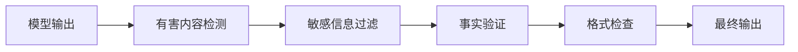
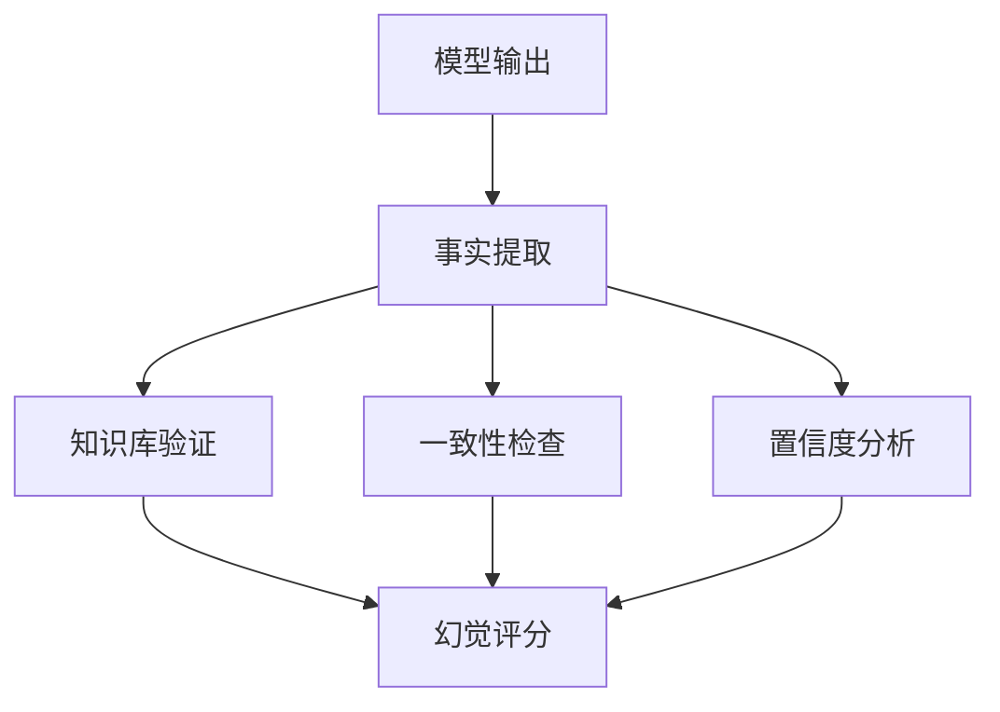

## 9.3 输出内容安全审核

输出层是防止有害内容泄露的最后屏障。本节介绍输出安全审核的实践方法。

### 9.3.1 输出安全的重要性

即使输入防护完善，输出仍可能包含问题：

- 模型生成有害内容
- 泄露敏感信息
- 产生误导性内容
- 违反合规要求

**输出审核流程**：



图 9-1：输出安全的重要性流程图

### 9.3.2 有害内容检测

检测并过滤有害内容：

**内容分类**：

| 类别 | 示例 | 处理方式 |
|------|------|----------|
| 违法内容 | 犯罪指南 | 完全拒绝 |
| 仇恨言论 | 歧视性言语 | 完全拒绝 |
| 暴力内容 | 暴力描写 | 根据上下文 |
| 成人内容 | 不适宜内容 | 年龄限制 |
| 误导信息 | 虚假声明 | 警告标记 |

**检测实现**：

```python
class ContentModerator:
    def __init__(self):
        self.classifier = load_moderation_model()
        self.rules = load_moderation_rules()
    
    def check(self, content: str) -> ModerationResult:
        # ML 模型检测

        scores = self.classifier.predict(content)
        
        # 规则检测

        rule_matches = self.check_rules(content)
        
        # 综合判断

        if self.should_block(scores, rule_matches):
            return ModerationResult(blocked=True, 
                                    reason=self.get_reason(scores, rule_matches))
        
        return ModerationResult(blocked=False)
    
    def should_block(self, scores: dict, rules: list) -> bool:
        for category, score in scores.items():
            if score > self.thresholds[category]:
                return True
        return len(rules) > 0
```

### 9.3.3 输出过滤器

对检测到的问题内容进行处理：

```python
class OutputFilter:
    def filter(self, content: str, issues: list) -> str:
        if self.should_completely_block(issues):
            return self.get_rejection_message()
        
        filtered = content
        for issue in issues:
            if issue.type == "sensitive_info":
                filtered = self.redact(filtered, issue)
            elif issue.type == "harmful_content":
                filtered = self.remove_section(filtered, issue)
            elif issue.type == "uncertain_claim":
                filtered = self.add_disclaimer(filtered, issue)
        
        return filtered
    
    def redact(self, content: str, issue: Issue) -> str:
        # 用占位符替换敏感信息

        return content.replace(issue.match, "[已过滤]")
    
    def add_disclaimer(self, content: str, issue: Issue) -> str:
        # 添加免责声明

        disclaimer = "\n\n[注意：以上内容可能包含不确定信息，请自行验证]"
        return content + disclaimer
```

### 9.3.4 幻觉检测

检测模型编造的虚假信息：



图 9-2：幻觉检测流程图

**检测方法**：

| 方法 | 描述 |
|------|------|
| 知识库验证 | 与可信知识源对比 |
| 自我一致性 | 多次生成对比 |
| 溯源检查 | 验证引用的来源 |
| 置信度分析 | 模型输出的不确定性 |

### 9.3.5 多级审核

根据内容敏感度实施分级审核：

```python
class MultiLevelReviewer:
    def review(self, content: str, context: dict) -> ReviewResult:
        # 第一级：自动审核

        auto_result = self.auto_review(content)
        if auto_result.decision == "pass":
            return auto_result
        if auto_result.decision == "block":
            return auto_result
        
        # 第二级：增强审核

        if auto_result.decision == "escalate":
            enhanced_result = self.enhanced_review(content, context)
            if enhanced_result.decision in ["pass", "block"]:
                return enhanced_result
        
        # 第三级：人工审核队列

        return self.queue_for_human_review(content, context)
```

**分级策略**：

| 级别 | 方法 | 延迟 | 成本 |
|------|------|------|------|
| L1 | 规则匹配 | 低 | 低 |
| L2 | ML 模型 | 中 | 中 |
| L3 | 增强模型 | 中高 | 中高 |
| L4 | 人工审核 | 高 | 高 |

### 9.3.6 实时与异步审核

**实时审核**：

```python
# 同步模式：等待审核完成

def generate_with_moderation(prompt: str) -> str:
    response = model.generate(prompt)
    moderation = moderator.check(response)
    
    if moderation.blocked:
        return "抱歉，我无法提供这个请求的回答。"
    
    return moderation.filtered_content
```

**异步审核**：

```python
# 异步模式：流式输出 + 后台审核

async def stream_with_moderation(prompt: str):
    buffer = ""
    async for chunk in model.stream(prompt):
        buffer += chunk
        
        # 定期检查缓冲区

        if len(buffer) >= CHECK_INTERVAL:
            if moderator.quick_check(buffer):
                yield chunk
            else:
                # 暂停并进行完整检查

                full_check = await moderator.full_check(buffer)
                if full_check.blocked:
                    yield "[内容已被过滤]"
                    break
                else:
                    yield chunk
```

### 9.3.7 审核日志与改进

记录审核结果用于改进：

```python
import hashlib

class AuditLogger:
    def log(self, input: str, output: str, moderation: ModerationResult):
        record = {
            "timestamp": datetime.now(),
            "input_hash": hashlib.sha256(input.encode("utf-8")).hexdigest(),  # 生产环境建议改为带密钥的 HMAC
            "output_hash": hashlib.sha256(output.encode("utf-8")).hexdigest(),
            "decision": moderation.decision,
            "categories": moderation.categories,
            "scores": moderation.scores,
            "latency_ms": moderation.latency_ms
        }
        self.store(record)
    
    def analyze_trends(self, period: str) -> TrendReport:
        records = self.query(period)
        return TrendReport(
            total_requests=len(records),
            block_rate=self.calc_rate(records, "blocked"),
            top_categories=self.top_categories(records),
            false_positive_rate=self.calc_fp_rate(records)
        )
```

输出审核是保护用户和维护系统声誉的关键环节。
