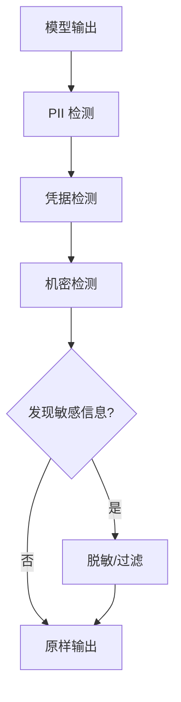

## 9.4 敏感信息保护

防止隐私和机密信息通过 LLM 泄露是重要的安全要求。

### 9.4.1 敏感信息类型

需要保护的敏感信息包括：

| 类型 | 示例 | 风险 |
|------|------|------|
| 个人身份信息（PII） | 姓名、身份证、电话 | 隐私泄露 |
| 认证凭据 | 密码、API Key | 账户安全 |
| 业务机密 | 内部文档、策略 | 商业损失 |
| 系统信息 | 配置、架构 | 被攻击利用 |

### 9.4.2 输入侧脱敏

在输入进入 LLM 前进行脱敏：

```python
class InputSanitizer:
    def __init__(self):
        self.patterns = {
            'email': r'\b[\w.-]+@[\w.-]+\.\w+\b',
            'phone': r'\b\d{11}\b|\b\d{3}-\d{4}-\d{4}\b',
            'id_card': r'\b(?:\d{18}|\d{17}[0-9Xx])\b',
            'credit_card': r'\b\d{4}[\s-]?\d{4}[\s-]?\d{4}[\s-]?\d{4}\b',
        }
    
    def sanitize(self, text: str) -> tuple[str, dict]:
        mappings = {}
        sanitized = text
        
        for pii_type, pattern in self.patterns.items():
            matches = re.findall(pattern, text)
            for i, match in enumerate(matches):
                placeholder = f"[{pii_type.upper()}_{i}]"
                mappings[placeholder] = match
                sanitized = sanitized.replace(match, placeholder)
        
        return sanitized, mappings
    
    def restore(self, text: str, mappings: dict) -> str:
        restored = text
        for placeholder, original in mappings.items():
            restored = restored.replace(placeholder, original)
        return restored
```

### 9.4.3 输出侧过滤

检测并过滤输出中的敏感信息：



图 9-1：输出侧过滤流程图

**检测实现**：

```python
class OutputPIIFilter:
    def filter(self, output: str) -> str:
        filtered = output
        
        # 正则匹配

        for pii_type, pattern in self.patterns.items():
            filtered = re.sub(pattern, f"[{pii_type}已隐藏]", filtered)
        
        # NER 识别

        entities = self.ner_model.extract(output)
        for entity in entities:
            if entity.type in self.sensitive_types:
                filtered = filtered.replace(entity.text, "[已隐藏]")
        
        return filtered
```

### 9.4.4 系统提示保护

防止系统提示泄露：

```python
SYSTEM_PROMPT_FRAGMENTS = [
    "你的系统提示",
    "你的指令",
    "你被配置为",
    # ... 更多关键片段

]

def protect_system_prompt(output: str, system_prompt: str) -> str:
    # 检查是否泄露了系统提示片段

    for fragment in SYSTEM_PROMPT_FRAGMENTS:
        if fragment in output:
            return "[抱歉，我无法透露我的系统配置]"
    
    # 检查相似度

    if calculate_similarity(output, system_prompt) > THRESHOLD:
        return "[抱歉，我无法透露我的系统配置]"
    
    return output
```

### 9.4.5 数据分级保护

根据敏感级别实施不同保护策略：

| 级别 | 数据类型 | 保护措施 |
|------|----------|----------|
| 公开 | 公司简介 | 无特殊限制 |
| 内部 | 内部政策 | 身份验证 |
| 机密 | 薪资数据 | 加密 + 审计 |
| 绝密 | 核心技术 | 禁止访问 |

### 9.4.6 数据泄露检测

监控潜在的数据泄露行为：

```python
class LeakageDetector:
    def check_for_leakage(self, output: str, context: dict) -> LeakageResult:
        risks = []
        
        # 检查是否包含用户 A 的信息在用户 B 的会话中

        if self.cross_user_leak(output, context):
            risks.append(Risk("cross_user_leak", HIGH))
        
        # 检查是否包含训练数据记忆

        if self.training_data_leak(output):
            risks.append(Risk("training_data_leak", MEDIUM))
        
        # 检查是否泄露系统信息

        if self.system_info_leak(output, context):
            risks.append(Risk("system_info_leak", HIGH))
        
        return LeakageResult(risks)
```

### 9.4.7 审计与合规

满足隐私保护法规要求：

**GDPR 合规要点**：

| 要求 | 实现 |
|------|------|
| 最小化处理 | 只处理必要数据 |
| 目的限制 | 明确数据用途 |
| 数据主体权利 | 支持访问、删除请求 |
| 传输保护 | 加密传输 |

**审计记录**：

```python
class PrivacyAuditLog:
    def log_data_access(self, user_id: str, data_type: str, purpose: str):
        record = {
            "timestamp": datetime.now(),
            "user_id": user_id,
            "data_type": data_type,
            "purpose": purpose,
            "legal_basis": self.get_legal_basis(purpose),
        }
        self.store(record)
    
    def log_data_deletion(self, request_id: str, user_id: str, status: str):
        record = {
            "timestamp": datetime.now(),
            "request_id": request_id,
            "user_id": user_id,
            "action": "deletion",
            "status": status,
        }
        self.store(record)
```

敏感信息保护需要在系统设计的各个层面落实，是合规和信任的基础。
