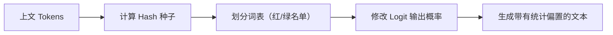

## 9.4 AI 生成内容鉴伪与水印技术

随着生成式 AI 被广泛用于文本、图像、音频与视频内容生产，深度伪造（Deepfake）和虚假信息带来的治理挑战日益严峻。“内容是否由 AI 生成、是否经过篡改、来源是否可信”成为新的安全与合规核心议题。本节将深入探讨生成内容的鉴伪与水印技术原理、工程落地方式以及在实际应用中的局限性。

### 9.4.1 核心需求与应用场景

在企业级 AI 应用中，我们需要内容溯源机制来应对以下场景：

**典型场景需求**
- **反深度伪造与舆情风险**：降低虚假图片、造谣文案在社交网络传播的破坏力。
- **版权保护与合规证明**：依据各国的 AI 法规（如 EU AI Act、中国《生成式人工智能服务管理暂行办法》），部分场景下需要对 AI 生成内容进行机器可读标记、来源披露或显式告知；具体义务并不是对所有 AI 输出一刀切地“显著标识”。
- **防止数据投毒递归**：避免新一代 AI 模型在训练时抓取到了上一代 AI 生成的大量合成数据（即合成数据污染），导致模型能力退化。
- **企业内部审计与追责**：区分客户服务记录是“真人客服产出”、“AI 助手产出”还是“外部资料引用”。

需要强调的是：水印与鉴伪系统不应是“单打独斗”的安全控制手段，必须与系统内建的内容审核体系、访问控制清单与操作日志审计结合，共同构成治理闭环。

### 9.4.2 文本模型的水印技术算法

文本由于其离散分布的特性，注入水印比连续信号（如图像、音频）更为困难。当前主流的文本水印技术主要在模型推理（解码）阶段直接介入。

**KGW 水印算法（John Kirchenbauer 等人，马里兰大学，ICML 2023，论文 \u201cA Watermark for Large Language Models\u201d）**
这是目前被广泛研究和应用的一种白盒水印算法。其核心思路是：在 LLM 计算下一个 Token 的概率分布时，利用前文（Prefix）的哈希值作为伪随机数生成器的种子，将整个大词表（Vocabulary）随机划分为“绿名单（Green List）”和“红名单（Red List）”。

1. **注入阶段**：修改解码策略，人为增加绿名单中 Token 的生成概率（施加 Logit 偏置），抑制红名单 Token。
2. **检测阶段**：给定一段待检测文本，检测方使用相同的伪随机和哈希规则重构红绿名单。如果文本中绿名单 Token 的比例显著高于自然分布的期望值（如高于 50%），即可从统计学上高置信度地判定文本由该模型生成。

图 9-6：文本水印注入流程示意图

**其他文本鉴别技术**
- **基于密码学哈希的安全水印**：进一步提高水印的抗篡改能力和防止攻击者逆向破解红绿名单规则。
- **被动检测（AI 对抗分类器）**：不修改模型生成过程，而是用另一个模型（如 RoBERTa 二分类器）学习“人类写作风格”和“AI 写作风格”的统计特征差异来进行判别。这种方法对黑盒模型很常用，但极易引发误报。

### 9.4.3 多模态生成水印：图像、音频与视频

相比文本，连续多媒体信号（图像的像素矩阵、音频的采样点）中拥有大量冗余空间，可以用来隐藏信息。

**不可见数字水印（Invisible Watermarking）**
- **空间域水印**：修改图像边缘或低对比度区域的最低有效位（LSB）。计算成本极低，但抗压缩折损能力差。
- **频域水印**：将图像转换到 DCT（离散余弦变换）或 DWT（离散小波变换）频域后，在中高频区域嵌入特定的比特序列。由于人类感官对高频细节不敏感，该方法既隐蔽又能抵抗一定程度的 JPEG 压缩与滤波攻击。
- **深度学习生成水印（如 StegaStamp）**：通过端到端的编码器-解码器网络对抗训练，使水印不仅不可见，还能在经过屏摄、缩放、旋转以及色彩变换后依然被高鲁棒检出。

工程落地时，除了追求更高的“水印携带容量（Payload）”，还要权衡：
1. **视觉/听觉保真度**：水印注入决不能以牺牲本来高质量的生成结果为代价。
2. **处理延迟**：在流式生成（Streaming）的管线中需做到极低延迟的水印注入，避免拖累 TTS 或画图服务的首字响应时间。

### 9.4.4 内容溯源的工业标准

对数字内容进行合规的溯源，不仅仅是依赖算法嵌入不可见水印，更严谨的工业做法是采用加密签名和元数据封装的标准联盟规范，例如 **C2PA（ Coalition for Content Provenance and Authenticity ）**（由 Adobe、Arm、Intel、Microsoft 和 Truepic 联合创立）。

- **显式元数据封装**：在媒体文件（如 JPEG、MP4）的头部嵌入标准语义的 `manifest` 声明文件。
- **哈希与非对称签名**：使用企业的私钥对媒体内容的像素哈希值、大模型的版本信息以及生成时间进行加密签名（如声明“由 GPT 生成并验证”）。
- **防篡改生命周期追踪**：当图像经过 Photoshop 等具备 C2PA 解析能力的工具编辑时，工具会保留原有系统的数字签名，并追加本次操作记录的签名链。最终消费者可以通过浏览器插件或公开验证平台实时查看其实际产生和被修改的生命周期全貌。

### 9.4.5 洗稿、对抗与检测指标博弈困境

无论是检测自身预先埋入的水印，还是作为第三方平台被动甄别“帖子是否是 AI 水军发布”，核心识别系统的能力都在以下几个指标之间进行高难度的博弈：

| 指标 | 业务意义 | 现实风险与困境 |
|------|------|------|
| **召回率 (TPR)** | 实际为 AI 生成的内容，被正确抓出的比例 | 高级黑灰产使用各种自研的“洗稿模型”和“人类风格润色 Prompt”进行多轮改版，可导致基础的检测器召回率断崖式下跌。 |
| **误报率 (FPR)** | 纯粹人类创作的内容，被系统冤枉的比例 | 即使极小的 FPR 攀升，也会在千日活 C 端业务下导致海量无辜真实创作者的作品被判定降权或拦截，酿成严重的平台信任危机和公关风险。 |
| **鲁棒性 (Robustness)** | 抵抗人工修饰、截屏翻拍、低清压缩等常见抹除行为的存活能力 | 图像发送通过某些社交通讯软件时，应用默认的二次极致压缩算法大概率会把所有不耐受的轻量级水印和 EXIF 元数据彻底抹除，导致溯源线索中断。 |

**被动文本侦测的“FPR 困境”原理**
很多市面的纯文本 AI 检测工具，经常会将部分严谨的人类作者错误地判定为 AI 生成。这是因为这类群体的行文困惑度（Perplexity）通常较低、词汇可预测性强，恰好与 LLM 默认的平滑概率输出特性高度重合。

### 9.4.6 认清技术局限性与“不要过度承诺”

在面向业务与监管侧交付生成风控方案时，安全架构师必须清晰定位鉴伪边界：

1. **水印绝非万能银弹**：在强对抗环境下（如黑客蓄意破坏溯源机制），只需简单的大幅度图片裁剪倒置、或是通过第三方未加水印的跨语言翻译大模型过两遍，绝大多数内置特征都会遭到破坏。
2. **开源模型的滥用监管盲区**：目前任何人都可以下载 Llama 等完整开源权重部署在本地，攻击者可以通过魔改分词器（Tokenizer）代码甚至是删除 `generate` 源码里的水印叠加逻辑，在根源上掐断水印的产生。

### 9.4.7 工程化防御落地建议

笔者建议把水印机制和鉴别工具作为风险对抗体系中抬高恶意使用者成本的“减速带”，并推荐采用与业务强结合的分层策略进行系统布防：

1. **组合联动出击**：摒弃单一依赖，将高强度的不可见频域水印与数字签名防篡改证书（如 C2PA 架构）绑定并用。一方面保证防截屏追踪能力，另一方面保证确权声明的不可抵赖。
2. **平台侧标签与隐式元数据透传**：在网关返回的响应报文中要求默认带上 `trace_id` 和 `model_version`，在源头直接留下内部排查审计用的审计锚点。
3. **建立风险分级柔性处理管控**：当内容安全系统提示某投稿“疑似高度由 AI 不良洗稿生成”时，推荐做法不是直接“机器一刀切”做封号强杀，而是将其置于低分发展示序列过滤，折叠展示标签，用最小的用户伤害换取社区合规；
4. **设立闭环的人工申诉快速通道**：由于任何 AI 鉴伪算法必然存在误伤，系统必须在制度和前端入口上预留直达人工审核池的复核链路处理假阳性投诉。

### 9.4.8 开源工具推荐

以下开源工具可帮助快速落地鉴伪与水印能力：

| 工具 | 核心能力 | 适用场景 |
|------|----------|----------|
| lm-watermarking（马里兰大学） | 本节介绍的 KGW 水印算法的参考实现，可在模型推理时通过修改 Logit 偏置注入统计水印，并提供对应的检测脚本 | 私有部署的 LLM（如 Llama、Qwen）生成内容的隐式水印注入与验证 |
| Binoculars | Zero-shot AI 生成文本鉴伪工具，通过交叉对比两个开源 LLM 对文本的困惑度差异来判断是否为 AI 生成，无需额外训练 | 轻量级的 AI 生成内容检测，适合快速部署的被动鉴伪场景 |

鉴伪和水印技术尽管存在被黑盒对抗绕过的技术天花板，但在确保平台内容生态透明度、满足政策溯源监管以及约束常规滥用手段上，仍然是大模型关键应用的基础组件。
