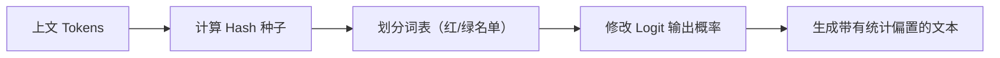

## 9.4 AI 生成内容鉴伪与水印技术

AI 生成内容鉴伪是指判断内容是否由 AI 生成、是否经过篡改、来源是否可信；水印与内容溯源是支撑这一判断的主要技术手段。随着生成式 AI 被广泛用于文本、图像、音频与视频内容生产，深度伪造（Deepfake）和虚假信息带来的治理挑战日益严峻，这些问题成为新的安全与合规核心议题。本节先说明应用场景（9.4.1），再依次介绍文本水印、多模态水印和 C2PA 内容溯源标准（9.4.2–9.4.4），然后分析检测指标的权衡与技术局限（9.4.5–9.4.6），最后给出工程落地建议（9.4.7）和开源工具（9.4.8）。结论是：**水印与鉴伪不能单独作为安全控制手段，宜作为提高恶意使用成本的“减速带”，与审核、访问控制和审计结合**。

### 9.4.1 核心需求与应用场景

企业级 AI 应用需要内容溯源机制，主要应对以下四类场景：

- 反深度伪造与舆情风险：降低虚假图片、造谣文案在社交网络传播的破坏力。
- 版权保护与合规证明：依据各国的 AI 法规（如 EU AI Act、中国《生成式人工智能服务管理暂行办法》及更对口的《人工智能生成合成内容标识办法》，详见 [15.1](../15_governance/15.1_regulations.md)），部分场景下需要对 AI 生成内容进行机器可读标记、来源披露或显式告知；具体义务因场景而异，并非要求所有 AI 输出都“显著标识”。
- 防止数据投毒递归：避免新一代 AI 模型在训练时抓取上一代 AI 生成的大量合成数据（即合成数据污染），导致模型能力退化。
- 企业内部审计与追责：区分客户服务记录是“真人客服产出”、“AI 助手产出”还是“外部资料引用”。

水印与鉴伪系统必须与系统内建的内容审核体系、访问控制清单与操作日志审计结合，共同构成治理闭环。

### 9.4.2 文本模型的水印技术算法

文本水印的主流做法是在模型推理（解码）阶段直接介入，给词元选择施加可统计检测的偏置。文本由于其离散分布的特性，注入水印比连续信号（如图像、音频）更为困难。本小节介绍 KGW 和 SynthID Text 两种解码阶段水印，以及其他文本鉴别技术。

#### KGW 水印算法

KGW 水印算法由 John Kirchenbauer 等人提出（马里兰大学，ICML 2023，论文 “A Watermark for Large Language Models”），是目前被广泛研究和应用的一种白盒水印算法。其做法是：在 LLM 计算下一个 Token 的概率分布时，利用前文（Prefix）的哈希值作为伪随机数生成器的种子，将整个大词表（Vocabulary）随机划分为“绿名单（Green List）”和“红名单（Red List）”。

1. 注入阶段：修改解码策略，人为增加绿名单中 Token 的生成概率（施加 Logit 偏置），抑制红名单 Token。
2. 检测阶段：给定一段待检测文本，检测方使用相同的伪随机和哈希规则重构红绿名单，再比较文本中的绿名单命中率是否显著高于期望值 `γ`，通常通过 `z-score / p-value` 一类统计检验来判断，而不是使用固定 `50%` 阈值。

```mermaid
flowchart LR
    A["上文 Tokens"] --> B["计算 Hash 种子"]
    B --> C["划分词表（红/绿名单）"]
    C --> D["修改 Logit 输出概率"]
    D --> E["生成带有统计偏置的文本"]
```

图 9-6：文本水印注入流程示意图

#### SynthID Text

SynthID Text（Google DeepMind，Nature 2024）与 KGW 同属解码阶段的统计水印，区别在于已有生产级实现。它作为 logits processor 作用于 top-k、top-p 采样之后，用伪随机 g 函数给候选词元打分并做锦标赛式采样，把水印信息编入词元选择；检测器可给出有水印、无水印、不确定三种状态。Hugging Face Transformers 4.46.0 起内置了生产实现，另有仅供研究复现、明确不面向生产的参考仓库（[附录 C-292](../16_appendix/C_references.md) 至 C-294）。官方文档写明两条局限：事实型回答留给水印的改动余地小，效果下降；文本被彻底改写或翻译后检测置信度大幅降低，这与 9.4.5 讨论的洗稿对抗一致。

#### 其他文本鉴别技术

- 基于密码学哈希的安全水印：进一步提高水印的抗篡改能力和防止攻击者逆向破解红绿名单规则。
- 被动检测（AI 对抗分类器）：不修改模型生成过程，而是用另一个模型（如 RoBERTa 二分类器）学习“人类写作风格”和“AI 写作风格”的统计特征差异来进行判别。这种方法对黑盒模型很常用，但极易引发误报。

### 9.4.3 多模态生成水印：图像、音频与视频

多模态水印利用连续多媒体信号（图像的像素矩阵、音频的采样点）中的大量冗余空间隐藏信息，因此比文本水印更容易嵌入。不可见数字水印（Invisible Watermarking）主要有三种做法：

- 空间域水印：修改图像边缘或低对比度区域的最低有效位（LSB）。计算成本极低，但抗压缩能力差。
- 频域水印：将图像转换到 DCT（离散余弦变换）或 DWT（离散小波变换）频域后，在中高频区域嵌入特定的比特序列。由于人类感官对高频细节不敏感，该方法既隐蔽又能抵抗一定程度的 JPEG 压缩与滤波攻击。
- 深度学习生成水印（如 StegaStamp）：通过端到端的编码器-解码器网络对抗训练，使水印不可见，并能在屏摄、缩放、旋转及色彩变换后仍被可靠检出。

工程落地时，除了追求更高的“水印携带容量（Payload）”，还要权衡：

1. 视觉/听觉保真度：水印注入不能降低生成结果的质量。
2. 处理延迟：流式生成（Streaming）管线中的水印注入需要做到极低延迟，避免增加 TTS 或图像生成服务的首字响应时间。

### 9.4.4 内容溯源的工业标准

内容溯源的工业做法是采用基于加密签名和元数据封装的联盟标准，比单靠算法嵌入不可见水印更严谨。代表性标准是 **C2PA（Coalition for Content Provenance and Authenticity）**（由 Adobe、Arm、BBC、Intel、Microsoft 和 Truepic 联合发起），其要点包括：

- 显式 provenance manifest：通过 `assertions + claim + claim signature` 记录来源声明；manifest 既可以嵌入资产，也可以采用外部引用方式。
- 哈希与非对称签名：使用企业私钥对 claim 进行签名，并把内容哈希、来源声明等关键信息纳入可验证链路；具体字段会随资产类型和业务场景变化，并不固定等于“模型版本 + 生成时间”。
- 防篡改生命周期追踪：当图像经过 Photoshop 等具备 C2PA 解析能力的工具编辑时，工具可以保留原有系统的签名链，并追加本次操作记录。最终消费者可通过验证工具查看其来源与修改历史。

### 9.4.5 洗稿、对抗与检测指标博弈困境

鉴伪系统需要在召回率、误报率和鲁棒性之间权衡，而洗稿、二次压缩等对抗手段会同时压低召回率和鲁棒性。无论是检测自己预先嵌入的水印，还是作为第三方平台被动识别帖子是否由 AI 水军发布，都面临这一权衡：

| 指标 | 业务意义 | 现实风险与困境 |
|------|------|------|
| 召回率 (TPR) | 实际为 AI 生成的内容，被正确抓出的比例 | 高级黑灰产使用各种自研的“洗稿模型”和“人类风格润色 Prompt”进行多轮改版，可导致基础检测器的召回率大幅下降。 |
| 误报率 (FPR) | 纯粹人类创作的内容，被系统冤枉的比例 | 即使 FPR 小幅上升，在高日活的 C 端业务中也会导致海量真实创作者的作品被误判降权或拦截，引发严重的平台信任危机和公关风险。 |
| 鲁棒性 (Robustness) | 抵抗人工修饰、截屏翻拍、低清压缩等常见抹除行为的存活能力 | 图像通过某些社交通讯软件发送时，应用默认的二次压缩算法大概率会抹除所有不耐压缩的轻量级水印和 EXIF 元数据，导致溯源线索中断。 |

被动文本侦测还存在“FPR 困境”：许多市面上的纯文本 AI 检测工具经常将部分行文严谨的人类作者误判为 AI 生成。原因是这类作者的行文困惑度（Perplexity）通常较低、词汇可预测性强，与 LLM 默认的平滑概率输出特性高度重合。

### 9.4.6 认清技术局限性与“不要过度承诺”

向业务与监管方交付生成内容风控方案时，需要明确鉴伪技术的两条边界：

1. 水印不是万能方案：在强对抗环境下（如蓄意裁剪、转码、改写或跨语言转译），许多水印和鉴伪方案都会被显著削弱；具体效果取决于算法与攻击方式，不能概括为普遍彻底失效。
2. 开源模型的滥用监管盲区：目前任何人都可以下载 Llama 等完整开源权重在本地部署，攻击者可以修改分词器（Tokenizer）代码，甚至删除 `generate` 源码中的水印叠加逻辑，从根源上阻止水印生成。

### 9.4.7 工程化防御落地建议

笔者建议把水印机制和鉴别工具作为风险对抗体系中提高恶意使用者成本的“减速带”，采用与业务紧密结合的分层策略部署：

1. 组合使用：将高强度的不可见频域水印与数字签名防篡改证书（如 C2PA 架构）结合使用，前者保证截屏后仍可追踪，后者保证确权声明不可抵赖。
2. 平台侧标签与隐式元数据透传：网关返回的响应报文默认携带 `trace_id` 和 `model_version`，在源头留下供内部排查的审计锚点。
3. 风险分级柔性处理：内容安全系统提示某投稿疑似高度由 AI 洗稿生成时，不直接由机器封号，而是降低其分发优先级、折叠展示并添加标签，以最小的用户伤害换取社区合规。
4. 设立闭环的人工申诉快速通道：任何 AI 鉴伪算法都必然存在误判，系统必须在制度和前端入口上预留直达人工审核的复核通道，处理假阳性投诉。

鉴伪和水印技术存在被黑盒对抗绕过的局限，但在提升平台内容透明度、满足溯源监管要求和约束常规滥用方面，仍是大模型关键应用的基础组件。

### 9.4.8 开源工具推荐

鉴伪与水印可借助以下开源工具实现，分别覆盖水印注入检测和被动鉴伪：

| 工具 | 核心能力 | 适用场景 |
|------|----------|----------|
| lm-watermarking（马里兰大学） | 本节介绍的 KGW 水印算法的参考实现，可在模型推理时通过修改 Logit 偏置注入统计水印，并提供对应的检测脚本 | 私有部署的 LLM（如 Llama、Qwen）生成内容的隐式水印注入与验证 |
| SynthID Text（Google DeepMind） | 生产级文本水印：Transformers 4.46.0 起内置的 logits processor 与贝叶斯检测器；GitHub 参考实现仅供研究复现 | 自有模型部署，需要可检测的生成标记，且接受对改写、翻译鲁棒性有限的前提 |
| Binoculars | 零样本、研究型的 AI 生成文本检测方法，基于一对共享 tokenizer 且相互接近的 `observer / performer` 模型，联合使用 `perplexity` 与 `cross-perplexity` 分数进行判别 | 更适合作为研究型/实验型检测工具，用于探索被动鉴伪思路，而非直接当作通用生产级消费品 |
