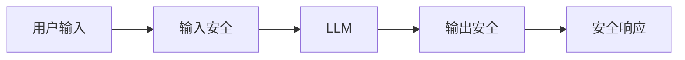

# 第九章：输入输出安全防护

输入和输出是 LLM 与外部世界交互的界面，也是攻击者最直接的攻击入口。本章详细介绍输入输出安全防护的实操技术。

本章聚焦于输入输出安全防护，主要内容包括：

- **9.1 输入验证与过滤**：构建输入层的安全屏障
- **9.2 提示注入防御实践**：实施针对性的注入防护
- **9.3 输出内容安全审核**：确保输出内容安全合规
- **9.4 敏感信息保护**：防止隐私和机密信息泄露

通过本章的学习，读者将掌握 LLM 应用输入输出安全防护的具体技术和最佳实践。

