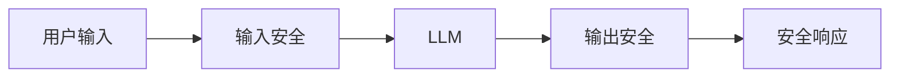

# 第九章 输入输出安全防护

输入和输出是 LLM 与外部世界交互的界面，也是攻击者最直接的攻击入口。本章详细介绍输入输出安全防护的实操技术。

本章聚焦于输入输出安全防护，主要内容包括：

- **9.1 输入验证与过滤**：构建输入层的安全屏障
- **9.2 输出内容安全审核**：确保输出内容安全合规
- **9.3 敏感信息保护**：防止隐私和机密信息泄露
- **9.4 AI 生成内容鉴伪与水印技术**：探讨生成内容的可溯源性与水印嵌入机制
- **9.5 下一代 Constitutional Classifiers**：了解内部激活监测与级联分类器在高风险场景下的补充作用

通过本章的学习，读者将掌握 LLM 应用输入输出安全防护的具体技术和最佳实践。

> **本章定位**：第九章聚焦**战术性输入/输出控制**——具体怎么过滤、怎么审核、怎么打水印、怎么级联分类器。宏观架构与原则（纵深防御、架构模式、权限模型）在第八章。
>
> **与攻击章的对应**：
> - [§9.1 输入验证](9.1_input_validation.md) 针对 [§4.2 直接提示注入](../04_prompt_injection/4.2_direct_injection.md) 与 [§4.3 间接提示注入](../04_prompt_injection/4.3_indirect_injection.md) 的具体载荷
> - [§9.2 输出审核](9.2_output_moderation.md) 针对 [§5 越狱](../05_jailbreak/README.md) 成功后的有害输出
> - [§9.3 敏感信息保护](9.3_sensitive_data.md) 针对 [§6.4 成员推理与隐私攻击](../06_data_model_attacks/6.4_privacy_attacks.md)
> - [§9.5 Constitutional Classifiers](9.5_constitutional_classifiers.md) 针对 [§5.6 自动化越狱](../05_jailbreak/5.6_automated_jailbreak_methods.md) 的对抗演化

```mermaid
flowchart LR
    A["用户输入"] --> B["输入安全"]
    B --> C["LLM"]
    C --> D["输出安全"]
    D --> E["安全响应"]
```
