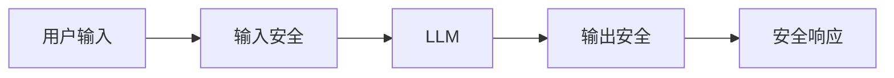

# 第九章 输入输出安全防护

输入和输出是 LLM 与外部世界交互的界面，也是攻击者最直接的攻击入口。本章讨论这两个界面上的具体防护技术：输入进入模型前如何验证与过滤，输出交付前如何审核与脱敏，以及如何标识和鉴别 AI 生成内容。第八章给出纵深防御的宏观架构，本章填充其中输入层与输出层的具体做法；第十章再讨论如何通过监控与运营验证这些防护的效果。

## 学习目标

读完本章，读者应能：

1. 说出输入验证的处理顺序（格式验证、长度检查、编码规范化、内容检测），并解释为什么规范化必须在关键词检测之前执行。
2. 区分关键词检测、语义分析和守卫模型的定位，说明它们为什么都只能降低攻击频率、不能替代确定性控制。
3. 设计按成本逐级升级的输出审核流程，并识别 Markdown 图片、链接等渲染通道造成的数据外发。
4. 判断敏感信息应在哪个环节保护：输入侧脱敏、输出侧过滤，还是在检索阶段做访问控制与租户隔离。
5. 说明文本水印（KGW、SynthID Text）、C2PA 内容溯源和级联分类器的原理与局限。

## 本章结构

- [9.1 输入验证与过滤](9.1_input_validation.md)：输入进入模型前应按什么顺序检查，各层能拦住什么、拦不住什么。
- [9.2 输出内容安全审核](9.2_output_moderation.md)：模型输出交付前应检查哪些问题，如何分级审核，守卫模型有哪些共同边界、如何选型。
- [9.3 敏感信息保护](9.3_sensitive_data.md)：PII、凭据、系统提示等敏感信息如何在输入侧、输出侧和检索链路中防止泄露。
- [9.4 AI 生成内容鉴伪与水印技术](9.4_watermarking_detection.md)：如何标识和鉴别 AI 生成内容，水印与溯源标准的局限在哪里。
- [9.5 下一代 Constitutional Classifiers](9.5_constitutional_classifiers.md)：级联分类器与内部激活监测如何在高风险场景下补充文本级护栏。

前三节按数据流展开：先输入，再输出，再到横跨两侧的敏感信息；9.4 转向生成内容本身的溯源；9.5 以一个厂商实践说明文本级 I/O 护栏的增强方向。

> **本章定位**：本章讨论战术性的输入/输出控制，即过滤、审核、水印和级联分类器的具体做法；宏观架构与原则（纵深防御、架构模式、权限模型）见[第八章](../08_architecture/README.md)。
>
> **与攻击章的对应**：
> - [§9.1 输入验证](9.1_input_validation.md) 针对 [§4.2 直接提示注入](../04_prompt_injection/4.2_direct_injection.md) 与 [§4.3 间接提示注入](../04_prompt_injection/4.3_indirect_injection.md) 的具体载荷
> - [§9.2 输出审核](9.2_output_moderation.md) 针对 [§5 越狱](../05_jailbreak/README.md) 成功后的有害输出
> - [§9.3 敏感信息保护](9.3_sensitive_data.md) 针对 [§6.4 成员推理与隐私攻击](../06_data_model_attacks/6.4_privacy_attacks.md)
> - [§9.5 Constitutional Classifiers](9.5_constitutional_classifiers.md) 针对 [§5.6 自动化越狱](../05_jailbreak/5.6_automated_jailbreak_methods.md) 的对抗演化

```mermaid
flowchart LR
    A["用户输入"] --> B["输入安全"]
    B --> C["LLM"]
    C --> D["输出安全"]
    D --> E["安全响应"]
```
