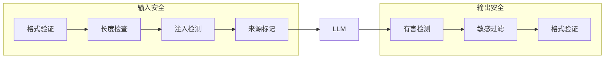

## 本章小结

本章详细介绍了 LLM 应用输入输出安全防护的具体技术和最佳实践。

### 核心要点回顾

**输入验证与过滤**：建立不信任任何输入的原则，实施格式验证、长度限制、编码规范化、模式检测和语义分析等多层验证。

**提示注入防御**：通过系统提示加固、输入输出分离、来源标记、基于 LLM 的注入检测、上下文隔离和工具调用保护等措施构建多层防御。

**输出内容审核**：实施有害内容检测、输出过滤、幻觉检测和多级审核，支持实时和异步两种审核模式。

**敏感信息保护**：在输入侧脱敏、输出侧过滤，实施数据分级保护，监控数据泄露，满足合规要求。

### 防护流程

图 9-1：防护流程图

### 技术选型建议

| 场景 | 推荐方案 |
|------|----------|
| 基础防护 | 规则匹配 + 长度限制 |
| 中等安全 | ML 模型检测 + 多级审核 |
| 高安全需求 | 多模型检测 + 人工审核 |
| 合规场景 | 完整审计 + PII 保护 |

### MVP 最小可行防线

对于"提示词/内部数据泄露"这一常见关切，以下是最小可行防线清单：

> [!IMPORTANT]
> **1. 机密不入上下文**
> 
> 系统提示里不要放密钥、内部 URL、数据库结构、策略原文。需要时在模型外做控制。

> [!IMPORTANT]
> **2. 外部内容默认不可信**
> 
> RAG 文档与工具返回值先做注入检测/清洗，再进入上下文。注入片段只作为"引用材料"，不作为指令源。

> [!IMPORTANT]
> **3. 输出脱敏与策略拦截**
> 
> 对"系统提示/内部指令/PII/密钥模式"等做检测与替换。

> [!IMPORTANT]
> **4. 工具最小权限**
> 
> 每个工具做 allowlist（操作类型、参数范围、资源范围），高风险动作（发邮件、转账、删除等）需人工审批。

### 延伸思考

1. 如何在安全与延迟之间取得最佳平衡？
2. 检测模型的误报如何影响用户体验？
3. 隐私保护如何与模型能力需求协调？

### 下章预告

第十章将介绍安全运营与监控，包括安全监控体系、异常检测与告警、事件响应流程和持续安全评估，构建完整的安全运营能力。
