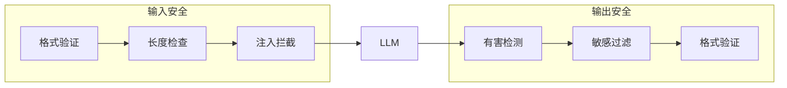

## 本章小结

本章详细介绍了 LLM 应用输入输出安全防护的具体技术和最佳实践。

### 核心要点回顾

**输入验证与过滤**：建立不信任任何输入的原则，实施格式验证、长度限制、编码规范化、模式检测和语义分析等多层验证。

**输出内容审核**：实施有害内容检测、输出过滤、幻觉检测和多级审核，支持实时和异步两种审核模式。

**敏感信息保护**：在输入侧脱敏、输出侧过滤，实施数据分级保护，监控数据泄露，满足合规要求。

**AI 生成内容鉴伪与水印技术**：用于判断内容的机器合成性以及版权溯源保护。

### 防护流程

```mermaid
flowchart LR
    subgraph "输入安全"
    A["格式验证"] --> B["长度检查"]
    B --> C["注入拦截"]
    end

    subgraph "输出安全"
    E["有害检测"] --> F["敏感过滤"]
    F --> G["格式验证"]
    end

    C --> LLM["LLM"]
    LLM --> E
```

图 9-7：防护流程图

### 技术选型建议

| 场景 | 推荐方案 |
|------|----------|
| 基础防护 | 规则匹配 + 长度限制 |
| 中等安全 | ML 模型检测 + 多级审核 |
| 高安全需求 | 多模型检测 + 人工审核 |
| 合规场景 | 完整审计 + PII 保护 |

### 推荐开源工具

以下是本章各环节推荐的代表性开源工具汇总：

| 防护环节 | 推荐工具 | 核心能力 |
|----------|----------|----------|
| 输入验证 | NeMo Guardrails（NVIDIA） | 可编程对话护栏，定义输入边界和主题限制 |
| 输入验证 | Llama Guard（Meta） | 判别式安全分类模型，拦截违规输入/输出 |
| 输入验证 | Promptfoo | 自动化 Prompt 注入和越狱红蓝对抗测试 |
| 输出审核 | Guardrails AI | 输出结构化验证与自动重试，防幻觉和格式约束 |
| 输出审核 | LangKit（WhyLabs） | 文本质量与安全指标监控 |
| 敏感信息 | Microsoft Presidio | PII 识别与数据脱敏 |
| 敏感信息 | Stanza NER（Stanford） | 多语言命名实体识别 |
| 鉴伪水印 | lm-watermarking（马里兰大学） | KGW 文本水印算法参考实现 |
| 鉴伪水印 | Binoculars | Zero-shot AI 生成文本鉴伪检测 |

### MVP 最小可行防线

对于“提示词/内部数据泄露”这一常见关切，以下是最小可行防线清单：

> [!IMPORTANT]
> **1. 机密不入上下文**
>
> 系统提示里不要放密钥、内部 URL、数据库结构、策略原文。需要时在模型外做控制。

> [!IMPORTANT]
> **2. 外部内容默认不可信**
>
> RAG 文档与工具返回值先做检测清洗，再进入上下文。

> [!IMPORTANT]
> **3. 输出脱敏与策略拦截**
>
> 对“系统提示/内部指令/PII/密钥模式”等做检测与替换。

> [!IMPORTANT]
> **4. 工具最小权限**
>
> 每个工具做 allowlist，高风险动作需人工审批。

### 延伸思考

1. 如何在安全与延迟之间取得最佳平衡？
2. 隐私保护如何与模型能力需求协调？

## 与其他章节的关联

- **攻击技术指导**：第 4-5 章的攻击技术指导本章输入过滤规则，针对性防御
- **架构支撑**：第 8 章提供安全架构基础，确保防护措施有效部署
- **监控验证**：第 10 章的监控体系验证防护效果，形成反馈环路

### 下章预告

[第十章](../10_operations/README.md)将介绍安全运营与监控，包括全景安全监控覆盖、异常响应、以及至关重要的服务降级和 Fallback 兜底机制构建。
---

> 📝 **发现错误或有改进建议？** 欢迎提交 [Issue](https://github.com/yeasy/ai_security_guide/issues) 或 [PR](https://github.com/yeasy/ai_security_guide/pulls)。
