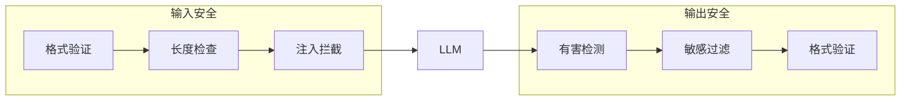

## 本章小结

本章按数据流讨论了 LLM 应用输入输出层的具体防护技术和最佳实践：输入验证与过滤、输出审核、敏感信息保护，以及生成内容鉴伪和级联分类器。

### 1. 核心要点

- 用户输入、上传文件、外部数据源和工具返回值都应视为不可信。
- 输入验证按格式、长度、编码规范化、内容检测的顺序执行，规范化必须先于关键词检测。
- 关键词检测、语义分类和守卫模型都是概率性防御，只能降低攻击频率，不能替代确定性控制。
- 输出审核除有害内容外，还要覆盖敏感信息、幻觉和渲染通道外发。
- 敏感信息保护以预防为主：机密不入上下文，检索阶段做访问控制与租户隔离，输出过滤只作补偿。
- 水印与鉴伪不能单独作为安全控制手段，宜作为提高恶意使用成本的“减速带”，与审核、访问控制和审计结合。

### 2. 各节要点

- [9.1](9.1_input_validation.md) 输入验证与过滤：建立不信任任何输入的原则，实施格式验证、长度限制、编码规范化、模式检测和语义分析等多层验证；检测结果按置信度分级处置，长上下文输入需分段检测。
- [9.2](9.2_output_moderation.md) 输出内容审核：实施有害内容检测、输出过滤、幻觉检测和多级审核，支持实时和异步两种审核模式；守卫模型是概率性过滤层，选型时比较类别口径、工具调用与 RAG 支持、许可和模态。
- [9.3](9.3_sensitive_data.md) 敏感信息保护：在输入侧脱敏、输出侧过滤，实施数据分级保护，监控数据泄露，满足合规要求，并用可测指标验证防护效果。
- [9.4](9.4_watermarking_detection.md) AI 生成内容鉴伪与水印技术：用于判断内容的机器合成性以及版权溯源保护；水印会被改写、转码等手段削弱，应与 C2PA 等签名溯源组合使用。
- [9.5](9.5_constitutional_classifiers.md) Constitutional Classifiers：在高风险部署中，可将文本级 I/O 护栏与内部激活监测结合，用于补充传统输入输出分类器难以捕捉的深层异常信号。

### 3. 防护流程

```mermaid
flowchart LR
    subgraph "输入安全"
    A["格式验证"] --> B["长度检查"]
    B --> C["注入拦截"]
    end

    subgraph "输出安全"
    E["有害检测"] --> F["敏感过滤"]
    F --> G["格式验证"]
    end

    C --> LLM["LLM"]
    LLM --> E
```

图 9-7：防护流程图

### 4. 技术选型建议

| 场景 | 推荐方案 |
|------|----------|
| 基础防护 | 规则匹配 + 长度限制 |
| 中等安全 | ML 模型检测 + 多级审核 |
| 高安全需求 | 多模型检测 + 人工审核 |
| 合规场景 | 完整审计 + PII 保护 |

### 5. 推荐开源工具

以下是本章各环节推荐的代表性开源工具汇总：

| 防护环节 | 推荐工具 | 核心能力 |
|----------|----------|----------|
| 输入验证 | NeMo Guardrails（NVIDIA） | 可编程对话护栏，定义输入边界和主题限制 |
| 输入验证 | Llama Guard（Meta） | 安全分类模型，以生成 `safe`/`unsafe` 文字给出判定，拦截违规输入/输出 |
| 测试与评估 | Promptfoo | 自动化 Prompt 注入和越狱红蓝对抗测试 |
| 输出审核 | Guardrails AI | 输出结构化验证与自动重试，在有 grounding context 时可接入事实性校验 |
| 监控与可观测性 | LangKit（WhyLabs） | 文本质量与安全指标监控 |
| 敏感信息 | Presidio | PII 识别与数据脱敏 |
| 敏感信息 | Stanza NER（Stanford） | 多语言命名实体识别 |
| 鉴伪水印 | lm-watermarking（马里兰大学） | KGW 文本水印算法参考实现 |
| 鉴伪水印 | Binoculars | 更偏研究型的 zero-shot AI 生成文本鉴伪工具 |
| 鉴伪水印 | SynthID Text（Google DeepMind） | Transformers 内置的生产级文本水印与检测器 |
| 守卫模型 | Granite Guardian、ShieldGemma、WildGuard | 与 Llama Guard 可比的开源守卫模型，选型见 [9.2.9](9.2_output_moderation.md) |

### 6. MVP 最小可行防线

针对提示词与内部数据泄露这一常见问题，最小可行防线包括以下四项：

1. 机密不入上下文：系统提示中不应放置密钥、内部 URL、数据库结构和策略原文，需要时在模型之外实施控制。
2. 外部内容默认不可信：RAG 文档与工具返回值先做检测清洗，再进入上下文。
3. 输出脱敏与策略拦截：对“系统提示/内部指令/PII/密钥模式”等做检测与替换。
4. 工具最小权限：每个工具做 allowlist，高风险动作需人工审批。

### 7. 延伸思考

1. 如何在安全与延迟之间取得最佳平衡？
2. 隐私保护如何与模型能力需求协调？

## 与后续章节的关联

- 攻击技术指导：第 4-5 章的攻击技术指导本章输入过滤规则，针对性防御
- 架构支撑：[第 8 章](../08_architecture/README.md)提供安全架构基础，确保防护措施有效部署
- 监控验证：[第 10 章](../10_operations/README.md)的监控体系验证防护效果，形成反馈环路

[第十章](../10_operations/README.md)讨论安全运营与监控，包括全景安全监控覆盖、异常响应，以及服务降级和 Fallback 兜底机制。

---

> 📝 **发现错误或有改进建议？** 欢迎提交 [Issue](https://github.com/yeasy/ai_security_guide/issues) 或 [PR](https://github.com/yeasy/ai_security_guide/pulls)。
