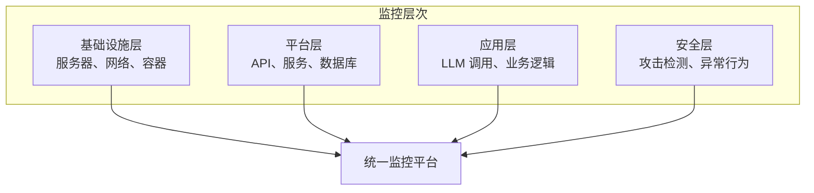
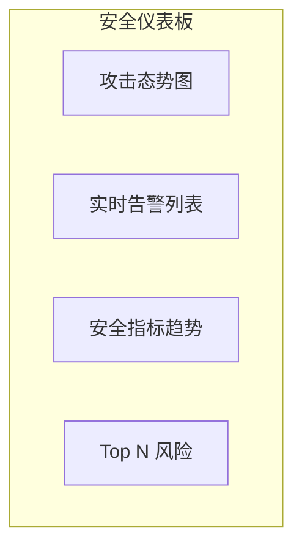

## 10.1 安全监控体系

建立全面的安全监控体系是发现和响应威胁的基础。

### 10.1.1 监控架构

LLM 安全监控需要覆盖多个层面：



图 10-1：监控架构图

### 10.1.2 监控指标

**业务指标**：

| 指标 | 描述 | 告警条件 |
|------|------|----------|
| 请求量 | 每秒请求数 | 突增/突降 |
| 响应时间 | P50/P95/P99 延迟 | 超过阈值 |
| 错误率 | 失败请求比例 | > 1% |
| Token 使用 | Token 消耗量 | 超预算 |

**安全指标**：

| 指标 | 描述 | 意义 |
|------|------|------|
| 注入检测率 | 检测到的注入尝试 | 攻击活跃度 |
| 拒绝率 | 被拒绝的请求 | 防护效果 |
| 越狱尝试 | 越狱攻击次数 | 威胁态势 |
| 敏感信息告警 | PII 泄露风险 | 数据安全 |

### 10.1.3 日志采集

**日志类型**：

```python
# 请求日志

request_log = {
    "timestamp": "2026-01-15T10:30:00Z",  # 示例时间
    "request_id": "req_xxx",
    "user_id": "user_123",
    "input_hash": "hash_xxx",  # 不记录原始输入
    "input_length": 256,
    "model": "llm-model",
    "latency_ms": 1500,
    "status": "success"
}

# 安全日志

security_log = {
    "timestamp": "2026-01-15T10:30:00Z",  # 示例时间
    "request_id": "req_xxx",
    "event_type": "injection_detected",
    "severity": "medium",
    "details": {...},
    "action_taken": "blocked"
}
```

**日志策略**：

| 考量 | 策略 |
|------|------|
| 隐私 | 不记录原始提示，使用哈希 |
| 存储 | 分级存储，热数据快速访问 |
| 保留 | 安全日志保留更长时间 |
| 加密 | 敏感日志加密存储 |

### 10.1.4 实时仪表板

关键仪表板组件：



图 10-2：实时仪表板组件图

**核心视图**：

1. **攻击态势**：可视化攻击类型和趋势
2. **告警中心**：按严重程度排序的告警
3. **用户行为**：异常用户活动
4. **系统健康**：服务状态和性能

### 10.1.5 监控工具选型

| 场景 | 工具选项 |
|------|----------|
| 日志管理 | ELK 类方案 / 商业日志平台 |
| 指标监控 | Prometheus + Grafana |
| 追踪 | 分布式追踪系统 |
| 告警 | On-call 告警平台 |
| SIEM | SIEM 平台 |

### 10.1.6 监控最佳实践

1. **全覆盖**：确保所有关键路径都有监控
2. **实时性**：关键安全事件实时告警
3. **可追溯**：支持问题根因分析
4. **自动化**：减少人工干预
5. **演练**：定期测试监控有效性
