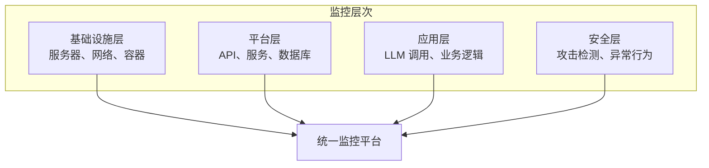
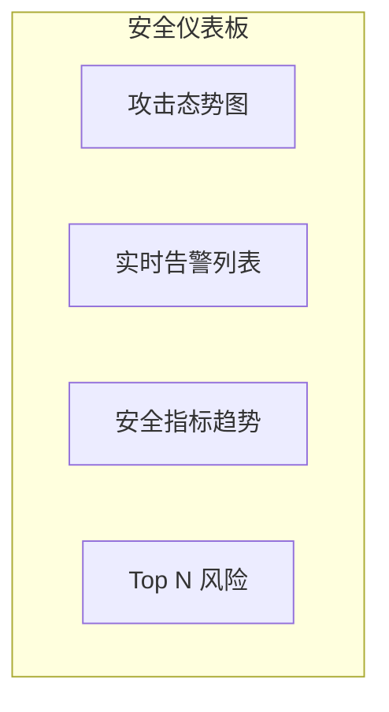

## 10.1 安全监控体系

建立全面的安全监控体系是发现和响应威胁的基础。

### 10.1.1 监控架构

LLM 安全监控需要覆盖多个层面：


```mermaid
flowchart TB
    subgraph "监控层次"
    A["基础设施层<br/>服务器、网络、容器"]
    B["平台层<br/>API、服务、数据库"]
    C["应用层<br/>LLM 调用、业务逻辑"]
    D["安全层<br/>攻击检测、异常行为"]
    end

    A --> E["统一监控平台"]
    B --> E
    C --> E
    D --> E
```

图 10-1：监控架构图

### 10.1.2 监控指标

**业务指标**
| 指标 | 描述 | 告警条件 |
|------|------|----------|
| 请求量 | 每秒请求数 | 突增/突降 |
| 响应时间 | P50/P95/P99 延迟 | 超过阈值 |
| 错误率 | 失败请求比例 | > 1% |
| Token 使用 | Token 消耗量 | 超预算 |

**安全指标**
| 指标 | 描述 | 意义 |
|------|------|------|
| 注入检测率 | 检测到的注入尝试 | 攻击活跃度 |
| 拒绝率 | 被拒绝的请求 | 防护效果 |
| 越狱尝试 | 越狱攻击次数 | 威胁态势 |
| 敏感信息告警 | PII 泄露风险 | 数据安全 |

### 10.1.3 日志与告警字段（Schema）设计

为了确保安全事件能够被正确路由、有效分析并用于策略迭代，**安全日志绝不能只记录简单的“拦截与否”**。在构建监控流水线时，建议强制包含以下标准安全字段（可作为 SIEM/SOC 的解析基线）：

**请求日志（业务与性能侧）**
```python
request_log = {
    "timestamp": "2026-01-15T10:30:00Z",
    "request_id": "req_xxx",
    "user_id": "user_123",
    "session_id": "sess_456",
    "input_hash": "hash_xxx",  # 从隐私保护角度考虑，不记录原始输入明文
    "model": "gpt-5.3",
    "latency_ms": 1500,
    "status": "success"
}
```

**安全告警日志（强制规范字段）**
当安全网关、检测分类器或业务逻辑层发现异常时，必须生成包含以下维度信息的结构化日志：

```python
security_log = {
    "timestamp": "2026-01-15T10:30:00Z",
    "request_id": "req_xxx",          # 用于关联 request_log
    
    # 【核心分类性】
    "attack_type": "prompt_injection", # 取值：prompt_injection/jailbreak/data_poisoning/model_theft 等
    "vector": "indirect",              # 取值：direct/indirect/supply-chain
    "impact": "safety",                # 取值：confidentiality/integrity/availability/safety
    
    # 【业务上下文】
    "tool_invocation": ["web_search", "send_email"],  # 记录当前上下文中开放/被操纵调用了哪些工具
    "data_source": "user_uploaded_pdf",               # 恶意载荷的来源途径（例如：直接对话、文档提取、网页搜索）
    
    # 【系统研判与处置】
    "confidence": 0.95,                # 检测器/分类模型给出的确信度评分 (0.0-1.0)
    "mitigation_applied": "redacted",  # 实际采取的缓解措施：blocked(阻断)/redacted(边界脱敏)/flagged(仅审计)
    
    "details": {
        "matched_rule": "jailbreak_dan_variant",
        "detector_version": "v2.1"
    }
}
```

**日志策略**
| 考量 | 策略 |
|------|------|
| 隐私 | 不记录原始提示和用户隐私数据，使用安全哈希存储请求校验值。 |
| 存储 | 请求基础日志归档；安全告警日志接入 SIEM，支持多维高频查询。 |
| 分析 | 依赖 `attack_type` 和 `vector` 进行趋势聚合与报表生成。 |
| 保留 | 敏感安全日志加密存储并保留更长周期，满足合规审计要求。 |

#### 分级脱敏策略：平衡隐私保护与根因分析

日志脱敏（Hash 化记录）与根因分析（RCA）之间存在天然的矛盾：前者要求不保存原始内容以保护隐私，后者需要原始数据来重现问题场景。我们推荐采用“分级脱敏策略”来解决这一对立：

**常规模式：隐私优先**
- 日志中仅记录请求的哈希值、内容分类标签和安全检测结果，不保存原始输入输出内容。
- 适用于日常运营与常规监控，支持快速的趋势分析与告警聚合。

**增强审计模式：自动升级**
- 当安全事件被触发时（例如检测到攻击尝试、异常检索行为、可疑工具调用等），系统自动升级为加密存储该事件及其前后文的原始请求/响应内容。
- 这种“热点保留”避免了存储所有请求，同时为重点事件的 RCA 提供了必要材料。

**授权恢复机制：双人控制**
- 解密特定时间段或特定事件的原始日志用于根因分析，需要至少两名授权人员同时审批（实施“双人控制”原则）。
- 审批过程必须留痕，形成“谁在何时因何故查看了哪些敏感日志”的完整审计链。

**时间衰减策略：自动清理**
- 加密存储的原始日志设置自动过期与删除策略（建议 30 天后自动删除），减少长期隐私风险与存储成本。
- 对于特别重要的安全事件，可由授权管理员主动延期保留，但仍需记录延期理由。

通过这种分层机制，既满足了日常运营中的隐私保护需求，也为真实发生的安全问题提供了根因分析的条件，在两者之间达到可接受的平衡。

### 10.1.4 实时仪表板

关键仪表板组件：


```mermaid
graph TB
    subgraph "安全仪表板"
    A["攻击态势图"]
    B["实时告警列表"]
    C["安全指标趋势"]
    D["Top N 风险"]
    end
```

图 10-2：实时仪表板组件图

**核心视图**
1. **攻击态势**：可视化攻击类型和趋势
2. **告警中心**：按严重程度排序的告警
3. **用户行为**：异常用户活动
4. **系统健康**：服务状态和性能

### 10.1.5 监控工具选型

在传统云原生架构的基础设施监控之外，针对大语言模型系统，建议同步引入专门的 LLM 可观测性（Observability）平台来追踪请求级的安全特征。

**传统基础架构监控**
| 场景 | 工具选项 |
|------|----------|
| 日志管理 | ELK 类方案 / 商业日志平台 |
| 指标监控 | Prometheus + Grafana |
| 追踪 | 分布式追踪系统 |
| 告警 | On-call 告警平台 |
| SIEM | SIEM 平台 |

**LLM 专属监控与可观测性开源工具**
| 工具 | 定位 | 安全与监控特点 | 开源协议 |
|------|------|----------------|----------|
| Langfuse | LLM 可观测平台 | 能够通过细粒度 Tracing 记录调用链路与 Token 消耗，内建数据面板便于监控提示注入防御效果等异常模式。 | MIT |
| Phoenix | AI 评估与可观测平台 | 侧重对 RAG 检索链路的分析，支持系统延迟追踪以及针对隐性数据泄露和不安全内容的监测。 | Apache 2.0 |
| Deepchecks | 持续验证监控平台 | 在生产环境中对大模型与数据的隐性漂移（Drift）做全生命周期监控，适用于持续安全集成测试。 | AGPL v3 |

### 10.1.6 监控最佳实践

1. **全覆盖**：确保所有关键路径都有监控
2. **实时性**：关键安全事件实时告警
3. **可追溯**：支持问题根因分析
4. **自动化**：减少人工干预
5. **演练**：定期测试监控有效性
