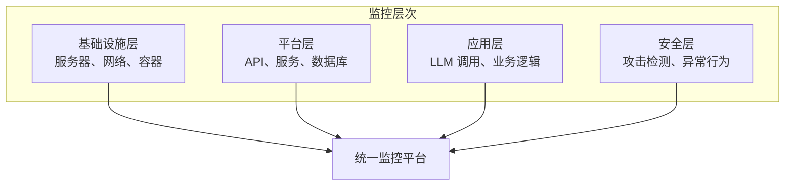
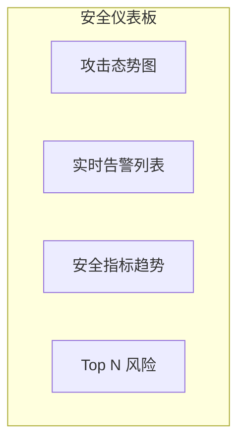

## 10.1 安全监控体系

安全监控体系是指对 LLM 系统从基础设施到应用和安全事件的持续观测，它是发现和响应威胁的基础。一套有效的监控体系应做到全覆盖（所有关键路径都有监控）、实时（关键安全事件实时告警）、可追溯（支持问题根因分析）、自动化（减少人工干预），并定期演练以测试监控有效性。本节先给出监控的层次架构（10.1.1）和指标（10.1.2），再详细讨论日志与告警字段的设计（10.1.3），最后介绍实时仪表板（10.1.4）和监控工具选型（10.1.5）。

### 10.1.1 监控架构

LLM 安全监控需要覆盖四个层面：基础设施层、平台层、应用层和安全层，各层数据汇入统一监控平台。


```mermaid
flowchart TB
    subgraph "监控层次"
    A["基础设施层<br/>服务器、网络、容器"]
    B["平台层<br/>API、服务、数据库"]
    C["应用层<br/>LLM 调用、业务逻辑"]
    D["安全层<br/>攻击检测、异常行为"]
    end

    A --> E["统一监控平台"]
    B --> E
    C --> E
    D --> E
```

图 10-1：监控架构图

### 10.1.2 监控指标

监控指标分为两类：业务指标反映服务是否正常运行，安全指标反映攻击态势与防护效果。

业务指标：

| 指标 | 描述 | 告警条件 |
|------|------|----------|
| 请求量 | 每秒请求数 | 突增/突降 |
| 响应时间 | P50/P95/P99 延迟 | 超过阈值 |
| 错误率 | 失败请求比例 | > 1% |
| Token 使用 | Token 消耗量 | 超预算 |

安全指标：

| 指标 | 描述 | 意义 |
|------|------|------|
| 注入检测率 | 检测到的注入尝试 | 攻击活跃度 |
| 拒绝率 | 被拒绝的请求 | 防护效果 |
| 越狱尝试 | 越狱攻击次数 | 威胁态势 |
| 敏感信息告警 | PII 泄露风险 | 数据安全 |

### 10.1.3 日志与告警字段设计

安全日志应记录对决策有帮助的信息，而非越多越好；监控流水线也不能只记录是否拦截。本小节依次讨论日志的设计目标、请求日志与安全告警日志的字段模板、日志策略与分级脱敏，以及智能体场景的追加字段。

#### 日志设计目标

日志既是事后审计的记录，也是实时安全决策的依据和长期改进的反馈。设计良好的日志系统应具备以下能力：

1. 实时告警：当安全事件发生时，立即识别并触发响应流程
2. 趋势分析：基于历史数据发现攻击模式和演进方向
3. 根因分析：在发生安全事件时，能快速查找事件的前因后果
4. 政策优化：根据日志数据评估防御措施的有效性，指导下一阶段改进

为此，日志设计包括以下三个维度：

- 分类维度：日志能被准确地分类（攻击类型、向量、影响范围），便于聚合和告警
- 关联维度：不同日志能被关联起来（通过 request_id），形成完整的事件链
- 可解释维度：日志包含足够的上下文信息（模型、工具、数据源等），支持事后分析

#### 请求日志与安全告警日志

以下是推荐的安全日志字段模板，可作为接入 SIEM / SOC 时的参考基线。

请求日志记录业务与性能侧信息，每个进入系统的请求都应生成一条：

```python
request_log = {
    "timestamp": "2026-01-15T10:30:00Z",
    "request_id": "req_xxx",
    "user_id": "user_123",
    "session_id": "sess_456",
    "input_hash": "hash_xxx",  # 从隐私保护角度考虑，不记录原始输入明文
    "model": "gpt-5.5",
    "latency_ms": 1500,
    "status": "success"
}
```

安全告警日志是强制规范字段：当安全网关、检测分类器或业务逻辑层发现异常时，必须生成包含以下维度信息的结构化日志：

```python
security_log = {
    "timestamp": "2026-01-15T10:30:00Z",
    "request_id": "req_xxx",          # 用于关联 request_log

    # 【核心分类性】
    "attack_type": "prompt_injection", # 取值：prompt_injection/jailbreak/data_poisoning/model_theft 等
    "vector": "indirect",              # 取值：direct/indirect/supply-chain
    "impact": "safety",                # 取值：confidentiality/integrity/availability/safety

    # 【业务上下文】
    "tool_invocation": ["web_search", "send_email"],  # 记录当前上下文中开放/被操纵调用了哪些工具
    "data_source": "user_uploaded_pdf",               # 恶意载荷的来源途径（例如：直接对话、文档提取、网页搜索）

    # 【系统研判与处置】
    "confidence": 0.95,                # 检测器/分类模型给出的确信度评分 (0.0-1.0)
    "mitigation_applied": "redacted",  # 实际采取的缓解措施：blocked(阻断)/redacted(边界脱敏)/flagged(仅审计)

    "details": {
        "matched_rule": "jailbreak_dan_variant",
        "detector_version": "v2.1"
    }
}
```

#### 日志策略与分级脱敏

日志在隐私、存储、分析和保留四个方面的策略如下：

| 考量 | 策略 |
|------|------|
| 隐私 | 不记录原始提示和用户隐私数据，使用安全哈希存储请求校验值。 |
| 存储 | 请求基础日志归档；安全告警日志接入 SIEM，支持多维高频查询。 |
| 分析 | 依赖 `attack_type` 和 `vector` 进行趋势聚合与报表生成。 |
| 保留 | 敏感安全日志加密存储并保留更长周期，满足合规审计要求。 |

日志脱敏（Hash 化记录）与根因分析（RCA）之间存在矛盾：前者要求不保存原始内容以保护隐私，后者需要原始数据重现问题场景。推荐采用分级脱敏策略兼顾二者，它包括四个机制：

1. 常规模式（隐私优先）：日志中仅记录请求的哈希值、内容分类标签和安全检测结果，不保存原始输入输出内容。适用于日常运营与常规监控，支持快速的趋势分析与告警聚合。
2. 增强审计模式（自动升级）：当安全事件被触发时（例如检测到攻击尝试、异常检索行为、可疑工具调用等），系统自动升级为加密存储该事件及其前后文的原始请求/响应内容。这种热点保留方式无须存储所有请求，同时为重点事件的 RCA 提供必要材料。
3. 授权恢复机制（双人控制）：解密特定时间段或特定事件的原始日志用于根因分析，需要至少两名授权人员同时审批（实施“双人控制”原则）。审批过程必须留痕，形成“谁在何时因何故查看了哪些敏感日志”的完整审计链。
4. 时间衰减策略（自动清理）：加密存储的原始日志设置自动过期与删除策略（建议 30 天后自动删除），减少长期隐私风险与存储成本。对于特别重要的安全事件，可由授权管理员主动延期保留，但仍需记录延期理由。

该分层机制既满足日常运营中的隐私保护需求，也为实际发生的安全事件保留了根因分析的条件，在两者之间取得可接受的平衡。

#### 智能体场景的追加字段

上述模板以单次请求为单位。智能体的一次任务包含多轮模型调用与工具调用，需要以**追踪**为单位组织日志，并补充几类单次请求日志里没有的信息：

| 字段 | 说明 |
|------|------|
| `trace_id` 与 `parent_span_id` | 把一次任务中的所有模型调用、工具调用、子智能体调用串成一棵树 |
| `context_sources` | 本步骤进入上下文的每段内容的来源类型、标识与可信度标记 |
| `tool_name` 与 `tool_arguments` | 模型请求的工具与完整参数 |
| `policy_decision` 与 `policy_rule` | 策略网关的判定结果及命中的规则 |
| `approval` | 是否经过人工确认、展示内容的摘要、决定与耗时 |
| `credential_scope` 与 `credential_audience` | 执行时所用凭据的范围与受众 |
| `egress_destination` | 出站请求的目标 |
| `agent_version` | 模型、系统提示、工具与技能清单各自的版本 |

OpenTelemetry 的生成式 AI 语义约定为智能体调用、工具执行与 MCP 定义了跨度类型与属性名（目前仍处于开发状态，字段可能变动）。自研字段应尽量与之对齐，以便不同框架产生的追踪能进入同一套分析工具。

相关章节：各字段支撑的检测见 [11.8 节](../11_agent_foundations/11.8_dark_code.md)；具体系统据此设置告警的示例见 [14.4.6 节](../14_agent_practice/14.4_case_study.md)。

### 10.1.4 实时仪表板

实时仪表板把攻击态势、告警、安全指标趋势和高风险项集中展示，供运营人员实时掌握安全状况。关键组件如下：


```mermaid
graph TB
    subgraph "安全仪表板"
    A["攻击态势图"]
    B["实时告警列表"]
    C["安全指标趋势"]
    D["Top N 风险"]
    end
```

图 10-2：实时仪表板组件图

核心视图有四个：

1. 攻击态势：可视化攻击类型和趋势
2. 告警中心：按严重程度排序的告警
3. 用户行为：异常用户活动
4. 系统健康：服务状态和性能

### 10.1.5 监控工具选型

监控工具分两类：传统基础架构监控覆盖日志、指标、追踪和告警；LLM 专属可观测性平台追踪请求级的安全特征。建议在传统云原生基础设施监控之外，为大语言模型系统同步引入后者。

传统基础架构监控：

| 场景 | 工具选项 |
|------|----------|
| 日志管理 | ELK 类方案 / 商业日志平台 |
| 指标监控 | Prometheus + Grafana |
| 追踪 | 分布式追踪系统 |
| 告警 | On-call 告警平台 |
| SIEM | SIEM 平台 |

LLM 专属监控与可观测性开源工具：

| 工具 | 定位 | 安全与监控特点 | 开源协议 |
|------|------|----------------|----------|
| Langfuse | LLM 可观测平台 | 通过细粒度 Tracing 记录调用链路与 Token 消耗，内建数据面板可监控提示注入防御效果等异常模式。 | MIT |
| Phoenix | AI 评估与可观测平台 | 侧重 tracing、evaluation 与 troubleshooting，尤其适合 RAG 检索链路分析和请求级可观测性建设。 | ELv2 |
| Deepchecks | 持续验证监控平台 | 在生产环境中对大模型与数据的隐性漂移（Drift）做全生命周期监控，适用于持续安全集成测试。 | AGPL v3 |
