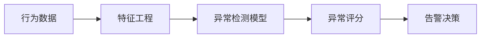
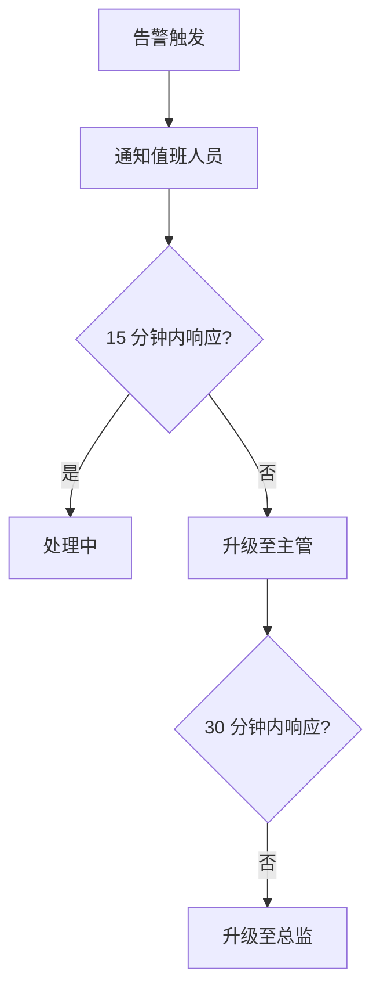

## 10.2 异常检测与告警

及时发现异常是安全运营的核心能力。

### 10.2.1 异常检测方法

**基于规则的检测**：

```python
class RuleBasedDetector:
    rules = [
        {
            "name": "high_rejection_rate",
            "condition": lambda m: m["rejection_rate"] > 0.2,
            "severity": "high"
        },
        {
            "name": "unusual_request_volume",
            "condition": lambda m: m["requests"] > m["baseline"] * 3,
            "severity": "medium"
        }
    ]
    
    def detect(self, metrics: dict) -> list:
        alerts = []
        for rule in self.rules:
            if rule["condition"](metrics):
                alerts.append(Alert(rule["name"], rule["severity"]))
        return alerts
```

**基于统计的检测**：

```python
class StatisticalDetector:
    def detect_anomaly(self, value: float, history: list) -> bool:
        mean = np.mean(history)
        std = np.std(history)
        
        # Z-score 检测（避免标准差为 0 时除零）

        if std <= 1e-9:
            return False

        z_score = abs(value - mean) / std
        return z_score > 3  # 3 个标准差外视为异常
```

**基于 ML 的检测**：



图 10-1：异常检测方法流程图

### 10.2.2 LLM 特定异常模式

| 异常模式 | 指标表现 | 可能原因 |
|----------|----------|----------|
| 注入攻击激增 | 拒绝率突增 | 被针对攻击 |
| 数据提取尝试 | 特定模式请求增加 | 信息窃取 |
| 资源耗尽 | Token 用量异常 | DoS 攻击 |
| 越狱尝试 | 特定内容类型增加 | 越狱攻击 |

### 10.2.3 告警分级

**严重性等级**：

| 等级 | 描述 | 响应时间 | 示例 |
|------|------|----------|------|
| P0 | 紧急 | 15 分钟 | 数据泄露确认 |
| P1 | 严重 | 1 小时 | 大规模攻击 |
| P2 | 重要 | 4 小时 | 可疑活动 |
| P3 | 一般 | 24 小时 | 异常趋势 |

### 10.2.4 告警降噪

**问题**：过多告警导致疲劳和忽视

**解决方案**：

```python
class AlertManager:
    def should_alert(self, alert: Alert) -> bool:
        # 去重：相同告警在窗口内只告一次

        if self.is_duplicate(alert):
            return False
        
        # 聚合：相关告警合并

        if self.can_aggregate(alert):
            self.aggregate(alert)
            return False
        
        # 抑制：根据条件抑制

        if self.is_suppressed(alert):
            return False
        
        return True
```

### 10.2.5 告警通知

**通知渠道**：

| 渠道 | 适用场景 |
|------|----------|
| 短信/电话 | P0/P1 紧急告警 |
| 即时通讯 | P1/P2 重要告警 |
| 邮件 | P2/P3 一般告警 |
| 工单系统 | 需要跟踪的问题 |

**升级机制**：



图 10-2：告警通知流程图

### 10.2.6 告警有效性评估

定期评估告警质量：

| 指标 | 目标 |
|------|------|
| 真正阳性率 | > 80% |
| 误报率 | < 20% |
| 平均响应时间 | 符合 SLA |
| 告警覆盖率 | 无漏报重大事件 |

持续优化告警规则，平衡灵敏度和噪音。
