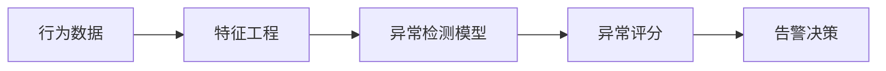
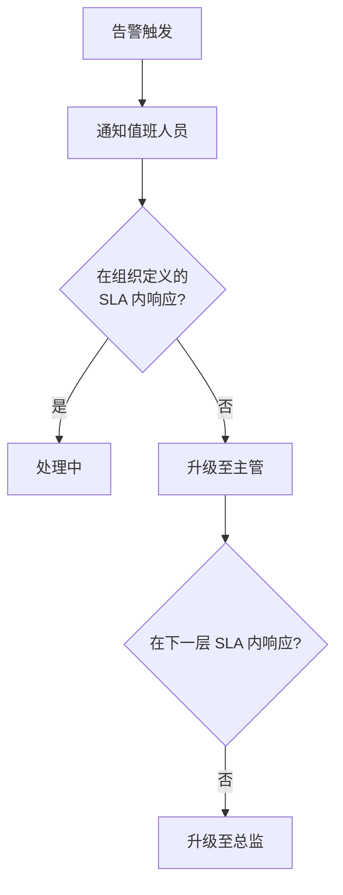

## 10.2 异常检测与告警

及时发现异常是安全运营的核心能力。

### 10.2.1 异常检测方法

**1. 基于规则的检测**
```python
class RuleBasedDetector:
    rules = [
        {
            "name": "high_rejection_rate",
            "condition": lambda m: m["rejection_rate"] > 0.2,
            "severity": "high"
        },
        {
            "name": "unusual_request_volume",
            "condition": lambda m: m["requests"] > m["baseline"] * 3,
            "severity": "medium"
        }
    ]

    def detect(self, metrics: dict) -> list:
        alerts = []
        for rule in self.rules:
            if rule["condition"](metrics):
                alerts.append(Alert(rule["name"], rule["severity"]))
        return alerts
```

**2. 基于统计的检测**
```python
class StatisticalDetector:
    def detect_anomaly(self, value: float, history: list) -> bool:
        mean = np.mean(history)
        std = np.std(history)

        # Z-score 检测（避免标准差为 0 时除零）

        if std <= 1e-9:
            return False

        z_score = abs(value - mean) / std
        return z_score > 3  # 3 个标准差外视为异常
```

**3. 基于 ML 的检测**

```mermaid
flowchart LR
    A["行为数据"] --> B["特征工程"]
    B --> C["异常检测模型"]
    C --> D["异常评分"]
    D --> E["告警决策"]
```

图 10-3：异常检测方法流程图

### 10.2.2 LLM 特定异常模式

| 异常模式 | 指标表现 | 可能原因 |
|----------|----------|----------|
| 注入攻击激增 | 拒绝率突增 | 被针对攻击 |
| 数据提取尝试 | 特定模式请求增加 | 信息窃取 |
| 资源耗尽 | Token 用量异常 | DoS 攻击 |
| 越狱尝试 | 特定内容类型增加 | 越狱攻击 |

### 10.2.3 告警分级

**严重性等级**
| 等级 | 描述 | 示例响应时间（需按组织 SLA 调整） | 示例 |
|------|------|-----------------------------|------|
| P0 | 紧急 | 分钟级 | 数据泄露确认 |
| P1 | 严重 | 小时级 | 大规模攻击 |
| P2 | 重要 | 当日内 | 可疑活动 |
| P3 | 一般 | 1 个工作日内 | 异常趋势 |

### 10.2.4 告警降噪

**问题**：过多告警导致疲劳和忽视

**解决方案**
```python
class AlertManager:
    def should_alert(self, alert: Alert) -> bool:
        # 去重：相同告警在窗口内只告一次

        if self.is_duplicate(alert):
            return False

        # 聚合：相关告警合并

        if self.can_aggregate(alert):
            self.aggregate(alert)
            return False

        # 抑制：根据条件抑制

        if self.is_suppressed(alert):
            return False

        return True
```

### 10.2.5 告警通知

**通知渠道**
| 渠道 | 适用场景 |
|------|----------|
| 短信/电话 | P0/P1 紧急告警 |
| 即时通讯 | P1/P2 重要告警 |
| 邮件 | P2/P3 一般告警 |
| 工单系统 | 需要跟踪的问题 |

**升级机制**

```mermaid
flowchart TB
    A["告警触发"] --> B["通知值班人员"]
    B --> C{"在组织定义的<br/>SLA 内响应?"}
    C --> |是| D["处理中"]
    C --> |否| E["升级至主管"]
    E --> F{"在下一层 SLA 内响应?"}
    F --> |否| G["升级至总监"]
```

图 10-4：告警通知流程图

### 10.2.6 告警有效性评估

定期评估告警质量：

| 指标 | 示例目标 |
|------|----------|
| 真正阳性率 | 按业务威胁模型持续提升 |
| 误报率 | 控制在运营团队可承受范围内 |
| 平均响应时间 | 符合组织自定义 SLA |
| 告警覆盖率 | 尽量避免漏报重大事件 |

持续优化告警规则，平衡灵敏度和噪音。

### 10.2.7 基线校准与误报管理

异常检测的有效性高度依赖于准确的基线建立。在实际运营中，需要注意以下问题：

**1. 业务场景差异化基线**

不同业务场景的“正常”指标差异很大。例如，内容审核类应用和客服助手的正常拒绝率、告警密度、异常波动区间都可能完全不同。将所有场景套用统一基线会产生大量误报。

**建议做法**：
- 按业务场景分别建立基线（如客服、代码生成、内容创作、数据分析等）
- 采用滑动窗口（7 天/30 天）计算动态基线，适应业务的自然波动
- 对新上线的场景，设置一段“学习期”，期间以记录和人工校准为主

**2. 季节性与周期性因素**

用户行为存在明显的时间模式：工作日 vs 周末、节假日前后、产品发布后等。应在基线建立时考虑这些周期性变化，避免在周末或假期触发不必要的告警。

**3. 告警疲劳对抗**

当某条规则连续产生误报时，运维人员会逐渐忽略该规则的告警（“狼来了效应”）。

**缓解措施**：
- 实施“告警衰减”机制：连续 N 次误报后自动降低该规则的告警级别
- 定期（每月）审查告警规则的精准率，淘汰精准率低于 50% 的规则
- 建立告警反馈闭环：运维人员标记误报/漏报，反向优化检测模型
