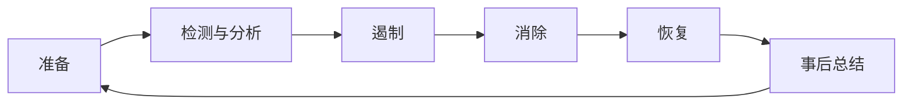
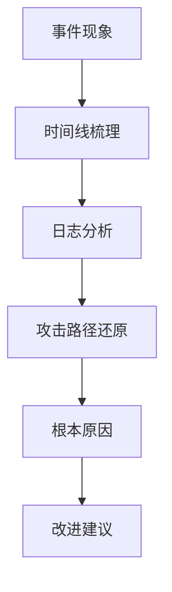

## 10.3 事件响应流程

当安全事件发生时，需要有明确的响应流程来控制损失。

### 10.3.1 事件分类

**按类型分类**：

| 类型 | 描述 | 示例 |
|------|------|------|
| 攻击事件 | 恶意攻击行为 | 大规模注入攻击 |
| 泄露事件 | 数据/信息泄露 | PII 泄露 |
| 误用事件 | 异常使用行为 | 内部人员滥用 |
| 故障事件 | 系统故障 | 服务中断 |

### 10.3.2 响应流程

**NIST 事件响应框架**：



图 10-1：响应流程图

### 10.3.3 遏制措施

根据事件类型采取遏制措施：

| 事件类型 | 遏制措施 |
|----------|----------|
| 注入攻击 | 阻断可疑 IP/用户 |
| 数据泄露 | 暂停相关功能 |
| 系统入侵 | 隔离受影响系统 |
| DoS 攻击 | 启用限流/CDN |

**遏制原则**：

1. 快速行动，控制损失蔓延
2. 保留证据，支持后续分析
3. 最小影响，避免过度反应
4. 持续监控，确保有效性

### 10.3.4 根因分析

**分析方法**：



图 10-2：根因分析流程图

**分析要点**：

- 攻击入口在哪里？
- 为什么防护没有生效？
- 影响范围有多大？
- 如何防止再次发生？

### 10.3.5 事件报告

**报告内容**：

```markdown
# 安全事件报告

## 基本信息

- 事件 ID: SEC-YYYY-NNN
- 发现时间: YYYY-MM-DD HH:MM
- 响应时间: YYYY-MM-DD HH:MM
- 关闭时间: YYYY-MM-DD HH:MM

## 事件摘要

[简述发生了什么]

## 时间线

- 10:30 检测到异常
- 10:35 值班人员确认
- 10:45 采取遏制措施
- ...

## 影响分析

- 受影响用户数: X
- 数据泄露情况: [描述]

## 根因分析

[详细分析]

## 改进措施

1. [短期措施]
2. [长期措施]
```

### 10.3.6 事件复盘

**复盘会议议程**：

1. 事件回顾
2. 响应过程评估
3. 根因确认
4. 改进措施讨论
5. 责任人和时间表

**改进跟踪**：

| 改进项 | 责任人 | 截止日期 | 状态 |
|--------|--------|----------|------|
| 增强注入检测 | 安全团队 | YYYY-MM-DD | 进行中 |
| 监控规则优化 | 运维团队 | YYYY-MM-DD | 待开始 |

事件响应能力需要通过演练和实战不断提升。
