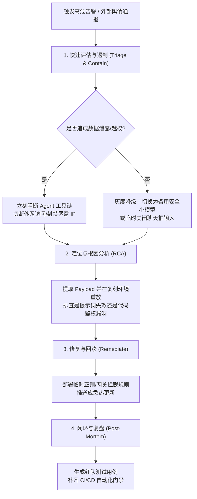

## 10.3 运行时安全与事件响应

在大模型时代，安全运营不再是单向的“事件审计”，而必须向 SRE（站点可靠性工程）与 SecOps（安全运营）紧密融合。当未知的提示注入或越狱攻击突破了前面的静态防线时，系统必须具备在运行时的“止血”与“止损”能力。

### 10.3.1 告警分级

无效或过载的告警会耗尽运营团队的精力导致“狼来了”效应。告警必须基于**业务影响（Impact）** 和 **确信度（Confidence）** 进行分级，并绑定不同的服务等级目标（SLA）：

| 级别 | 定义与判定条件 | 响应动作与 SLA |
|------|----------------|----------------|
| **P0（致命）** | **业务底线被击穿或面临大规模数据泄密**。 如：越权检测工具返回 `True` 且涉及写操作；或 DLP 探针拦截到批量用户 PII 外发。 | **自动熔断**：阻断当前用户/IP 会话，甚至降级切断大模型的所有工具调用权限。 **人工介入**：5 分钟内拉起最高级战情室（War Room）。 |
| **P1（严重）** | **检测到高置信度的恶意攻击行为**。 如：前端安全网关（分类器）连续 5 次阻断同一个来源的 Jailbreak（越狱）尝试。 | **特征限流或封禁**：在网关层触发该 IP/设备指纹的速率限制或封禁。 **人工介入**：30 分钟内值守确认。 |
| **P2（中危）** | **潜在的业务打扰或灰色地带**。 如：大模型输出了疑似不适当的内容但在低置信度区间，或发生了轻微的系统级策略绕过。 | **柔性降级**：阻断异常输出，回复用户标准安全话术“抱歉，我不明白您的意思”。 **人工介入**：每日 T+1 复盘加入测试数据集。 |
| **P3（提示）** | **探针记录的低危异常行为**。 如：用户输入包含罕见生僻字或超长无意义字符串（可能是模型试探）。 | **仅记日志（Audit Only）**：不出触发阻断，供安全大盘做趋势统计与离线分析。 |

### 10.3.2 标准事件响应剧本

面对突发的大模型安全响应事件（例如：某知名黑客在社交媒体公开了绕过贵司 AI 助手的特定 Prompt），SecOps 团队不能凭经验救火，而需要按照预定义剧本执行：

```mermaid
flowchart TD
    A["触发高危告警 / 外部舆情通报"] --> B["1. 快速评估与遏制 (Triage & Contain)"]
    B --> C{"是否造成数据泄露/越权?"}
    C -- "是" --> D["立刻阻断 Agent 工具链<br/>切断外网访问/封禁恶意 IP"]
    C -- "否" --> E["灰度降级：切换为备用安全小模型<br/>或临时关闭聊天框输入"]
    D --> F["2. 定位与根因分析 (RCA)"]
    E --> F
    F --> G["提取 Payload 并在复刻环境重放<br/>排查是提示词失效还是代码鉴权漏洞"]
    G --> H["3. 修复与回滚 (Remediate)"]
    H --> I["部署临时正则/网关拦截规则<br/>推送应急热更新"]
    I --> J["4. 闭环与复盘 (Post-Mortem)"]
    J --> K["生成红队测试用例<br/>补齐 CI/CD 自动化门禁"]
```

图 10-5：SRE/SecOps 视角下的事件响应剧本

### 10.3.3 热修复、回滚与特征封禁

大模型重新训练或微调耗时极长，发生安全事件时不可能指望立刻通过“改模型代码”来修复。系统必须预留以下速效控制手柄以备不时之需：

1. **一键阻断与特征封禁**：在 API 网关（如 Kong 或 Cloudflare AI Gateway）层预留应急黑名单接口。一旦提取出恶意 Payload 的哈希或特征字符串（如特定的虚构系统指令），立即全局封禁拦截。
2. **工具链快速降级（Fallback）**：系统架构需支持动态能力开关。当发现大模型被诱导频繁调用邮件发送接口提取内部隐私时，可通过配置中心一键将该接口的“读写”权限降级为“直接熔断”或“强制转人工审批”，力保底层数据安全。
3. **版本回滚能力**：如果确认是因为最新版本的 System Prompt 或 RAG 检索链路改动带来了意料之外的越狱漏洞，系统应具备分钟级切回上一个已知稳定版的持续交付（CD）回滚能力。

### 10.3.4 安全重放与根因分析

在事件响应的定位阶段，常需要在受控环境中重放攻击载荷以验证根因。以下是安全重放的操作规范：

**环境隔离要求**：
1. 使用完全隔离的测试环境，与生产环境无网络连通
2. 使用脱敏后的测试数据替换真实用户 PII（如用合成数据替换真实姓名、邮箱）
3. 测试环境的模型应与生产版本一致（包括 system prompt 和安全配置）
4. 所有重放操作需由至少两名安全工程师共同执行（四眼原则）

**载荷处理流程**：
- 从安全日志中提取攻击载荷时，使用哈希索引关联原始数据（参考 10.1 的分级脱敏策略）
- 对载荷进行分类分级：低风险载荷可直接重放，高风险载荷（涉及真实数据泄露、权限提升）需经安全主管审批
- 重放完成后，测试环境中的所有日志和中间数据应在 72 小时内清除

**自动化重放工具集成**：
将事件载荷自动转化为红队测试用例（参考 10.4 红队用例库），实现“事件→用例→回归测试”的闭环。

### 10.3.5 红队回归测试与无指责复盘

任何引发 P0/P1 响应的事件，在应急封堵结束后，必须执行死循环闭环落地，绝对不允许“修了就完事”：

1. **转化为自动化红队用例**：将真实世界的攻击验证 Payload 及其可能的变种，硬编码入项目的持续红队扫描库（参见 10.4 节）。
2. **设立回归门禁**：在下一次业务迭代发版前，若该分类的攻击依然能绕过现有防护，流水线必须强阻断发布。彻底杜绝旧漏洞“二度破防”。
3. **免责复盘（Blameless Post-Mortem）文化**：分析重心应放在“为什么拦截网关没发现？”“为什么越权调用没有被截断？”，而非追究某个具体 Prompt 工程师的责任。真正优秀的 SecOps 组织会不断通过惨痛教训加固 [第 8 章](../08_architecture/8.1_defense_depth.md) 所述的纵深防线。
