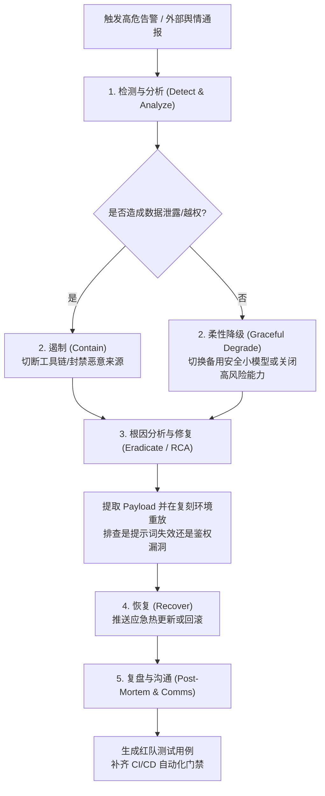
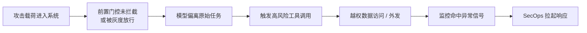
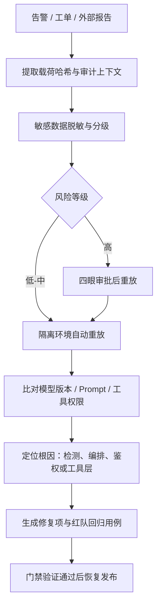

## 10.3 运行时安全与事件响应

运行时事件响应在攻击突破前置防线后遏制事态、定位根因、恢复服务并防止复发。SRE（站点可靠性工程）与 SecOps（安全运营）需要共同维护响应剧本，使停用工具、隔离数据源、回滚配置和恢复服务有明确的触发条件与责任人。

### 10.3.1 从告警到事件响应

告警触发后，SecOps/SRE 团队需要把它转化为有序的遏制、回滚、重放和复盘流程。异常检测与告警分级见上一节；下表是各级别的响应动作示例，而不是另一份独立的告警分级标准。

| 级别 | 定义与判定条件 | 响应动作与 SLA |
|------|----------------|----------------|
| P0（致命） | 业务底线被突破或面临大规模数据泄密。 如：越权检测工具返回 `True` 且涉及写操作；或 DLP 探针拦截到批量用户 PII 外发。 | 自动熔断：阻断当前用户/IP 会话，甚至降级切断大模型的所有工具调用权限。 人工介入：按最高优先级 SLA 启动战情室（War Room）。 |
| P1（严重） | 检测到高置信度的恶意攻击行为。 如：前端安全网关（分类器）连续多次阻断同一个来源的 Jailbreak（越狱）尝试。 | 特征限流或封禁：在网关层触发该 IP/设备指纹的速率限制或封禁。 人工介入：按严重等级 SLA 值守确认。 |
| P2（中危） | 潜在的业务打扰或灰色地带。 如：大模型输出了疑似不适当的内容但在低置信度区间，或发生了轻微的系统级策略绕过。 | 柔性降级：阻断异常输出，回复标准安全话术。 人工介入：纳入后续复盘与测试数据集。 |
| P3（提示） | 探针记录的低危异常行为。 如：用户输入包含罕见生僻字或超长无意义字符串（可能是模型试探）。 | 仅记日志（Audit Only）：不触发阻断，供安全大盘做趋势统计与离线分析。 |

### 10.3.2 标准事件响应剧本

面对突发的大模型安全事件（例如某知名黑客在社交媒体公开了绕过企业 AI 助手的特定 Prompt），SecOps 团队应按预定义剧本执行，而不是凭经验临场处置。剧本应覆盖五个阶段：检测与分析 → 遏制 → 根除 → 恢复 → 复盘与沟通。

```mermaid
flowchart TD
    A["触发高危告警 / 外部舆情通报"] --> B["1. 检测与分析 (Detect & Analyze)"]
    B --> C{"是否造成数据泄露/越权?"}
    C -- "是" --> D["2. 遏制 (Contain)<br/>切断工具链/封禁恶意来源"]
    C -- "否" --> E["2. 柔性降级 (Graceful Degrade)<br/>切换备用安全小模型或关闭高风险能力"]
    D --> F["3. 根因分析与修复 (Eradicate / RCA)"]
    E --> F
    F --> G["提取 Payload 并在复刻环境重放<br/>排查是提示词失效还是鉴权漏洞"]
    G --> H["4. 恢复 (Recover)<br/>推送应急热更新或回滚"]
    H --> I["5. 复盘与沟通 (Post-Mortem & Comms)"]
    I --> J["生成红队测试用例<br/>补齐 CI/CD 自动化门禁"]
```

图 10-4：SRE/SecOps 视角下的事件响应剧本

实际响应中，团队还需要从现象快速归纳出因果链，判断问题出在检测漏拦、权限失守还是工具执行面：

```mermaid
flowchart LR
    A["攻击载荷进入系统"] --> B["前置门控未拦截<br/>或被灰度放行"]
    B --> C["模型偏离原始任务"]
    C --> D["触发高风险工具调用"]
    D --> E["越权数据访问 / 外发"]
    E --> F["监控命中异常信号"]
    F --> G["SecOps 拉起响应"]
```

图 10-5：运行时事故因果链

### 10.3.3 热修复、回滚与特征封禁

大模型重新训练或微调耗时极长，发生安全事件时无法立即通过修改模型来修复，因此系统必须预留以下快速生效的控制手段：

1. 一键阻断与特征封禁：在 API 网关（如 Kong 或 Cloudflare AI Gateway）层预留应急黑名单接口。提取出恶意 Payload 的哈希或特征字符串后，可据此快速拦截。该方法只是临时缓解手段，不能作为提示注入的唯一或主要防线。
2. 工具链快速降级（Fallback）：系统架构需支持动态能力开关。当发现大模型被诱导频繁调用邮件发送接口提取内部隐私时，可通过配置中心一键将该接口的“读写”权限降级为“直接熔断”或“强制转人工审批”，保护底层数据安全。产品化的降级设计见 [10.5 节](10.5_fallback_strategy.md)。
3. 版本回滚能力：如果确认最新版本的 System Prompt 或 RAG 检索链路改动引入了意料之外的越狱漏洞，系统应具备分钟级切回上一个已知稳定版的持续交付（CD）回滚能力。

### 10.3.4 安全重放与根因分析

安全重放是指在受控环境中重放攻击载荷以验证根因，常用于事件响应的定位阶段。重放必须满足环境隔离和载荷分级审批的要求，以免再次影响生产环境。

环境隔离要求：

1. 使用完全隔离的测试环境，与生产环境无网络连通
2. 使用脱敏后的测试数据替换真实用户 PII（如用合成数据替换真实姓名、邮箱）
3. 测试环境的模型应与生产版本一致（包括 system prompt 和安全配置）
4. 所有重放操作应遵循组织定义的授权和复核流程；在高风险场景中可采用四眼原则

载荷处理流程：

- 从安全日志中提取攻击载荷时，使用哈希索引关联原始数据（参考 [10.1](10.1_monitoring.md) 的分级脱敏策略）
- 对载荷进行分类分级：低风险载荷可直接重放，高风险载荷（涉及真实数据泄露、权限提升）需经安全主管审批
- 重放完成后，测试环境中的日志和中间数据应按组织的数据保留与清理策略及时清除

为避免重放恶意载荷时再次影响生产环境，安全重放与 RCA 通常按受控流水线执行：

```mermaid
flowchart TD
    A["告警 / 工单 / 外部报告"] --> B["提取载荷哈希与审计上下文"]
    B --> C["敏感数据脱敏与分级"]
    C --> D{"风险等级"}
    D -->|低-中| E["隔离环境自动重放"]
    D -->|高| F["四眼审批后重放"]
    F --> E
    E --> G["比对模型版本 / Prompt / 工具权限"]
    G --> H["定位根因：检测、编排、鉴权或工具层"]
    H --> I["生成修复项与红队回归用例"]
    I --> J["门禁验证通过后恢复发布"]
```

图 10-6：安全重放与 RCA 流水线

重放还可以与自动化工具集成：将事件载荷自动转化为红队测试用例（参考 [10.4](10.4_red_teaming.md) 红队用例库），实现“事件→用例→回归测试”的闭环。

### 10.3.5 红队回归测试与无指责复盘

任何引发 P0/P1 响应的事件，在应急封堵结束后都必须完成以下三项闭环工作，防止同一漏洞再次被利用：

1. 转化为自动化红队用例：将真实攻击中验证过的 Payload 及其可能的变种固化到项目的持续红队扫描库（参见 [10.4](10.4_red_teaming.md) 节）。
2. 设立回归门禁：在下一次业务迭代发版前，若该分类的攻击依然能绕过现有防护，流水线必须阻断发布，防止旧漏洞再次被利用。
3. 无指责复盘（Blameless Post-Mortem）文化：分析重点是拦截网关为什么没有发现、越权调用为什么没有被截断，而非追究某个具体 Prompt 工程师的责任。SecOps 组织应借每次事件的教训持续加固 [第 8 章](../08_architecture/8.1_defense_depth.md) 所述的纵深防线。
