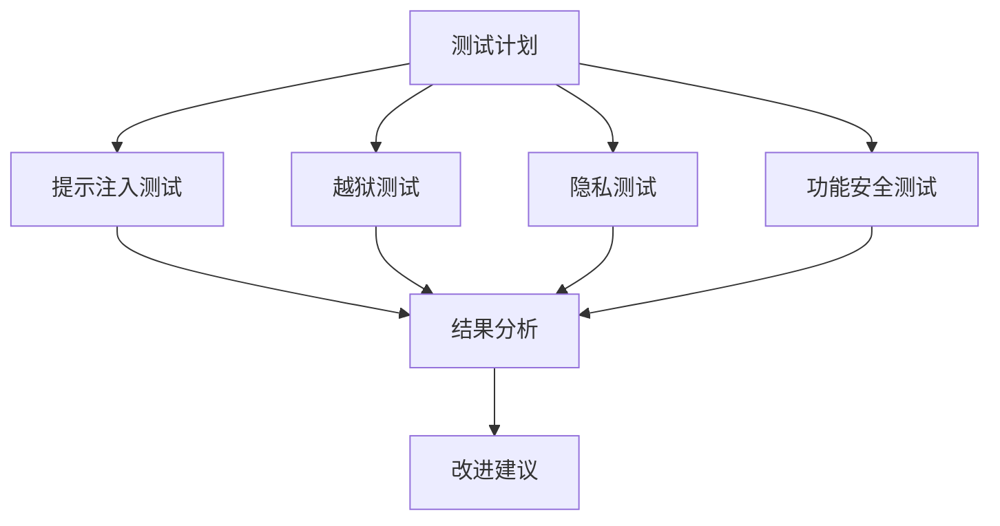
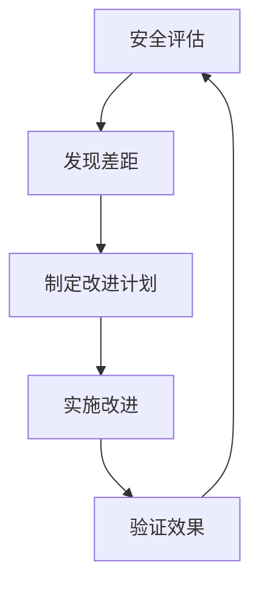

## 10.4 持续安全评估

安全是一个持续过程，需要定期评估和改进。

### 10.4.1 评估周期

**评估类型和频率**：

| 评估类型 | 频率 | 内容 |
|----------|------|------|
| 日常扫描 | 每日 | 自动化漏洞扫描 |
| 周度审查 | 每周 | 安全指标审查 |
| 月度评估 | 每月 | 综合安全评估 |
| 季度测试 | 每季 | 渗透测试/红队 |
| 年度审计 | 每年 | 全面安全审计 |

### 10.4.2 安全测试

**LLM 安全测试框架**：

图 10-1：安全测试流程图

**测试工具**：

| 工具 | 功能 |
|------|------|
| Garak | LLM 漏洞扫描 |
| promptfoo | Prompt 测试 |
| PyRIT | 红队自动化 |
| HarmBench/StrongREJECT 等基准 | 越狱与拒答鲁棒性评估 |
| 自定义脚本 | 业务特定测试 |

### 10.4.3 红队演练

**红队目标**：

- 发现未知漏洞
- 验证防御有效性
- 测试响应能力
- 提升安全意识

**演练流程**：

1. 制定演练方案
2. 明确范围和规则
3. 实施攻击模拟
4. 记录发现
5. 输出报告
6. 跟踪改进

### 10.4.4 安全度量

**关键安全指标**：

| 指标 | 描述 | 目标 |
|------|------|------|
| 漏洞修复时间 | 平均修复周期 | < 7 天 |
| 安全事件数 | 月度事件数量 | 趋势下降 |
| 防护成功率 | 攻击成功被阻止比例 | > 95% |
| 安全培训覆盖 | 员工培训比例 | 100% |

### 10.4.5 合规审计

**常见合规要求**：

| 标准 | 关键要求 |
|------|----------|
| SOC 2 | 安全控制、可用性 |
| ISO 27001 | 信息安全管理 |
| GDPR | 数据保护 |
| AI 法规 | AI 特定要求 |

**审计准备**：

1. 政策文档完善
2. 控制措施实施
3. 证据材料收集
4. 问题整改跟踪

### 10.4.6 持续改进机制

图 10-2：持续改进机制流程图

**改进来源**：

- 安全测试发现
- 事件复盘教训
- 威胁情报更新
- 合规要求变化
- 技术能力提升

持续安全评估确保安全能力与威胁态势同步演进。
