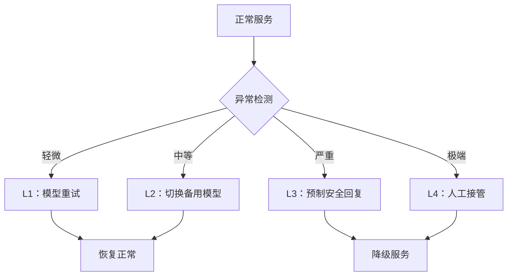
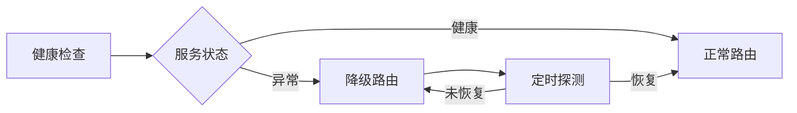

## 10.5 服务降级与 Fallback 策略

当 LLM 系统遭受攻击、模型服务异常或安全策略触发阻断时，系统需要一套完善的降级与 Fallback 机制，确保业务连续性和用户体验不被严重破坏。

### 10.5.1 为什么需要降级策略

传统 Web 服务的降级通常是“返回缓存/静态页面”，但 LLM 系统的降级更复杂：

| 场景 | 传统 Web 降级 | LLM 系统降级 |
|------|--------------|-------------|
| 服务不可用 | 返回缓存页面 | 返回预制安全回复 |
| 输入异常 | 返回 400 错误 | 需要自然语言解释拒绝原因 |
| 输出有毒 | 过滤/替换 | 需要重新生成或切换模型 |
| 安全策略触发 | 拦截请求 | 需要平滑过渡，避免暴露防御细节 |

**核心原则**：即使系统处于降级状态，也要向用户提供有意义的、安全的响应，而不是错误栈或静默失败。

### 10.5.2 降级层级设计

下面的 `L1-L4` 更适合作为**示例性分层策略**或一个常见降级框架。具体层级、触发条件、是否切换模型，仍需按业务风险、依赖关系、权限范围和 SLO 单独设计。



图 10-8：降级层级设计流程图

**各层级说明**
| 层级 | 触发条件 | 响应方式 | 恢复策略 |
|------|----------|----------|----------|
| L1 模型重试 | 超时、格式异常 | 重新生成（可调低温度） | 自动恢复 |
| L2 备用模型 | 主模型不可用、持续异常 | 切换到备用模型或简化模型 | 主模型恢复后自动切回 |
| L3 预制回复 | 安全策略触发、输出有毒 | 返回预定义的安全话术 | 人工审核后恢复 |
| L4 人工接管 | 高危攻击、系统性故障 | 转交人工客服或运营团队 | 故障排除后恢复 |

### 10.5.3 预制安全回复设计

预制回复是降级策略的核心组件。设计要点：

**分场景预制**
```text
场景：输入被检测为注入攻击
回复："抱歉，我无法处理该请求。请尝试重新描述您的问题。
       如需帮助，请联系客服。"

场景：输出安全审核未通过
回复："抱歉，我暂时无法回答这个问题。
       您可以尝试换一种方式提问，或咨询相关专业人士。"

场景：模型服务不可用
回复："系统正在维护中，预计很快恢复。
       您可以稍后再试，或通过其他渠道联系我们。"
```

**设计原则**
| 原则 | 说明 |
|------|------|
| 不暴露细节 | 不告知用户具体触发了哪条安全规则 |
| 提供替代方案 | 引导用户使用其他渠道或重新提问 |
| 语气友好 | 避免生硬的错误信息，保持品牌一致性 |
| 可配置 | 不同业务线可定制回复内容 |

### 10.5.4 自动降级与恢复



图 10-9：自动降级与恢复流程图

**实现要点**
```python
class FallbackManager:
    def __init__(self):
        self.fallback_level = 0  # 当前降级层级
        self.error_window = []   # 滑动窗口错误计数
        self.canned_responses = load_canned_responses()

    def handle_request(self, request: Request) -> Response:
        if self.fallback_level >= 3:
            return self.get_canned_response(request.category)

        try:
            response = self.primary_model.generate(request)

            # 输出安全检查
            if not self.safety_check(response):
                return self.get_canned_response(request.category)

            self.record_success()
            return response

        except ModelUnavailableError:
            self.record_failure()
            return self.escalate_fallback(request)

    def escalate_fallback(self, request: Request) -> Response:
        self.fallback_level = min(self.fallback_level + 1, 4)

        if self.fallback_level == 1:
            return self.retry_with_lower_temperature(request)
        elif self.fallback_level == 2:
            return self.use_backup_model(request)
        elif self.fallback_level == 3:
            return self.get_canned_response(request.category)
        else:
            return self.route_to_human(request)
```

### 10.5.5 降级监控与告警

降级本身需要被监控，避免系统长期处于降级状态而无人知晓：

| 监控指标 | 示例阈值 | 说明 |
|----------|----------|------|
| 降级触发次数/分钟 | 按 error budget / 攻击基线设定 | 可能遭受持续攻击 |
| 降级持续时间 | 按 SLO 和恢复目标设定 | 需要人工介入排查 |
| 预制回复占比 | 按用户体验预算设定 | 用户体验明显受损 |
| 人工接管队列长度 | 按运营容量设定 | 运营资源不足 |

降级策略是 LLM 安全运营中“最后一道防线”。一个好的降级机制不仅能在攻击发生时保护系统，更能在日常运营中为不可预见的模型异常提供安全兜底。

### 10.5.6 终极兜底机制

当 L1-L4 所有降级层均失败时，系统需要一个终极安全网（Ultimate Safety Net）：

**设计原则**：
1. **优先最小化风险**：终极兜底的目标不是维持完整服务，而是避免高风险动作和误导性输出
2. **静态化回复**：使用完全预制的静态消息，不涉及任何模型推理，避免因模型故障产生不可预期的输出
3. **自动降级到非 AI 模式**：如提供传统的搜索/FAQ 界面，或直接转接人工

**终极兜底回复模板**：
```text
非常抱歉，系统当前无法处理您的请求。
您可以：
1. 稍后重试
2. 联系人工客服：[客服渠道]
3. 查阅帮助文档：[文档链接]

请求编号：[request_id]（如需反馈请提供此编号）
```

**服务降级决策矩阵**：

| 失败场景 | 用户影响 | 决策 |
|---------|---------|------|
| 单次请求超时 | 低 | L1 重试 |
| 主模型连续失败 | 中 | L2 备用模型 |
| 所有模型不可用 | 高 | L3 预制回复 |
| 安全组件失效 | 极高 | L4 人工接管 |
| 全面服务故障 | 极高 | 终极兜底：静态页面 + 人工转接 |

**监控与恢复**：
- 进入终极兜底状态后，应按影响范围和严重性评估升级级别，并激活所需值班与业务负责人
- 因可用性故障失败的请求，可在恢复后按幂等性和用户同意策略重试；因安全拦截或审批失败而被拒绝的请求，不应自动重放
- 恢复探测频率应可配置，并结合 failure threshold、探测成本和多地域探针行为确定
