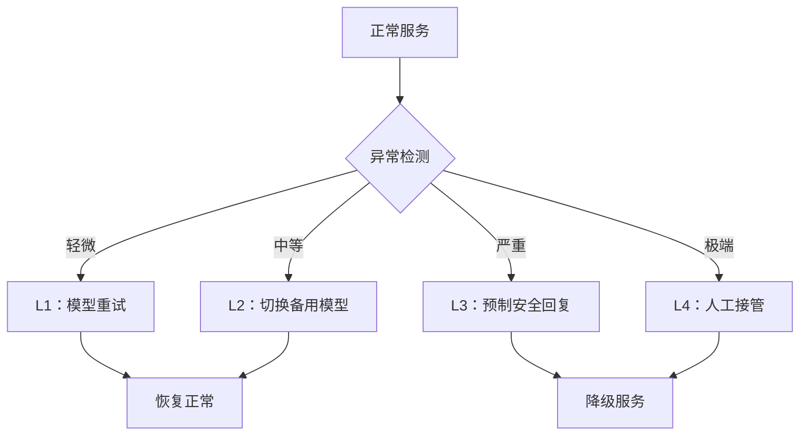
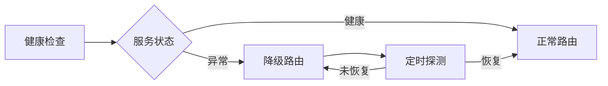

## 10.5 服务降级与 Fallback 策略

当 LLM 系统遭受攻击、模型服务异常或安全策略触发阻断时，系统需要一套完善的降级与 Fallback 机制，确保业务连续性和用户体验不被严重破坏。

### 10.5.1 为什么需要降级策略

传统 Web 服务的降级通常是"返回缓存/静态页面"，但 LLM 系统的降级更复杂：

| 场景 | 传统 Web 降级 | LLM 系统降级 |
|------|--------------|-------------|
| 服务不可用 | 返回缓存页面 | 返回预制安全回复 |
| 输入异常 | 返回 400 错误 | 需要自然语言解释拒绝原因 |
| 输出有毒 | 过滤/替换 | 需要重新生成或切换模型 |
| 安全策略触发 | 拦截请求 | 需要平滑过渡，避免暴露防御细节 |

**核心原则**：即使系统处于降级状态，也要向用户提供有意义的、安全的响应，而不是错误栈或静默失败。

### 10.5.2 降级层级设计



图 10-7：降级层级设计流程图

**各层级说明**
| 层级 | 触发条件 | 响应方式 | 恢复策略 |
|------|----------|----------|----------|
| L1 模型重试 | 超时、格式异常 | 重新生成（可调低温度） | 自动恢复 |
| L2 备用模型 | 主模型不可用、持续异常 | 切换到备用模型或简化模型 | 主模型恢复后自动切回 |
| L3 预制回复 | 安全策略触发、输出有毒 | 返回预定义的安全话术 | 人工审核后恢复 |
| L4 人工接管 | 高危攻击、系统性故障 | 转交人工客服或运营团队 | 故障排除后恢复 |

### 10.5.3 预制安全回复设计

预制回复是降级策略的核心组件。设计要点：

**分场景预制**
```
场景：输入被检测为注入攻击
回复："抱歉，我无法处理该请求。请尝试重新描述您的问题。
       如需帮助，请联系客服。"

场景：输出安全审核未通过
回复："抱歉，我暂时无法回答这个问题。
       您可以尝试换一种方式提问，或咨询相关专业人士。"

场景：模型服务不可用
回复："系统正在维护中，预计很快恢复。
       您可以稍后再试，或通过其他渠道联系我们。"
```

**设计原则**
| 原则 | 说明 |
|------|------|
| 不暴露细节 | 不告知用户具体触发了哪条安全规则 |
| 提供替代方案 | 引导用户使用其他渠道或重新提问 |
| 语气友好 | 避免生硬的错误信息，保持品牌一致性 |
| 可配置 | 不同业务线可定制回复内容 |

### 10.5.4 自动降级与恢复



图 10-8：自动降级与恢复流程图

**实现要点**
```python
class FallbackManager:
    def __init__(self):
        self.fallback_level = 0  # 当前降级层级
        self.error_window = []   # 滑动窗口错误计数
        self.canned_responses = load_canned_responses()

    def handle_request(self, request: Request) -> Response:
        if self.fallback_level >= 3:
            return self.get_canned_response(request.category)

        try:
            response = self.primary_model.generate(request)

            # 输出安全检查
            if not self.safety_check(response):
                return self.get_canned_response(request.category)

            self.record_success()
            return response

        except ModelUnavailableError:
            self.record_failure()
            return self.escalate_fallback(request)

    def escalate_fallback(self, request: Request) -> Response:
        self.fallback_level = min(self.fallback_level + 1, 4)

        if self.fallback_level == 1:
            return self.retry_with_lower_temperature(request)
        elif self.fallback_level == 2:
            return self.use_backup_model(request)
        elif self.fallback_level == 3:
            return self.get_canned_response(request.category)
        else:
            return self.route_to_human(request)
```

### 10.5.5 降级监控与告警

降级本身需要被监控，避免系统长期处于降级状态而无人知晓：

| 监控指标 | 告警阈值 | 说明 |
|----------|----------|------|
| 降级触发次数/分钟 | > 10 | 可能遭受持续攻击 |
| 降级持续时间 | > 5 分钟 | 需要人工介入排查 |
| 预制回复占比 | > 20% | 用户体验严重受损 |
| 人工接管队列长度 | > 50 | 运营资源不足 |

降级策略是 LLM 安全运营中"最后一道防线"。一个好的降级机制不仅能在攻击发生时保护系统，更能在日常运营中为不可预见的模型异常提供安全兜底。
