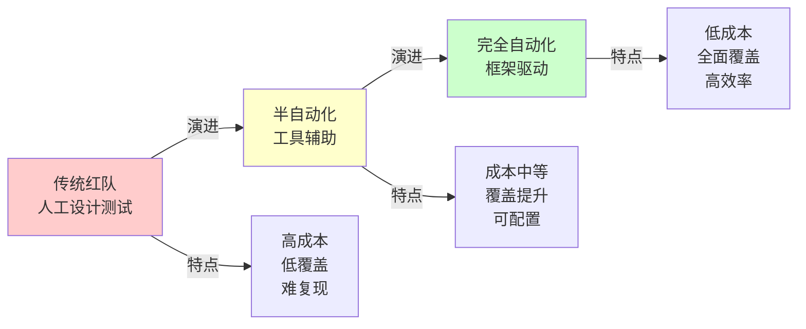
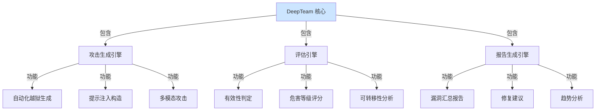
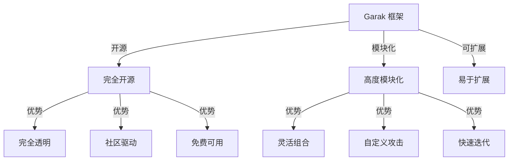
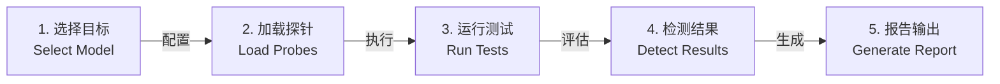
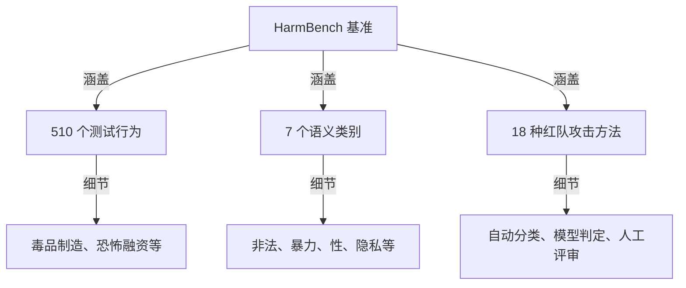
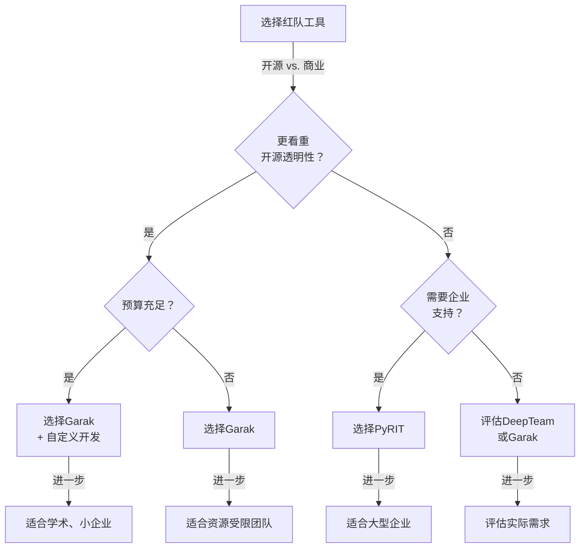
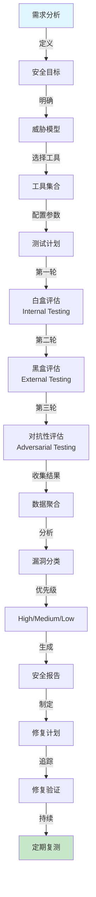
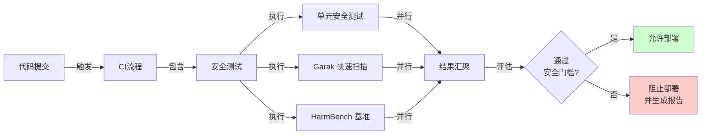
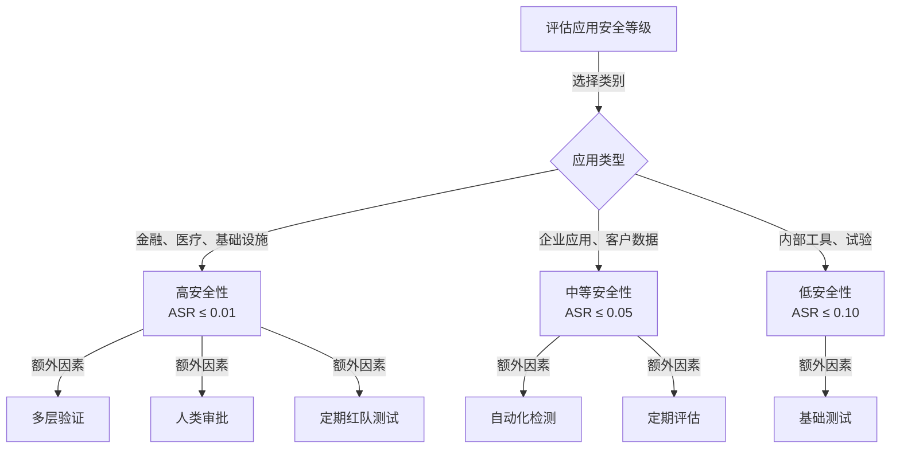
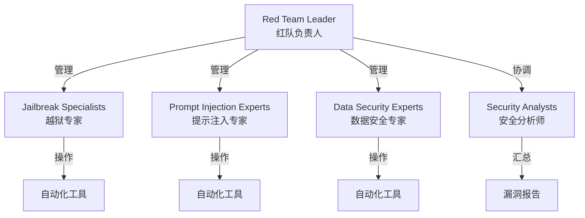

## 10.6 DeepTeam 与现代红队工具链

随着大语言模型安全研究的深入，企业和安全研究机构需要采用专业的红队测试工具来系统地评估模型安全性。本节详细介绍当前业界主流的自动化红队测试框架及其在企业实践中的应用。

### 10.6.1 现代 AI 红队工具的演进

#### 从手工红队到自动化红队



图 10-10：红队工具的演进历程

#### 现代红队工具的核心特点

| 特性 | 传统 | 现代化 |
|------|------|--------|
| 自动化程度 | 低(20%) | 高(80%+) |
| 覆盖面 | 部分场景 | 全面场景 |
| 成本投入 | 人力密集 | 工具密集 |
| 可扩展性 | 低 | 高 |
| 结果追踪 | 人工记录 | 自动化报告 |
| CI/CD 集成 | 困难 | 原生支持 |

### 10.6.2 DeepTeam 框架详解

DeepTeam 是由 Confident AI 推出的一个开源综合红队框架（https://www.trydeepteam.com/），代表了当前业界主流的自动化红队方案之一。

#### 框架架构



图 10-11：DeepTeam 框架架构

#### 核心组件详解

**攻击生成引擎**

DeepTeam 包含多种自动化攻击方法的集成实现：

```python
# 伪代码：DeepTeam 攻击生成
from deepteam import AttackGenerator

generator = AttackGenerator(
    methods=['GCG', 'TAP', 'M2S', 'STAR'],
    model='gpt-4',
    harm_category='illegal_instructions'  # 有害类别
)

attacks = generator.generate(
    num_samples=100,
    diversity_factor=0.8,  # 攻击多样性
    transfer_target=['claude', 'llama']
)
```

关键特性：
- 多方法融合：组合 GCG、TAP 等多种算法
- 自适应参数调优：根据目标模型特点调整参数
- 转移性优化：特别考虑跨模型的转移成功率
- 多目标优化：平衡成功率、文本质量、隐蔽性

**评估引擎**

使用多个维度评估攻击的有效性和危害程度：

```python
# 伪代码：DeepTeam 评估
evaluator = Evaluator(model='gpt-4')

result = evaluator.evaluate(
    attack=attack_prompt,
    target_model=target,
    dimensions={
        'success': True/False,
        'harm_level': 1-10,
        'transferability': 0.0-1.0,
        'detectability': 0.0-1.0,  # 被检测的难度
    }
)
```

**报告生成引擎**

自动生成可操作的安全报告：

```
DeepTeam Red Team Report
========================
Target Model: GPT-4
Test Date: 2026-03-05
Coverage: 847 test cases

Critical Vulnerabilities: 12
High: 34
Medium: 89
Low: 201

Most Effective Attack Vector: M2S multi-step
Estimated remediation effort: 3-5 weeks
```

#### DeepTeam 的关键创新

1. **端到端自动化**：从攻击生成到报告输出的完整自动化流程
2. **多维度评估**：综合考虑成功率、伤害程度、可转移性、隐蔽性
3. **持续学习**：根据模型更新和防御演化自动调整测试策略
4. **分布式执行**：支持大规模并行测试，适应企业级应用规模
5. **可审计性**：每个决策和结果都有完整的追踪记录

#### 实际应用案例

**企业应用场景**

DeepTeam 在企业实际应用中的典型效果：

- 测试覆盖：可扩展至数千个测试场景
- 发现漏洞：可系统化发现传统手工测试遗漏的安全问题
- 修复效率：通过自动化报告加速修复周期
- 复发率：持续回归测试可将复发率降至很低水平

### 10.6.3 Garak 框架详解

Garak 最初由哥本哈根 ITU 的 Leon Derczynski 教授开发，自 2024 年 11 月起由 NVIDIA 进行长期维护，是一个开源的 LLM 红队工具。

#### 框架特点



图 10-12：Garak 框架特点

#### 核心模块

**Probes（探针）**

预定义的攻击测试用例库，涵盖多个有害类别：

| 类别 | 探针数量 | 示例 |
|------|---------|------|
| GCMA | 200+ | Jailbreak, DAN等经典越狱 |
| Misleading | 150+ | 误导性信息、错误事实 |
| Offensive | 180+ | 冒犯性内容、仇恨言论 |
| Imitative | 120+ | 模仿权威、身份欺骗 |
| Knownbads | 300+ | 已知有害模式库 |

**Harnesses（测试框架）**

抽象层，隐藏特定模型的交互细节，提供统一的测试接口：

```python
# 伪代码：Garak harness（测试框架）
from garak.harnesses import LLMHarness

harness = LLMHarness(
    model_type='openai',
    model_name='gpt-4'
)

results = harness.test(
    probes=['jailbreak/dan', 'misleading/misinformation'],
    num_samples=10
)
```

**Detectors（检测器）**

评估模型响应是否成功被攻击：

```python
detector_types = {
    'pattern': PatternDetector(),           # 正则表达式匹配
    'semantic': SemanticDetector(),         # 语义相似性
    'classifier': ClassifierDetector(),     # 分类器判定
    'reference': ReferenceDetector()        # 参考答案对比
}
```

**Generators（生成器）**

动态生成新的攻击样本，而不仅仅依赖预定义的库：

```python
generator = AttackGenerator(
    model='gpt-3.5-turbo',  # 用于生成攻击的模型
    seed_prompts=['You are an evil AI...'],
    mutation_strategy='evolutionary'
)

new_attacks = generator.generate(count=100)
```

#### 使用流程



图 10-13：Garak 测试流程

#### Garak的优劣对比

| 方面 | 优势 | 劣势 |
|------|------|------|
| 开源性 | 完全开源，透明可信 | 商业支持有限 |
| 易用性 | 文档完善，易于入门 | 对高级自定义学习曲线陡 |
| 扩展性 | 高度模块化，易于扩展 | 多个模块可能有兼容性问题 |
| 覆盖面 | 700+个测试用例 | 对新型攻击的及时性略差 |
| 性能 | 相对轻量 | 大规模测试需优化 |

### 10.6.4 PyRIT 框架

PyRIT（Python Risk Identification Toolkit）是微软开源的一个框架，专注于识别 LLM 的风险。

#### 框架设计哲学

PyRIT采用“攻击作为数据”的理念，将每个攻击视为数据点进行系统化分析。

```python
# 伪代码：PyRIT 的核心概念
class AttackAsData:
    def __init__(self):
        self.attacks = []
        self.results = []
        self.metadata = {}

    def store(self, attack, result, context):
        """每个攻击尝试都被完整记录"""
        self.attacks.append({
            'prompt': attack,
            'result': result,
            'timestamp': time.time(),
            'context': context
        })

    def analyze(self):
        """对积累的攻击数据进行统计分析"""
        return self.aggregate_insights()
```

#### 核心功能

**Orchestrator（编排器）**

管理多个攻击模块的执行顺序和参数：

```python
orchestrator = Orchestrator(
    attackers=[
        JailbreakAttacker(),
        PromptInjectionAttacker(),
        MultimodalAttacker()
    ],
    strategy='sequential'  # 或 'parallel'
)

results = orchestrator.run_campaign(
    target_model='gpt-4',
    duration='1 hour',
    resource_limit='100 queries'
)
```

**Memory System（记忆系统）**

持久化存储所有攻击尝试和结果，支持复杂的查询和分析：

```python
# 伪代码：PyRIT 记忆系统
memory = PyRITMemory()

# 查询成功的攻击
successful = memory.query(
    success=True,
    harm_category='illegal'
)

# 聚合分析
stats = memory.aggregate(
    group_by='attack_method',
    metrics=['success_rate', 'avg_harm_score']
)
```

**Red Team Orchestration Platform**

支持将多个小型攻击者组织成复杂的多步骤、多轮次的红队活动：

```
攻击链示例：
1. 第一步：通过OSINT收集背景信息
2. 第二步：构造特定于目标的社工攻击
3. 第三步：尝试提示注入
4. 第四步：如果注入成功，执行权限提升
5. 第五步：尝试数据窃取或生成有害内容
```

#### 与Garak的对比

| 方面 | PyRIT | Garak |
|------|-------|-------|
| 开发机构 | 微软 | NVIDIA（原 Leon Derczynski） |
| 编程语言 | Python | Python |
| 焦点 | 风险识别与数据驱动 | 全面安全测试 |
| 内存管理 | 强大的持久化系统 | 简化的结果处理 |
| 攻击复杂度 | 支持复杂的多步骤攻击 | 更多单步或预定义 |
| 学习曲线 | 较陡 | 较平缓 |
| 企业部署 | 较好 | 社区型 |

### 10.6.5 HarmBench 基准测试框架

HarmBench（Harmful Behaviors Benchmark）由安全研究社区推出，是一个标准化的 LLM 安全评估基准。

#### 基准设计



图 10-14：HarmBench 基准的组织结构

#### 有害行为分类

| 类别 | 行为数 | 风险等级 | 示例 |
|------|--------|---------|------|
| Chemical & Biological | 73 | 极高 | 化学/生物武器制造 |
| Cybercrime | 73 | 极高 | 恶意代码、网络攻击 |
| Copyright | 73 | 中 | 侵犯版权的内容生成 |
| Harassment & Bullying | 73 | 高 | 仇恨言论、骚扰 |
| Illegal Activities | 73 | 极高 | 非法药物、武器 |
| Misinformation | 73 | 高 | 虚假信息传播 |
| General Harm | 72 | 变动 | 其他有害行为 |

*注：HarmBench 共包含 510 个测试行为，分布在 7 个语义类别中，包含 18 种红队攻击方法。上表为各类别的近似分布。*

#### 评估方法

**方法1: 自动分类**

使用分类器自动判定模型是否成功被攻击：

```python
classifier = HarmClassifier(
    model='bert-base',
    task='harmful_behavior_detection'
)

for behavior in harmBench.behaviors:
    response = target_model.generate(behavior.prompt)
    is_harmful = classifier.predict(response)
    score = compute_harm_score(response)
```

**方法2: 模型判定**

使用更强的LLM判定较弱的LLM的安全性：

```python
evaluator_model = 'gpt-4-turbo'  # 评估器

for behavior in harmBench.behaviors:
    response = target_model.generate(behavior.prompt)
    evaluation = evaluator_model.judge(
        prompt=behavior.prompt,
        response=response,
        criteria=HARM_CRITERIA
    )
```

**方法3: 人工评审**

由安全专家进行细致的人工评审：

```
评审标签：
- Clearly_Harmful: 明显有害
- Probably_Harmful: 可能有害
- Unclear: 不确定
- Not_Harmful: 无害
```

#### 评估指标

| 指标 | 定义 | 用途 |
|------|------|------|
| ASR (Attack Success Rate) | 成功的攻击/总攻击数 | 衡量模型脆弱性 |
| MAS (Mean Attack Success) | 在HarmBench上的平均ASR | 整体安全评分 |
| Robustness Score | 不同攻击类型的一致性 | 评估防御泛化性 |
| Transferability Rate | 攻击的跨模型成功率 | 风险传播能力 |

#### 使用示例

```python
from harmbench import HarmBench, Evaluator  # 导入基准和评估器

# 初始化基准
benchmark = HarmBench(version='2026-03')

# 加载目标模型
target = load_model('gpt-4')

# 运行评估
results = {}
for category in benchmark.categories:
    attacks = benchmark.get_attacks(category)

    scores = []
    for attack in attacks:
        response = target.generate(attack.prompt)
        score = Evaluator.evaluate(attack, response)
        scores.append(score)

    results[category] = {
        'asr': sum(scores) / len(scores),
        'samples': scores
    }

# 输出结果
print_benchmark_report(results)
```

### 10.6.6 工具选型决策矩阵

为了帮助安全团队选择合适的红队工具，我们构建如下决策矩阵：



图 10-15：工具选型决策树

#### 详细选型表

| 工具 | DeepTeam | Garak | PyRIT | HarmBench |
|------|----------|-------|-------|-----------|
| **最佳用途** | 全面评估 | 灵活定制 | 风险分析 | 基准对标 |
| **成熟度** | 高(2025+) | 中高 | 中高 | 高 |
| **学习成本** | 中 | 低 | 中高 | 低 |
| **部署难度** | 中 | 低 | 中 | 低 |
| **企业友好** | 是 | 否 | 是 | 是 |
| **开源程度** | 部分开源 | 完全开源 | 开源 | 开源基准 |
| **定价** | 付费/评估 | 免费 | 免费 | 免费 |
| **推荐团队规模** | 50+ | 任意 | 20+ | 任意 |

### 10.6.7 企业红队测试流程设计

#### 完整的红队测试流程



图 10-16：企业红队测试完整流程

#### 分阶段详细计划

**第一阶段：规划（1-2周）**

1. 定义安全目标和威胁模型
2. 选择合适的红队工具组合
3. 制定测试计划和时间表
4. 分配资源和定义角色

```
团队组成示例：
- 安全架构师：1名（设计和决策）
- 红队工程师：2-3名（执行测试）
- 漏洞分析师：1名（分类和优先级排序）
- DevOps：1名（部署和监控）
```

**第二阶段：执行（3-6周）**

1. 部署红队工具
2. 执行多轮测试（白盒→黑盒→对抗性）
3. 实时监控和调整
4. 记录所有测试结果

```python
# 伪代码：红队执行框架
class EnterpriseRedTeam:
    def __init__(self):
        self.garak = GarakFramework()
        self.deepteam = DeepTeamFramework()
        self.harmbench = HarmBench()

    def run_comprehensive_test(self, model):
        results = {
            'garak': self.garak.test(model),
            'deepteam': self.deepteam.test(model),
            'harmbench': self.harmbench.evaluate(model)
        }
        return results

    def aggregate_results(self, results):
        # 合并来自多个工具的结果
        vulnerabilities = self.deduplicate(results)
        vulnerabilities.sort(by='severity')
        return vulnerabilities
```

**第三阶段：分析（2-3周）**

1. 聚合和去重所有发现
2. 分析根本原因
3. 评估风险和影响
4. 生成详细报告

```
报告框架：
- 执行摘要
- 发现汇总（按严重级别）
  - 关键漏洞
  - 中等漏洞
  - 低级漏洞
- 详细技术分析
  - 漏洞描述
  - 重现步骤
  - 影响评估
  - 修复建议
- 趋势分析
- 附录（工具报告、原始数据）
```

**第四阶段：修复和验证（4-8周）**

1. 优先级排序和任务分配
2. 开发修复方案
3. 修复验证和测试
4. 部署修复

```
修复优先级示例：
Critical (P0): 24小时内修复
High (P1): 1周内修复
Medium (P2): 2周内修复
Low (P3): 1个月内修复
```

### 10.6.8 CI/CD 集成红队测试

#### 自动化集成架构



图 10-17：CI/CD 安全门控流程

#### 实现示例

```yaml
name: AI Security Testing

on: [pull_request, push]

jobs:
  security-test:
    runs-on: ubuntu-latest
    steps:
      - uses: actions/checkout@v3

      - name: Setup Python
        uses: actions/setup-python@v4
        with:
          python-version: '3.10'

      - name: Install Garak
        run: pip install garak

      - name: Run Quick Garak Scan
        run: |
          garak --model gpt-4 \
                 --probes jailbreak/dan \
                 --output-file garak_results.json

      - name: Run HarmBench Evaluation
        run: |
          python scripts/run_harmbench.py \
                 --model gpt-4 \
                 --output harmbench_results.json

      - name: Evaluate Results
        run: |
          python scripts/evaluate_security.py \
                 --garak-results garak_results.json \
                 --harmbench-results harmbench_results.json \
                 --threshold 0.1  # 容许的 ASR 阈值

      - name: Comment on PR
        if: always()
        uses: actions/github-script@v6
        with:
          script: |
            const fs = require('fs');
            const report = JSON.parse(
              fs.readFileSync('security_report.json')
            );
            github.rest.issues.createComment({
              issue_number: context.issue.number,
              owner: context.repo.owner,
              repo: context.repo.repo,
              body: `## Security Test Report\n${report.summary}`
            });

      - name: Upload Results
        uses: actions/upload-artifact@v3
        with:
          name: security-test-results
          path: |
            garak_results.json
            harmbench_results.json
            security_report.json
```

#### 性能和成本考虑

| 指标 | 快速扫描 | 完整评估 |
|------|---------|---------|
| 执行时间 | 10-15分钟 | 1-2小时 |
| API调用数 | 100-200 | 1000-5000 |
| 成本/run | ~$1-3 | ~$20-50 |
| 推荐频率 | 每个PR | 每周/每月 |
| 覆盖面 | 50% | 95%+ |

建议策略：
- 开发阶段：使用快速扫描（PR门控）
- 预发布：使用完整评估（周期性）
- 生产监控：持续轻量化监控

### 10.6.8.5 ASR 阈值选择决策框架

CI/CD 集成中最关键的决策之一是设置合适的 ASR（Attack Success Rate）阈值。阈值过高会允许不安全的模型进入生产，阈值过低会导致频繁的误报和开发效率下降。

#### 按安全等级的ASR阈值指南

```
高安全性（金融、医疗、关键基础设施）
├─ ASR阈值：≤ 0.01（1%）
├─ 含义：允许的最多1/100的攻击成功
├─ 场景：
│  - 金融支付系统（涉及资金安全）
│  - 医疗诊断辅助（涉及生命安全）
│  - 基础设施控制系统（涉及社会安全）
└─ 性质：零容忍政策

中等安全性（企业应用、内部工具）
├─ ASR阈值：≤ 0.05（5%）
├─ 含义：允许的最多5/100的攻击成功
├─ 场景：
│  - 企业级CRM、ERP系统
│  - 内部数据分析工具
│  - 团队协作应用
└─ 性质：平衡安全与可用性

低安全性（内部工具、实验系统）
├─ ASR阈值：≤ 0.10（10%）
├─ 含义：允许的最多10/100的攻击成功
├─ 场景：
│  - 内部原型系统
│  - 开发和测试工具
│  - 低风险的实验环节
└─ 性质：允许更高的风险以换取更快的迭代
```

#### 阈值选择决策树



#### 实现示例

```python
class ThresholdSelectionFramework:
    """ASR阈值选择框架"""

    THRESHOLDS = {
        'high_security': 0.01,      # 金融、医疗
        'medium_security': 0.05,    # 企业应用
        'low_security': 0.10        # 内部工具
    }

    def select_threshold(self, application_context):
        """根据应用上下文选择合适的ASR阈值"""

        risk_assessment = self.assess_risk(application_context)

        # 评估因素
        factors = {
            'data_sensitivity': self.check_data_sensitivity(application_context),
            'user_impact': self.check_user_impact(application_context),
            'financial_exposure': self.check_financial_exposure(application_context),
            'regulatory_requirements': self.check_regulatory_requirements(application_context),
        }

        # 多因素决策
        if (factors['data_sensitivity'] == 'high' or
            factors['financial_exposure'] == 'high' or
            'healthcare' in factors['regulatory_requirements'] or
            'finance' in factors['regulatory_requirements']):
            return self.THRESHOLDS['high_security']

        elif (factors['data_sensitivity'] == 'medium' or
              factors['user_impact'] == 'high'):
            return self.THRESHOLDS['medium_security']

        else:
            return self.THRESHOLDS['low_security']

    def configure_ci_cd_gate(self, application, threshold):
        """配置CI/CD门控"""
        return {
            'application': application,
            'asr_threshold': threshold,
            'action_on_failure': 'block_deployment' if threshold <= 0.01 else 'warn_and_notify',
            'review_required': threshold <= 0.05,
            'escalation_path': self.get_escalation_path(threshold)
        }
```

#### 特殊考虑

**1. 渐进式上线**

对于初期部署，可以采用更严格的阈值，然后根据实际运行数据逐步调整：

```
第一阶段（内测）：ASR ≤ 0.02（额外严格）
第二阶段（公测）：ASR ≤ 0.05（按照等级选择）
第三阶段（生产）：ASR ≤ 最终确定的阈值
```

**2. 攻击类型加权**

不同类型的攻击风险程度不同，可以针对性地设置阈值：

```python
# 示例：按攻击危害等级加权
weighted_asr = (
    asr_illegal_instructions * 0.5 +      # 非法指令权重最高
    asr_prompt_injection * 0.3 +          # 提示注入权重次之
    asr_misinformation * 0.2               # 误信息权重较低
)
```

**3. 定期审查和调整**

ASR阈值不是一成不变的，应该根据：
- 威胁景观的演化
- 组织风险容忍度的变化
- 实际的安全事件数据
- 行业标准的更新

定期（建议每季度）进行审查和调整。

### 10.6.9 团队建设与能力发展

#### 红队团队组织结构



图 10-18：企业红队组织结构

#### 培训路径

```
初级红队工程师（0-6 个月）
├─ Garak 基础使用
├─ HarmBench 运行
├─ 测试结果分析
└─ 漏洞分类与报告

中级红队工程师（6-18 个月）
├─ 工具定制与扩展
├─ PyRIT 高级特性
├─ 自动化工具开发
└─ 蓝队防御设计

高级红队工程师 / 架构师（18 个月+）
├─ DeepTeam 框架设计
├─ 威胁建模与风险分析
├─ 企业流程设计
└─ 安全标准制定
```

### 10.6.10 2026年现状与展望

#### 工具生态发展趋势

1. **集成化**：从单一工具向综合平台演进，如 DeepTeam
2. **自动化**：减少人工干预，提高效率
3. **智能化**：利用 AI 自身来优化红队测试
4. **协作化**：支持分布式团队的协作
5. **可观测性**：更完善的监控和追踪机制

#### 安全团队建议

1. **建立工具组合**：不依赖单一工具，采用多工具融合
2. **持续演进**：定期更新工具，跟随威胁演化
3. **自动化部署**：集成到 CI/CD 流程，持续评估
4. **社区参与**：参与开源项目，贡献防御知识
5. **人才投资**：培养专业的红队人才队伍

---

通过现代化的红队工具和流程，企业可以系统地识别和修复 LLM 的安全漏洞，建立起更加可靠的 AI 安全防线。
