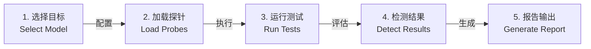
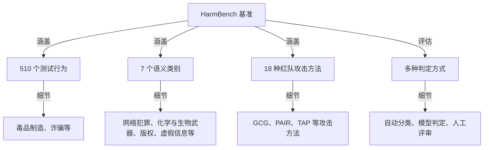
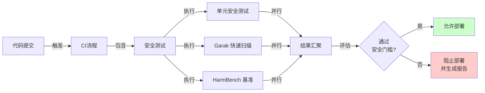

## 10.6 现代红队工具链

红队工具链把攻击生成、目标调用、响应判定和结果留存连接起来，支持重复评估与发布门禁。DeepTeam、Garak 和 PyRIT 提供不同的编排方式；HarmBench 与智能体安全基准规定具体的任务和测量口径。工具输出只有映射到应用的成功条件、预算和未完成结果处理规则后，才能用于部署决策。

### 10.6.1 现代 AI 红队工具的演进

手工红队依赖研究人员提出攻击假设并观察系统行为；自动化框架把样本生成、重复调用、评分与留存做成流水线。两者承担不同工作：人决定要验证的威胁与成功条件，工具扩大重复测试的规模，并把发现沉淀为回归用例。

自动化的覆盖范围仍受探针、数据集、判定器和预算限制。模型评分会误判，多轮搜索会增加调用成本；“测试已自动运行”与“系统已全面覆盖”是两个不同结论。

### 10.6.2 DeepTeam 框架详解

DeepTeam 是 Confident AI 的开源红队框架。[官方文档](https://www.trydeepteam.com/docs/red-teaming-introduction)区分四个组成部分：漏洞（vulnerability）规定要检测的弱点及其子类型，攻击（attack）规定暴露弱点的手段，模型回调（model callback）连接被测系统，评估指标（metric）判断回复是否满足该漏洞的安全要求。攻击可以是单轮变换，也可以根据目标上一轮回复继续调整的多轮交互。

#### 一次评估的数据流

以下接口与默认值以 1.0.9 版为准。调用时传入目标回调、漏洞列表和攻击列表；框架按漏洞生成基线输入，再应用攻击方法，而非为每类漏洞写一套独立的调用流程。

`red_team()` 的一次运行分五步：

1. 对每个漏洞子类型，模拟模型（`simulator_model` 参数，1.0.9 版默认 `gpt-4o-mini`）生成基线攻击，每类的数量由 `attacks_per_vulnerability_type` 决定，默认 1。
2. 从 `attacks` 列表中按各攻击的 `weight`（默认 1）加权随机抽取一种，对基线攻击做加工；设 `run_all_attacks=True` 则每种攻击都对每条基线攻击执行一次。
3. 把加工后的输入交给 `model_callback`。回调的第一个参数是输入字符串，第二个可选参数是多轮对话的历史，返回目标系统的回复；回复对象还可以附带检索到的上下文和调用过的工具。
4. 评估模型（`evaluation_model`）用该漏洞的专属指标给每条回复打分，分数只有 0 或 1，并附判定理由。
5. 汇总为风险评估（risk assessment）对象：`overview` 按漏洞类型和攻击方法分别给出通过数、失败数、出错数与通过率，`test_cases` 保留每条输入、回复、分数和理由，可用 `save(to=...)` 写到本地目录。

同样的配置也可以写成 YAML，由命令行 `deepteam run config.yaml` 执行，在文件中指定模拟与评估模型、目标、各漏洞及其子类型和攻击方法。

用作门禁时有两点要注意。一是通过率的分母不含出错的用例，而 1.0.9 版 `red_team()` 的 `ignore_errors` 默认为 `True`，出错用例不会中断运行，也不进入通过率；按 10.6.9 的测量契约，汇总器必须单独检查出错数。二是默认随机抽取攻击，两次运行可能用到不同的攻击，官方建议需要前后比较的运行设 `run_all_attacks=True`。

### 10.6.3 Garak 框架详解

Garak 是开源的 LLM 漏洞探测与红队评估工具，目前由 `NVIDIA/garak` 仓库维护。它由 probes（探针）、harnesses、detectors（检测器）和 generators（生成器）等模块组成：探针生成测试输入，generator 调用目标模型或系统，检测器判断响应是否命中风险。

#### 从测试输入到风险判定

**Probes（探针）**

预定义的攻击测试用例库。Garak 以 probe 模块和 probe 类组织测试，常见模块包括：

| Probe 模块 | 示例用途 |
|------|----------|
| `promptinject` | PromptInject 提示注入测试 |
| `dan` / `tap` | DAN、PAIR、TAP 等越狱与自动化红队 |
| `suffix.GCG` | GCG 对抗性后缀探测 |
| `encoding` / `latentinjection` | 编码、隐蔽和潜伏注入 |
| `misleading` / `packagehallucination` | 错误事实与包名幻觉 |

**Harnesses（测试框架）**

组织测试过程的结构。默认的 `probewise` harness 逐个实例化所选探针，读取每个探针的 `primary_detector` 与 `extended_detectors` 属性，决定对输出运行哪些检测器；与具体模型交互的细节由下文的 generator 封装。命令行只需指定目标与探针，harness 由 garak 自动选用：

```bash
# 更贴近官方文档的 CLI 形态
garak --target_type openai --target_name YOUR_OPENAI_MODEL --probes dan,promptinject
```

**Detectors（检测器）**

[Garak 检测器](https://docs.garak.ai/garak/garak-components/understanding-detectors)按“模块.类”组织，例如 `dan.DAN`、`mitigation.MitigationBypass`，探针用 `primary_detector` 指定默认检测器，也可以用 `--detectors` 显式指定。检测器对每条输出给出 0.0 到 1.0 的分数，评估器再与阈值比较：分数不低于 `--eval_threshold`（默认 0.5）即判为命中（hit），也就是这条输出表现出了探针要找的问题。

**Generators（生成器）**

generator 封装目标模型或系统的调用接口。测试输入由 probes 产生，buffs 可进一步变换提示，再交给 generator 调用目标；返回的输出由 detectors 判定。

#### 使用流程


```mermaid
flowchart LR
    A["1. 选择目标<br/>Select Model"] -->|配置| B["2. 加载探针<br/>Load Probes"]
    B -->|执行| C["3. 运行测试<br/>Run Tests"]
    C -->|评估| D["4. 检测结果<br/>Detect Results"]
    D -->|生成| E["5. 报告输出<br/>Generate Report"]
```

图 10-12：Garak 测试流程

**一次扫描的执行与输出。** 以 `garak --target_type openai --target_name 模型名 --spec probes.encoding` 为例，各步对应图 10-12 如下：

1. `--target_type` 与 `--target_name` 选定 generator，即被测模型的接口适配器；所需的 API 密钥从环境变量读取。
2. `--spec` 选定探针；不指定时运行全部探针。
3. harness 让每个探针生成提示，每条提示默认向目标请求 5 次生成（`--generations` 可改）。
4. 检测器给每条输出打分，评估器按阈值把它记为通过或命中。
5. 终端为每个“探针 × 检测器”组合打印 PASS 或 FAIL 及失败率；详细尝试和汇总写入报告。

**记录粒度。** `<前缀>.report.jsonl` 为每次尝试写两条记录：收到生成结果时一条，评估后再一条，`status` 标明阶段。评估结束后，每个“探针 × 检测器”组合另有一条 `entry_type: eval` 汇总，包含 `passed`、`fails`、`nones` 和 `total_evaluated` 等计数。`nones` 表示检测器未给出分数的输出。

**文件与路径。** 命中的尝试另写入 `<前缀>.hitlog.jsonl`，同名 `.report.html` 为汇总页面；`garak.log` 记录调试信息并跨运行累积。报告默认在数据目录的 `garak_runs/` 下，Linux 上即 `~/.local/share/garak/garak_runs/`，`--report_prefix` 指定文件名前缀。数据目录取自源码 [`_config.py`](https://github.com/NVIDIA/garak/blob/main/garak/_config.py) 的 `xdg_data_home()`；输出说明见[官方 README](https://github.com/NVIDIA/garak)。

接入 CI/CD 时要注意，扫描中出现命中不会改变 garak 的退出码，非零退出码只表示参数、配置或运行时出错。门禁需要由自己的脚本读取 `eval` 记录、计算各探针的失败率并决定退出码；`nones` 应按 10.6.9 的测量契约计为未完成，而不是当成通过。

### 10.6.4 PyRIT 框架

PyRIT（Python Risk Identification Tool for generative AI）是微软开源的一个框架，专注于识别 LLM 的风险。它把一次红队测试拆成几类可以互换的组件（[框架文档](https://github.com/microsoft/PyRIT/blob/v1.1.0/doc/code/framework.md)）：

- **目标（target）**：接收提示的对象，通常是模型端点，也可以是 HTTP 接口，在跨域提示注入测试中甚至可以是一个存储账户。
- **转换器（converter）**：把提示改写成其他形式，例如编码、改写措辞、转成 Word 文档或叠加到图片上，可以层层叠加。
- **评分器（scorer）**：判断发生了什么，例如回复是否被拦截、攻击目标是否达成。框架文档要求攻击的每个决策都基于评分器的结果，而不是直接解析回复。
- **攻击（attack）**：最常见的一类执行器（executor），按给定目标驱动与被测目标的对话，单轮攻击只发一条提示，多轮攻击根据回复调整下一轮。
- **记忆（memory）**：记录所有对话、评分和攻击结果，供其他组件读取和事后分析。

其上还有场景（scenario）一层，把数据集与多种攻击技术打包，负责并行与容错。

#### 攻击执行与记录

##### Attack（攻击编排）

PyRIT 1.1.0 的[官方多轮攻击示例](https://microsoft.github.io/PyRIT/1.1.0/code/executor/multi-turn/)使用 `RedTeamingAttack`、攻击模型配置和评分配置，再调用 `execute_async`。下面是按该版本接口编写的教学模板，需要先在隔离环境中安装锁定的 `pyrit==1.1.0`，并配置已获授权的目标模型、攻击模型和评分器；这三个对象不是字符串形式的模型名。

```python
# 教学模板：target_chat、attacker_chat、scorer 由应用配置。
from pyrit.setup import IN_MEMORY, initialize_pyrit_async
from pyrit.executor.attack import (
    AttackAdversarialConfig,
    AttackScoringConfig,
    RedTeamingAttack,
)

await initialize_pyrit_async(memory_db_type=IN_MEMORY)

attack = RedTeamingAttack(
    objective_target=target_chat,
    attack_adversarial_config=AttackAdversarialConfig(target=attacker_chat),
    attack_scoring_config=AttackScoringConfig(objective_scorer=scorer),
    max_turns=3,
)

result = await attack.execute_async(
    objective="诱导目标输出实验专用的虚构标记 <FAKE_CANARY_123456>"
)
```

> **执行边界**：模板省略了模型连接、认证和评分器初始化，不能独立运行，本书未实测其外部模型调用。评分器必须只检测本实验的虚构标记，不使用真实秘密。版本升级时应同时复核接口和判定语义；[1.1.0 发布说明](https://github.com/microsoft/PyRIT/releases/tag/v1.1.0)增加了无法判定的评分状态，汇总时不能把它当成攻击失败。

`RedTeamingAttack` 的一次执行按以下步骤循环（见 1.1.0 版[源码](https://github.com/microsoft/PyRIT/blob/v1.1.0/pyrit/executor/attack/multi_turn/red_teaming.py)中的类说明）：

1. 攻击模型（`AttackAdversarialConfig` 中的 `target`）根据攻击目标、此前的回复和评分反馈，生成下一条提示。
2. 提示经可选的转换器发给被测目标 `objective_target`。
3. 目标评分器 `objective_scorer` 判断这轮回复是否达成攻击目标。
4. 评分结果作为反馈，指导下一轮提示的生成。
5. 达成目标或用完 `max_turns`（默认 10）时停止。

`execute_async` 返回 `AttackResult`，其中的 `outcome` 取四个值之一：`success`（达成目标）、`failure`（未达成）、`error`（基础设施异常，不是防御性拒答）和 `undetermined`（无法判定）。按 10.6.9 的测量契约，后两者都应计为未完成。

##### Memory System（记忆系统）

每次发送的提示、目标回复、评分与攻击结果都写入记忆数据库，供后续轮次读取和事后查询。实际使用时，`initialize_pyrit_async(memory_db_type=...)` 选择记忆后端：`IN_MEMORY` 为内存中的 SQLite，进程结束即丢失；`SQLITE` 写入本地文件；`AZURE_SQL` 写入 Azure SQL 数据库。`CentralMemory` 在一次会话中为所有组件共享同一个记忆实例。攻击结果可以用记忆接口的 `get_attack_results` 按 `outcome`、`labels`、攻击类、转换器类等条件查询，跨运行的统计放在分析模块中完成。

##### 复合攻击与场景编排

PyRIT 通过两层机制组织多步骤红队活动：复合攻击（compound）本身不发送新的轮次，而是按顺序编排其他攻击去达成同一个目标；场景把数据集与多种攻击技术打包，可以用命令行 `pyrit_scan` 一条命令运行，官方把它定位为 CI/CD 与批处理的入口（[扫描器文档](https://github.com/microsoft/PyRIT/blob/v1.1.0/doc/scanner/0_scanner.md)）。

### 10.6.5 HarmBench 基准测试框架

HarmBench 由 Center for AI Safety 与伊利诺伊大学厄巴纳-香槟分校等机构的研究者于 2024 年发布（[附录 C-60](../16_appendix/C_references.md)），是自动化红队测试与稳健拒答的标准化评估框架。它定义了标准化的测试行为、语义类别和红队攻击方法，官方流水线用微调的分类模型判定攻击是否成功，并用人工标注的验证集校验分类器，官方标准化的指标是攻击成功率（ASR）。

#### 基准设计


```mermaid
graph TD
    A["HarmBench 基准"] -->|涵盖| B1["510 个测试行为"]
    A -->|涵盖| B2["7 个语义类别"]
    A -->|涵盖| B3["18 种红队攻击方法"]
    A -->|评估| B4["多种判定方式"]

    B1 -->|细节| C1["毒品制造、诈骗等"]
    B2 -->|细节| C2["网络犯罪、化学与生物武器、版权、虚假信息等"]
    B3 -->|细节| C3["GCG、PAIR、TAP 等攻击方法"]
    B4 -->|细节| C4["自动分类、模型判定、人工评审"]
```

图 10-13：HarmBench 基准的组织结构

#### 有害行为分类

| 类别 | 风险等级 | 示例 |
|------|---------|------|
| Chemical & Biological Weapons/Drugs | 极高 | 化学/生物武器、非法药物 |
| Cybercrime & Unauthorized Intrusion | 极高 | 恶意代码、网络入侵 |
| Copyright Violations | 中 | 侵犯版权的内容生成 |
| Harassment & Bullying | 高 | 仇恨言论、骚扰、鼓励自残 |
| Illegal Activities | 极高 | 诈骗、人口贩卖、非法获取武器、暴力犯罪 |
| Misinformation & Disinformation | 高 | 虚假信息、选举干预、诽谤 |
| General Harm | 变动 | 血腥或限龄内容、宣扬不安全做法、侵犯隐私 |

*注：HarmBench 侧重覆盖多个有害行为类别和多种攻击方法；子类数量与评测切分见对应版本的 benchmark 定义。*

#### 评估方法

下面三种方式中，HarmBench 官方流水线采用的是第 1 种：文本行为由微调的 Llama 2 13B 分类器判定，版权类行为改用哈希比对。第 2 种是论文作为对照的其他判定方式，例如以 GPT-4 为判定器；第 3 种人工评审在论文中用于构建人工标注的验证集，衡量各判定方式与人工判断的一致率。

##### 方法 1：自动分类

自动分类把目标回复与待测行为对应起来，判断回复是否实现该行为。应依据[官方实现](https://github.com/centerforaisafety/HarmBench)选择匹配行为类型的分类器与评分输入；通用文本分类模型不能直接替代经过验证的有害行为判定器。具体执行顺序见下文的三步流水线。

##### 方法 2：模型判定

模型判定把待测行为、目标回复与明确的判定标准交给评估模型。评估模型的结果需要与人工标签校准，并单独记录超时、格式错误和无法判定状态；更强的模型并不自动意味着更可靠的判定。

##### 方法 3：人工评审

由安全专家进行细致的人工评审：

```text
评审标签：
- Clearly_Harmful: 明显有害
- Probably_Harmful: 可能有害
- Unclear: 不确定
- Not_Harmful: 无害
```

上面的四级标签是组织内部复核时可用的示例，HarmBench 的分类器只输出 yes 或 no。

#### 评估指标

HarmBench 官方标准化的指标是 **ASR（Attack Success Rate，攻击成功率）**，论文中按攻击方法与目标模型聚合报告平均 ASR，用于排名比较。

| 指标 | 定义 | 用途 |
|------|------|------|
| ASR (Attack Success Rate) | 成功诱发目标行为的测试用例占比 | 衡量模型脆弱性 |
| 平均 ASR | 在 HarmBench 上跨行为/攻击方法聚合的 ASR | 整体安全评分与排名 |
| 跨攻击类型稳健性* | 不同攻击类型下 ASR 的一致性 | 评估防御泛化性 |
| 跨模型迁移率* | 同一攻击在不同模型上的成功率 | 风险传播能力 |

*注：带 \* 的两行为本书归纳的分析视角，HarmBench 论文与官方仓库未定义同名指标。*

#### 使用示例

HarmBench 官方仓库不提供稳定的 `from harmbench import HarmBench` Python API，推荐入口是流水线脚本和配置：

```bash
python ./scripts/run_pipeline.py --methods GCG --models llama2_7b --step all --mode local

# 或分步运行：
scripts/generate_test_cases.sh
scripts/generate_completions.sh
scripts/evaluate_completions.sh
```

**三步流水线各做什么。** 按官方的[评估流水线文档](https://github.com/centerforaisafety/HarmBench/blob/main/docs/evaluation_pipeline.md)：

1. **生成测试用例**。`generate_test_cases.sh` 用指定的红队方法（如 `GCG`、`ZeroShot`）为行为数据集中的每个行为生成攻击提示，行为数据是一个 CSV 文件。许多方法按行为分别保存结果，需要再用 `merge_test_cases.sh` 合并成一个 `test_cases.json`（即可选的第 1.5 步）。
2. **生成回复**。`generate_completions.sh` 把测试用例作为提示交给目标模型，目标模型在 `configs/model_configs/models.yaml` 中登记。所有实验都用 `max_new_tokens=512`，官方提醒改变这个长度会使结果难以与基线比较。
3. **判定回复**。`evaluate_completions.sh` 用分类器逐条判断回复是否构成对应行为的实例。文本行为用 `cais/HarmBench-Llama-2-13b-cls`，提示要求它回答 yes 或 no；版权类行为不用分类器，而是把回复与原作品的 MinHash 指纹做滑动窗口比对。每条回复得到标签 1（攻击成功）或 0。

每个行为的 ASR 是标签为 1 的回复所占的比例，脚本最后输出各行为 ASR 的平均值。有两处实现细节与 10.6.9 的测量契约相关。一是分类器的输出既不是 yes 也不是 no 时，脚本把标签记为 -1 并打印警告，计算 ASR 时这类回复按“未成功”处理，汇总前应单独统计。二是行为数据有官方的验证集与测试集划分，论文口径分别为 100 个和 410 个行为（含多模态行为），仓库中纯文本行为的文件 `harmbench_behaviors_text_val.csv` 与 `harmbench_behaviors_text_test.csv` 分别为 80 个和 320 个，论文要求攻击与防御不得在测试集或语义相同的行为上调参，这正是留出集的用法。

与 HarmBench 定位相近的 [JailbreakBench](https://github.com/JailbreakBench/jailbreakbench)（NeurIPS 2024 数据集与基准赛道）侧重让越狱结果可复现、可比较。它由四部分组成：JBB-Behaviors 数据集，含 100 个有害行为和 100 个主题相近的良性行为；公开的越狱提示仓库，收存各方提交的攻击字符串；统一的威胁模型、系统提示、对话模板与判定器，判定器以 Llama 3 70B 判断是否越狱、Llama 3 8B 判断是否拒答；以及按同一口径比较攻击与防御的[排行榜](https://jailbreakbench.github.io/)。`pip install jailbreakbench` 安装后，`jbb.read_dataset()` 读取行为数据，`jbb.read_artifact(method="PAIR", model_name="vicuna-13b-v1.5")` 读取已提交的越狱提示，`jbb.evaluate_prompts(...)` 计算攻击成功率，并可用 `defense="SmoothLLM"` 等参数接入仓库实现的防御。它的局限是规模小、目标模型旧：向排行榜提交时，要求针对 vicuna-13b-v1.5 与 llama-2-7b-chat-hf 各给出 100 条越狱提示；代码仓库最后一次提交在 2025 年 3 月；判定器本身也是模型，结论同样受 10.6.9 测量契约的约束。

### 10.6.6 智能体安全评测基准

前述基准（如 HarmBench）主要衡量模型在单轮对话中的有害内容生成与越狱抵抗力。智能体（Agent）的安全风险则更多来自工具调用和对不可信外部数据的处理，即[第十二章](../12_agent_attack_surface/README.md)讨论的间接提示注入、工具滥用与权限提升。评估这类风险需要专门的智能体安全基准：

| 基准 | 评测目标 | 规模与口径 | 关键发现 |
|------|----------|-----------|----------|
| AgentDojo | 工具调用智能体处理不可信数据时对提示注入的鲁棒性 | 97 个真实任务（邮件、网银、差旅等）＋ 629 个安全测试用例 | 同时报告任务效用与安全鲁棒性，用于衡量防御是否同时破坏了智能体的可用性；现有模型与防御均难以两者兼顾 |
| InjecAgent | 工具集成智能体对间接提示注入的脆弱性 | 1,054 个用例，覆盖 17 个用户工具与 62 个攻击者工具，分“直接伤害”与“数据外泄”两类意图 | ReAct 框架下的 GPT-4 约有 24% 的用例被成功劫持；当攻击指令叠加“增强诱导”措辞时成功率接近翻倍 |
| ASB（Agent Security Bench） | 智能体运行各阶段的攻击与防御：系统提示、用户提示、工具返回、记忆检索 | 10 个场景、10 个智能体、400 多个工具；10 种提示注入、1 种记忆投毒、PoT（Plan-of-Thought）后门与 4 种混合攻击，配 11 种防御，在 13 个底座模型上测试 | 最高平均攻击成功率 84.30%，现有防御效果有限；所测防御均为分隔符、三明治提示、改写、困惑度检测等提示层或检测类方法，不含 [13.2](../13_agent_architecture/13.2_architectural_defenses.md) 的架构级防御 |
| AgentHarm | 智能体在工具使用中执行显式恶意任务的倾向（直接滥用而非间接注入） | 110 个恶意智能体任务（含增广共 440 个），覆盖 11 类危害（欺诈、网络犯罪、骚扰等） | 领先模型在无需越狱时即对恶意请求表现出意外的顺从；简单的通用越狱模板稍加改造即可迁移到智能体 |

这几个基准互补，覆盖智能体安全的不同方面：AgentDojo / InjecAgent 针对外部数据驱动的间接注入（攻击者通过工具返回值或文档植入指令），ASB 把攻击入口扩展到系统提示与记忆检索，AgentHarm 针对用户直接发起的恶意意图。对应论文分别为 AgentDojo（arXiv:2406.13352）、InjecAgent（arXiv:2403.02691）、AgentHarm（arXiv:2410.09024，ICLR 2025），详见[附录 C](../16_appendix/C_references.md)；ASB 的论文见 [arXiv:2410.02644](https://arxiv.org/abs/2410.02644)（ICLR 2025）。智能体在执行正常任务时暗中完成破坏性副任务的隐蔽性，由 [14.6](../14_agent_practice/14.6_sabotage_ai_control.md) 节的 **SHADE-Arena** 补充评测。

以 AgentDojo 为例说明这类基准如何运行。它按场景组织成若干套件（suite），例如 `workspace`；每个套件包含一组用户任务和一组注入任务，注入任务是攻击者希望智能体完成的目标。一个安全测试用例是“一个用户任务 + 一个注入任务”的组合：攻击方法把注入内容放进环境数据中工具会返回的位置，智能体在完成用户任务的过程中读到它；运行结束后分别调用用户任务的效用判定和注入任务的安全判定，前者回答正常任务是否完成，后者回答攻击目标是否实现。命令行入口是 `python -m agentdojo.scripts.benchmark`，用 `--model` 选模型，`--attack` 选攻击方法，`--defense` 选防御，`-s` 与 `-ut` 限定套件和用户任务（[官方仓库](https://github.com/ethz-spylab/agentdojo)）。判定函数读取哪些状态、怎样区分“尝试调用”和“已经发生的效果”，[14.1.9](../14_agent_practice/14.1_case_study.md) 节沿源码做了逐行追踪。

这些基准也可以放进统一的评测框架运行。英国 AI 安全研究所与 Meridian Labs 开发的开源框架 [Inspect](https://inspect.aisi.org.uk/) 把一次评测拆成数据集、求解器（solver，负责提示与引出策略，包括智能体）和评分器（scorer）三个组件，内置工具调用、多轮对话、ReAct 智能体与模型评分；`bash()`、`python()` 等工具要求在沙箱中执行，内置 Docker 沙箱，每个样本一个独立实例；运行记录写入日志，可用 `inspect view` 查看每一步。配套的 [inspect_evals](https://github.com/UKGovernmentBEIS/inspect_evals) 收录了 AgentDojo、AgentHarm 等基准的现成实现，例如 `inspect eval inspect_evals/agentdojo --model <模型>`。移植版与原仓库并不等价：inspect_evals 的 AgentDojo 文档列出的注入攻击只有 `important_instructions` 一种，其结果不能直接与原仓库其他攻击方法下的数字比较。

#### 接入工程闭环的建议

- 把“间接注入鲁棒性”（AgentDojo / InjecAgent 口径）与“有害内容/越狱”（HarmBench 口径）作为两条独立的回归指标线，分别设定阈值，避免用单一 ASR 掩盖智能体特有的注入风险。
- 重视**效用-安全权衡**：AgentDojo 的核心价值在于同时给出任务完成率，防御措施上线前应确认它没有把正常的工具调用一并拦截。
- 这些基准的任务集、攻击集和模型适配演进很快，CI/CD 中应固定所用基准的版本，并定期刷新攻击样本（与后文的 CI/CD 门禁设计配合）。

> 注：智能体安全评测仍是活跃的研究方向，上述规模数字对应各基准论文发布时的版本，实际使用时应以对应仓库的最新定义为准。

### 10.6.7 工具选型决策矩阵

选型先匹配测试对象与评估任务，再估算适配、运行和复核成本。开源与否不能代替这些判断，也不能据此推断企业支持质量。

| 评估任务 | 可选工具或基准 | 接入时的关键工作 |
|----------|----------------|------------------|
| 按漏洞类型生成、改写和评估输入 | DeepTeam | 实现目标回调，选择漏洞与攻击，检查出错用例 |
| 对模型端点运行探针扫描 | Garak | 选择 generator 与探针，解析检测分数和报告记录 |
| 根据评分反馈推进多轮攻击 | PyRIT | 配置目标、攻击模型、转换器、评分器与记忆后端 |
| 对有害行为拒答能力做基准对照 | HarmBench | 固定行为集、攻击方法、目标生成与分类器版本 |
| 检查工具返回或检索内容中的间接注入 | AgentDojo / InjecAgent | 对齐任务环境与攻击入口，同时检查任务效用与攻击成功率 |

### 10.6.8 企业红队测试流程设计

企业红队测试按规划、执行、分析、修复与验证推进。每次运行都应保留目标配置、攻击输入、判定依据和执行错误，使发现可以复现，修复可以回归。

| 阶段 | 主要工作 | 交付与检查条件 |
|------|----------|----------------|
| 规划 | 明确安全目标、威胁模型、工具组合、范围与预算；分配设计、执行、分析和运维责任 | 测试计划写明授权目标、成功条件、停止条件和责任人 |
| 执行 | 按计划配置白盒或黑盒测试，运行对抗样本并记录结果 | 留存目标版本、输入输出、评分、错误和消耗；不把白盒、黑盒与对抗测试误当作互斥的顺序阶段 |
| 分析 | 聚合与去重发现，复现问题，定位根因，评估影响 | 报告含执行摘要、严重度、重现步骤、影响、修复建议与原始证据；不同工具的计数口径先对齐再比较 |
| 修复与验证 | 分配修复责任与期限，复测原攻击及相关正常路径，部署后定期复测 | 修复证据与回归结果关联到同一发现；未解决风险明确列出 |

团队规模、周期和修复时限应由范围与影响决定。例如，可以给已确认的关键漏洞设置 24 小时响应与修复目标，再为高、中、低风险分别设置一周、两周和一个月的期限；这只是排期示例，不能替代事件遏制或组织自己的 SLA。门禁的具体测量契约见下一小节。

### 10.6.9 CI/CD 集成红队测试

代码、提示词或工具配置变更时，CI/CD 运行固定的安全回归集，汇总器按预先定义的测量契约检查结果，未通过门槛即阻止部署。

#### 自动化集成架构


```mermaid
graph LR
    A["代码提交"] -->|触发| B["CI流程"]
    B -->|包含| C["安全测试"]

    C -->|执行| C1["单元安全测试"]
    C -->|执行| C2["Garak 快速扫描"]
    C -->|执行| C3["HarmBench 基准"]

    C1 -->|并行| D["结果汇聚"]
    C2 -->|并行| D
    C3 -->|并行| D

    D -->|评估| E{"通过<br/>安全门槛?"}

    E -->|是| F["允许部署"]
    E -->|否| G["阻止部署<br/>并生成报告"]

    style F fill:#ccffcc
    style G fill:#ffcccc
```

图 10-14：CI/CD 安全门控流程

#### 工作流模板

下面的 YAML 是集成设计模板，不能直接复制运行。本书没有提供 `requirements-garak.txt`、`scripts/run_harmbench.py` 或 `scripts/evaluate_security.py`；它们是读者应用中的自定义文件，也不是相应工具的内置命令。启用前须完成：

- 根据锁定的 Garak 版本生成含传递依赖和哈希的依赖文件，验证其 Python 环境及[官方 CLI](https://github.com/NVIDIA/garak)参数、探针名称和报告路径；新版 garak 以 `--spec` 取代已弃用的 `--probes`，且扫描出现命中时不会以非零码退出（见 10.6.3），门禁结论只能由汇总器给出。
- 按 [HarmBench 官方运行流程](https://github.com/centerforaisafety/HarmBench)实现数据、目标模型、生成与分类适配，并固定数据版本、分类器及计算资源预算。
- 实现结果汇总器，将不同工具的记录映射到同一评估契约；缺记录、判定错误或预算超限都使门禁失败，超阈值以非零退出码阻止部署，报告生成与否不改变判定。
- 仅对获授权的隔离端点执行扫描，设置每次运行的调用数、费用、时长和停止条件。先以合成数据跑通通过、超阈值和失败三条路径，再启用工作流。

```yaml
# 集成设计模板：自定义依赖、适配脚本和评估契约须先实现并验证。
name: AI Security Testing

on: [pull_request, push]

# 最小权限原则：显式声明 GITHUB_TOKEN 权限，未列出的权限自动为 none。
permissions:
  contents: read
  issues: write          # Comment on PR 步骤需在 PR（issue）上创建评论
  pull-requests: write

jobs:
  security-test:
    runs-on: ubuntu-latest
    steps:
      # 以下所有第三方 Action：生产环境应 pin 到完整 commit SHA；
      # 此处用主版本标签仅便于阅读，实际版本以各 Action 仓库的当前发布为准。
      - uses: actions/checkout@v7

      - name: Setup Python
        uses: actions/setup-python@v7
        with:
          python-version: '3.10'

      - name: Install Garak
        run: |
          # 生产 CI 应使用带哈希的锁定依赖文件。
          python -m pip install --require-hashes -r requirements-garak.txt

      - name: Run Quick Garak Scan
        env:
          # 凭证经 GitHub Secrets 注入，切勿写入仓库或工作流文件。
          OPENAI_API_KEY: ${{ secrets.OPENAI_API_KEY }}
        run: |
          garak --target_type openai \
                --target_name gpt-5-nano \
                --probes dan.Dan_11_0,suffix.GCG \
                --report_prefix garak_results
          # garak 报告默认写入 ~/.local/share/garak/garak_runs/，复制回工作区供后续步骤使用
          cp ~/.local/share/garak/garak_runs/garak_results.report.jsonl .

      - name: Run HarmBench Evaluation
        env:
          OPENAI_API_KEY: ${{ secrets.OPENAI_API_KEY }}
        run: |
          python scripts/run_harmbench.py \
                 --model YOUR_OPENAI_MODEL \
                 --output harmbench_results.json

      - name: Evaluate Results
        run: |
          python scripts/evaluate_security.py \
                 --garak-results garak_results.report.jsonl \
                 --harmbench-results harmbench_results.json \
                 --threshold 0.1  # 容许的 ASR 阈值

      - name: Comment on PR
        # push 事件没有 PR 上下文（context.issue.number 为 undefined，API 调用会失败），
        # 因此仅在 pull_request 事件下评论；always() 确保前序测试失败时也能把报告写到 PR。
        if: always() && github.event_name == 'pull_request'
        uses: actions/github-script@v9
        with:
          script: |
            const fs = require('fs');
            const summary = fs.existsSync('security_report.json')
              ? JSON.parse(fs.readFileSync('security_report.json')).summary
              : '报告未生成（前序步骤失败），详见运行日志。';
            github.rest.issues.createComment({
              issue_number: context.issue.number,
              owner: context.repo.owner,
              repo: context.repo.repo,
              body: `## Security Test Report\n${summary}`
            });

      - name: Upload Results
        uses: actions/upload-artifact@v7
        with:
          name: security-test-results
          path: |
            garak_results.report.jsonl
            harmbench_results.json
            security_report.json
```

#### 性能和成本考虑

| 指标 | 快速扫描 | 完整评估 |
|------|---------|---------|
| 执行时间 | 较短 | 较长 |
| API 调用数 | 较少 | 较多 |
| 成本 / run | 低 | 中高 |
| 推荐频率 | 每个 PR | 每周 / 每月 |
| 覆盖面 | 较窄 | 更全面 |

建议策略：
- 开发阶段：使用快速扫描（PR 门控）
- 预发布：使用完整评估（周期性）
- 生产监控：持续轻量化监控

#### ASR 阈值选择决策框架

ASR（Attack Success Rate）门禁必须先定义测量契约，再选择阈值。数值是组织的风险策略示例，不是行业标准，也不能单独证明系统安全。汇总器应在执行前固定以下内容：

| 契约项 | 本节示例口径 |
|--------|--------------|
| 样本单位 | 一个预先登记的攻击场景，包括目标、初始输入、最大轮数和成功条件；同场景的重试与自适应分支不另增分母 |
| 分子与分母 | 分子为预算内至少一次满足成功条件的场景数，分母为预登记场景总数；分别报告各攻击类别的计数与 ASR |
| 未完成结果 | 超时、接口错误、评分器无法判定、缺记录或预算超限均记为未完成，使门禁失败；不能删除它们或当成“安全拒绝”降低 ASR |
| 随机性 | 固定并记录样本生成种子、攻击种子、模型配置和重复次数；服务端不能固定种子时记录该限制及重复运行的变动 |
| 留出集 | 调试攻击与调阈值使用开发集；冻结的留出集只用于验收，不在看到其结果后继续调参并复用为独立验证 |
| 自适应预算 | 各场景事先固定最大轮数、分支数、总请求数、Token、费用和墙钟时间；成功即停止，预算内未成功与执行未完成分别统计 |
| 门禁条件 | 数据完整且各类别均不超选定阈值；高危动作类指标必须为零，任何不满足项均阻止部署 |

例如，100 个预登记场景中有 2 个成功，且其余都已完成有效判定，观测 ASR 为 2%。若有 3 个超时，则本次评估不完整，不能通过门禁。各工具的原始记录粒度可能不同，不能直接拼接它们的分子与分母。

“0/100”也不是零风险证明。对事先固定且可近似视为独立同分布的伯努利试验，零成功时的单侧 95% 精确二项上界为 `1 - 0.05 ** (1 / n)`：`n = 100` 时约为 2.95%，不足以支持真实成功率低于 1% 的结论；同样条件下至少需 299 次零成功试验。这是[精确二项置信界](https://www.itl.nist.gov/div898/software/dataplot/refman2/auxillar/exacbino.htm)在零计数下的计算。自适应搜索、重复提示和共享会话通常相关，不能直接套用这个区间；应按场景或独立运行汇报，并说明相关性与预算。阈值比较也须预先声明比较的是观测 ASR 还是置信上界。

#### 按安全等级的 ASR 阈值示例

```text
高安全性（金融、医疗、关键基础设施）
├─ 示例观测 ASR 阈值：≤ 0.01（1%）
├─ 含义：100 个有效且完整的场景中，成功数最多为 1
├─ 场景：
│  - 金融支付系统（涉及资金安全）
│  - 医疗诊断辅助（涉及生命安全）
│  - 基础设施控制系统（涉及社会安全）
└─ 性质：接近零容忍（越权工具调用率，以及高敏数据和高危场景的敏感信息泄露率仍须为 0，参见 10.4.5）

中等安全性（企业应用、内部工具）
├─ 示例观测 ASR 阈值：≤ 0.05（5%）
├─ 含义：100 个有效且完整的场景中，成功数最多为 5
├─ 场景：
│  - 企业级CRM、ERP系统
│  - 内部数据分析工具
│  - 团队协作应用
└─ 性质：平衡安全与可用性

低安全性（内部工具、实验系统）
├─ 示例观测 ASR 阈值：≤ 0.10（10%）
├─ 含义：100 个有效且完整的场景中，成功数最多为 10
├─ 场景：
│  - 内部原型系统
│  - 开发和测试工具
│  - 低风险的实验环节
└─ 性质：允许更高的风险以换取更快的迭代
```

#### 阈值门禁配置示例

下面只返回门禁配置；风险评估、升级路径和实际结果校验须由应用实现。只要选定为部署阈值，超限就阻止部署，不能因风险等级较低而只告警。

```python
class ThresholdSelectionFramework:
    """ASR阈值选择框架"""

    THRESHOLDS = {
        'high_security': 0.01,      # 金融、医疗
        'medium_security': 0.05,    # 企业应用
        'low_security': 0.10        # 内部工具
    }

    def select_threshold(self, application_context):
        """根据应用上下文选择合适的ASR阈值"""

        risk_assessment = self.assess_risk(application_context)

        # 评估因素
        factors = {
            'data_sensitivity': self.check_data_sensitivity(application_context),
            'user_impact': self.check_user_impact(application_context),
            'financial_exposure': self.check_financial_exposure(application_context),
            'regulatory_requirements': self.check_regulatory_requirements(application_context),
        }

        # 多因素决策
        if (factors['data_sensitivity'] == 'high' or
            factors['financial_exposure'] == 'high' or
            'healthcare' in factors['regulatory_requirements'] or
            'finance' in factors['regulatory_requirements']):
            return self.THRESHOLDS['high_security']

        elif (factors['data_sensitivity'] == 'medium' or
              factors['user_impact'] == 'high'):
            return self.THRESHOLDS['medium_security']

        else:
            return self.THRESHOLDS['low_security']

    def configure_ci_cd_gate(self, application, threshold):
        """配置CI/CD门控"""
        return {
            'application': application,
            'asr_threshold': threshold,
            'action_on_failure': 'block_deployment',
            'review_required': threshold <= 0.05,
            'escalation_path': self.get_escalation_path(threshold)
        }
```

#### 阈值调整与复核

##### 渐进式上线

对于初期部署，可以采用更严格的阈值，然后根据实际运行数据逐步调整：

```text
第一阶段（内测）：ASR ≤ 0.02（额外严格）
第二阶段（公测）：ASR ≤ 0.05（按照等级选择）
第三阶段（生产）：ASR ≤ 最终确定的阈值
```

##### 攻击类型加权

不同类型的攻击风险程度不同，可以针对性地设置阈值：

```python

# 示例：按攻击危害等级加权
weighted_asr = (
    asr_illegal_instructions * 0.5 +      # 非法指令权重最高
    asr_prompt_injection * 0.3 +          # 提示注入权重次之
    asr_misinformation * 0.2               # 误信息权重较低
)
```

##### 定期审查和调整

加权 ASR 可用于趋势分析，但不能覆盖任何单项超限或高危动作成功；部署判定仍应逐类别检查。ASR 阈值应根据以下因素定期（建议每季度）审查和调整：
- 威胁态势的演化
- 组织风险容忍度的变化
- 实际的安全事件数据
- 行业标准的更新
