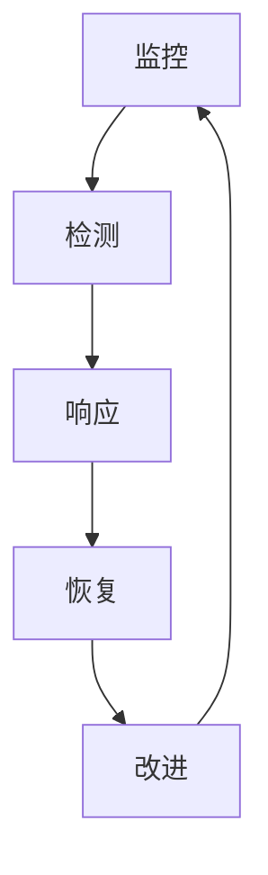

# 第十章：安全运营与监控

安全不是一次性任务，而是持续的过程。本章介绍 LLM 系统的安全运营和监控实践。

本章聚焦于安全运营与监控，主要内容包括：

- **10.1 安全监控体系**：构建全面的安全监控能力
- **10.2 异常检测与告警**：识别和响应异常行为
- **10.3 事件响应流程**：处理安全事件的标准流程
- **10.4 持续安全评估**：持续评估和改进安全能力

通过本章的学习，读者将掌握 LLM 系统安全运营的核心能力。

