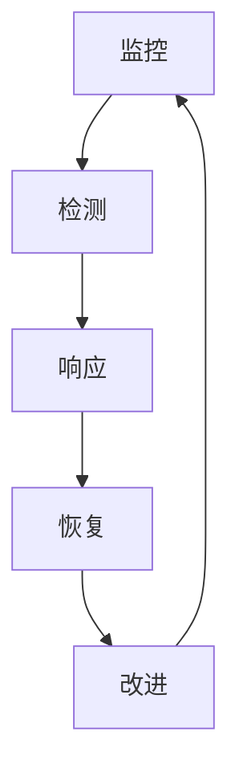

# 第十章 安全运营与监控

安全不是一次性任务，而是持续的过程。本章介绍 LLM 系统的安全运营和监控实践。

本章聚焦于安全运营与监控，主要内容包括：

- **10.1 安全监控体系**：构建全面的安全监控能力
- **10.2 异常检测与告警**：识别和响应异常行为
- **10.3 运行时安全与事件响应**：处理安全事件的标准流程
- **10.4 红队演练与自动化评估**：开展系统化的红队测试和自动化安全基准测试
- **10.5 服务降级与 Fallback 策略**：部署系统异常时的降级预案
- **10.6 DeepTeam 与现代红队工具链**：介绍 DeepTeam、Garak、HarmBench 等主流自动化红队测试框架及企业实践
- **10.7 隐蔽破坏检测：SHADE-Arena 基准与 Agent 监控**：关注“主任务正常完成、暗中多做一步”的 Agent 破坏行为及其监控思路

通过本章的学习，读者将掌握 LLM 系统安全运营的核心能力。

```mermaid
flowchart TB
    A["监控"] --> B["检测"]
    B --> C["响应"]
    C --> D["恢复"]
    D --> E["改进"]
    E --> A
```
