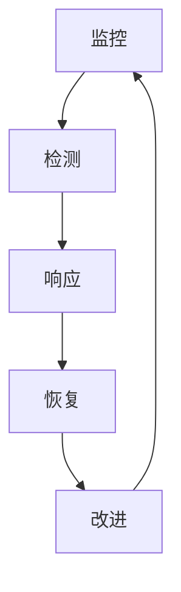

# 第十章 安全运营与监控

安全是持续的过程：上线前的防护会被新的攻击绕过，模型服务也会出现不可预见的异常。本章讨论 LLM 系统上线后的安全运营实践，即如何发现问题、响应事件、在异常时降级兜底，以及如何持续评估防护是否有效。第八、九章给出防御架构与具体防护措施，本章负责验证并维持它们的效果；第十一章起的智能体安全篇会针对多步调用重新展开本章的监控与红队方法。

## 学习目标

读完本章，读者应能：

1. 设计安全告警日志的字段，并用分级脱敏策略平衡隐私保护与根因分析。
2. 区分规则、统计和 ML 三类异常检测方法，按 P0–P3 对告警分级，并说明降噪与基线校准如何控制误报。
3. 按“检测与分析、遏制、根除、恢复、复盘与沟通”的剧本处置运行时安全事件，并把事件载荷转化为红队回归用例。
4. 解释为什么红队“未发现漏洞”不能证明系统安全，并为 CI/CD 安全门禁定义 ASR 的测量契约与阈值。
5. 设计 L1–L4 降级层级与终极兜底，说明为什么单次安全拒绝不应改变全局降级层级。

## 本章结构

- [10.1 安全监控体系](10.1_monitoring.md)：监控应覆盖哪些层次和指标，日志与告警字段如何设计。
- [10.2 异常检测与告警](10.2_anomaly_detection.md)：如何从监控数据中发现异常，告警如何分级、降噪、通知并控制误报。
- [10.3 运行时安全与事件响应](10.3_incident_response.md)：告警触发后如何遏制、修复、重放验证根因并复盘。
- [10.4 红队演练与自动化评估](10.4_red_teaming.md)：如何组织红队演练、沉淀测试用例，并把评估接入发布门禁。
- [10.5 服务降级与回退策略](10.5_fallback_strategy.md)：模型或安全组件异常时如何分层降级与兜底。
- [10.6 现代红队工具链](10.6_modern_redteam_tools.md)：DeepTeam、Garak、PyRIT、HarmBench 等工具与基准各适合什么场景，企业如何落地 CI/CD 门禁。

前三节按“监控 → 检测 → 响应”的运营闭环展开，10.4 讲持续评估，10.5 讲异常时的降级兜底，10.6 是对 10.4 中自动化评估工具的展开。

```mermaid
flowchart TB
    A["监控"] --> B["检测"]
    B --> C["响应"]
    C --> D["恢复"]
    D --> E["改进"]
    E --> A
```

隐蔽破坏检测、控制协议与推理过程的可监控性，已随智能体安全篇移至 [14.2 节](../14_agent_practice/14.2_sabotage_ai_control.md)。
