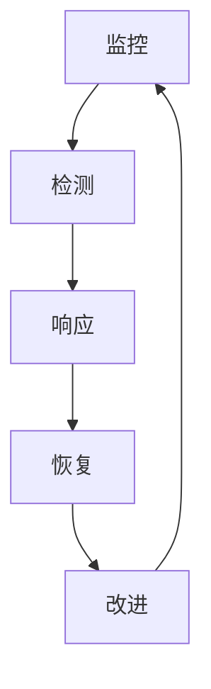

# 第十章 安全运营与监控

安全不是一次性任务，而是持续的过程。本章介绍 LLM 系统的安全运营和监控实践。

本章聚焦于安全运营与监控，主要内容包括：

- **[10.1](10.1_monitoring.md) 安全监控体系**：构建全面的安全监控能力
- **[10.2](10.2_anomaly_detection.md) 异常检测与告警**：识别和响应异常行为
- **[10.3](10.3_incident_response.md) 运行时安全与事件响应**：处理安全事件的标准流程
- **[10.4](10.4_red_teaming.md) 红队演练与自动化评估**：开展系统化的红队测试和自动化安全基准测试
- **[10.5](10.5_fallback_strategy.md) 服务降级与回退策略**：部署系统异常时的降级预案
- **[10.6](10.6_modern_redteam_tools.md) 现代红队工具链**：介绍 DeepTeam、Garak、HarmBench 等主流自动化红队测试框架及企业实践

通过本章的学习，读者将掌握 LLM 系统安全运营的核心能力。

```mermaid
flowchart TB
    A["监控"] --> B["检测"]
    B --> C["响应"]
    C --> D["恢复"]
    D --> E["改进"]
    E --> A
```

隐蔽破坏检测、控制协议与推理过程的可监控性，已随智能体安全篇移至 [14.2 节](../14_agent_practice/14.2_sabotage_ai_control.md)。
