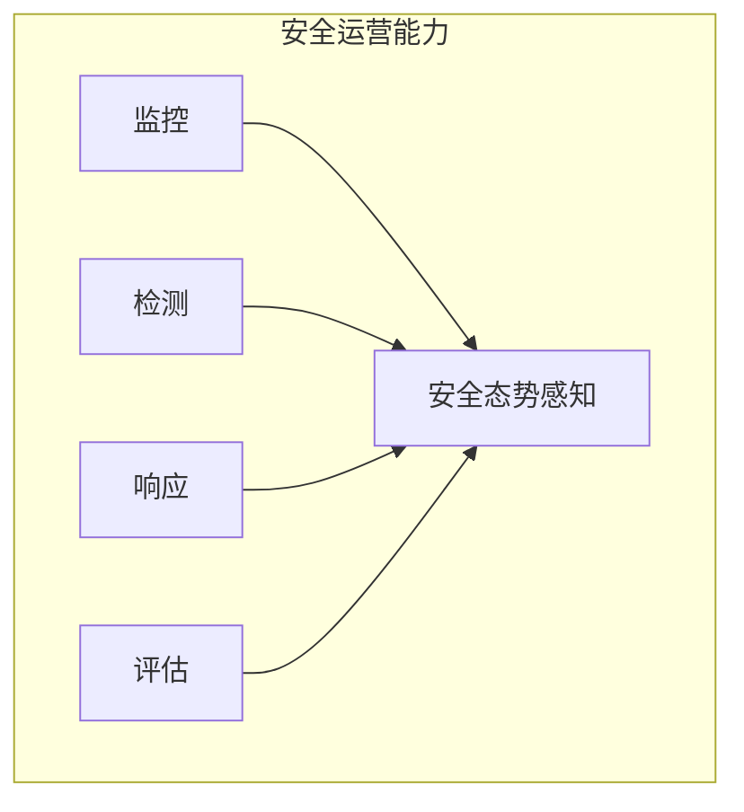

## 本章小结

本章介绍了 LLM 系统安全运营的核心能力，包括监控、检测、响应和持续评估。

### 核心要点回顾

**安全监控体系**：构建覆盖基础设施、平台、应用和安全多层的监控体系，采集关键日志，建立实时仪表板。

**异常检测与告警**：结合规则、统计和 ML 方法检测异常，实施告警分级和降噪，建立有效的通知和升级机制。

**事件响应流程**：遵循准备-检测-遏制-消除-恢复-总结的流程，做好根因分析和事件复盘，持续改进响应能力。

**持续安全评估**：定期进行安全测试和红队演练，度量安全效果，满足合规要求，建立持续改进机制。

### 运营能力矩阵

图 10-1：运营能力矩阵图

| 能力 | 关键要素 |
|------|----------|
| 监控 | 全覆盖、实时性 |
| 检测 | 准确性、时效性 |
| 响应 | 快速、有效 |
| 评估 | 持续、全面 |

### 延伸思考

1. 如何平衡监控深度和隐私保护？
2. 自动化响应的边界在哪里？
3. 如何衡量安全投入的 ROI？

### 下章预告

第十一章将介绍治理与未来展望，包括 AI 法规与合规要求、负责任 AI 实践、新兴威胁趋势、以及 LLM 安全的未来发展方向。
