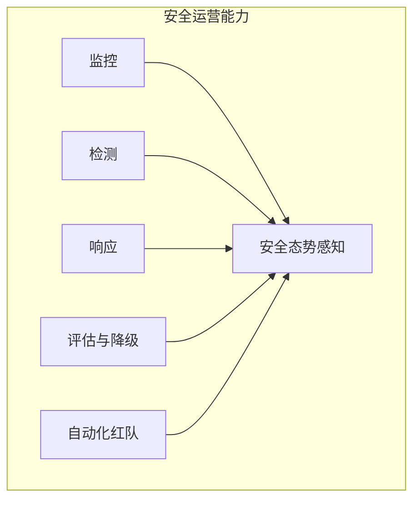

## 本章小结

本章介绍了 LLM 系统安全运营的核心能力，包括监控、检测、响应、兜底降级和持续评估。

### 核心要点回顾

**安全监控体系**：构建覆盖基础设施、平台、应用和安全多层的监控体系，采集关键日志，建立实时仪表板。

**异常检测与告警**：结合规则、统计和 ML 方法检测异常，实施告警分级和降噪，建立有效的通知和升级机制。

**事件响应流程**：遵循准备-检测-遏制-消除-恢复-总结的流程，做好根因分析和事件复盘，持续改进响应能力。

**红队演练与自动化评估**：定期进行安全测试和红队演练，度量安全效果，满足合规要求，建立持续改进机制。

**服务降级与 Fallback**：大模型服务不可用或触发拦截时的 L1 至 L4 分层降级与话术兜底，保障极端情况下业务的稳定连续性。

**DeepTeam 与现代红队工具链**：随着 LLM 安全评估需求的增长，DeepTeam、Garak、HarmBench 等自动化红队框架应运而生。这些工具实现了从手工红队到全自动化测试的演进，覆盖 40+ 攻击向量和 10+ 安全指标。企业应将红队测试纳入 CI/CD 流水线，建立安全门控机制，并通过分层组织结构（工具层、战术层、战略层）实现持续化、常态化的安全评估。

### 运营能力矩阵

```mermaid
graph TB
    subgraph "安全运营能力"
    A["监控"] --> F["安全态势感知"]
    B["检测"] --> F
    C["响应"] --> F
    D["评估与降级"] --> F
    E["自动化红队"] --> F
    end
```

图 10-19：运营能力矩阵图

| 能力 | 关键要素 |
|------|----------|
| 监控 | 全覆盖、实时性 |
| 检测 | 准确性、时效性 |
| 响应 | 快速、有效 |
| 兜底 | 降级预案、对用户无害 |
| 评估 | 持续、全面 |
| 自动化红队 | 工具链集成、CI/CD 门控、持续化 |

### 延伸思考

1. 如何平衡监控深度和隐私保护？
2. Fallback 策略在多模型调度中如何保证响应时效和成本控制？
3. 如何衡量安全投入的 ROI？
4. 如何在企业中建立可持续的红队测试文化，避免安全评估流于形式？

## 与其他章节的关联

- **防御监控**：第 8-9 章的防御措施需要本章运营监控保障，形成闭环防护
- **红队指导**：第 4-7 章的攻击知识指导本章红队用例，验证防御有效性
- **治理指引**：第 11 章的治理框架指导本章安全运营策略，实现合规运营

### 下章预告

[第十一章](../11_governance/README.md)将介绍治理与未来展望，包括 AI 法规与合规要求、负责任 AI 实践、新兴威胁趋势、以及 LLM 安全的未来发展方向。
---

> 📝 **发现错误或有改进建议？** 欢迎提交 [Issue](https://github.com/yeasy/ai_security_guide/issues) 或 [PR](https://github.com/yeasy/ai_security_guide/pulls)。
