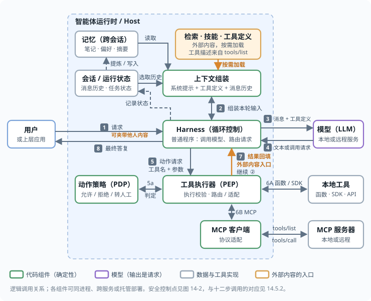

## 11.1 智能体的实现结构与调用过程

LLM 智能体（Agent）是指能够自主规划、执行任务并与外部环境交互的 AI 系统。本书采用 Anthropic 对它的概括：智能体“就是在循环里根据环境反馈使用工具的 LLM”（附录 C-154）。这句话里的三个要素——循环、工具、环境反馈——决定了后面所有的安全问题，所以先把实现结构讲清楚。读者如果已经熟悉智能体的实现，可以直接跳到本小节末尾的四条结论。

**一次模型调用看到什么。** 模型每次被调用时，输入是一段连续的文本，称为上下文窗口，通常由四部分拼成：

- **系统提示**：开发者写的角色、规则和约束；
- **工具定义**：每个工具的名称、用途说明和参数结构，模型据此判断什么时候调用谁、填什么参数；
- **消息历史**：用户说过的话、模型此前的输出、工具返回过的结果；
- **本轮新内容**：用户的最新一句，或刚刚返回的工具结果。

模型的输出只有两种形态：一段给用户看的文本，或者一个（或几个）结构化的**工具调用请求**——调用哪个工具、参数是什么。模型本身不执行任何东西。

**智能体循环。** 把模型放进一个循环，由一段普通程序负责把工具调用请求真正执行掉、再把结果交回模型，就得到了智能体。这段程序常被称为 Harness 或编排器，它连同会话、记忆等周边组件所在的那一层称为运行时。去掉细节后，它只有十来行：

<!-- SAFE-LAB: defensive-only -->
```python
messages = [{"role": "user", "content": task}]          # 用户的任务

def run_agent(messages, max_steps=20):                  # 步数上限：循环的出口由代码把守
    for _ in range(max_steps):
        reply = model.generate(system=SYSTEM_PROMPT,     # 1. 调用模型：系统提示 + 工具定义 + 消息历史
                               tools=TOOL_DEFINITIONS,
                               messages=messages)
        messages.append(reply.message)                   # 2. 模型的输出整体进入历史

        if not reply.tool_calls:                         # 3. 没有工具调用请求：任务结束
            return reply.text

        for call in reply.tool_calls:                    # 4. 每个请求都由这段程序决定是否执行、如何执行
            result = execute(call.name, call.arguments)  #    真实执行发生在模型之外
            messages.append(tool_result(call.id, result))  # 5. 结果原样追加进历史 —— 外部内容由此进入上下文
    raise RuntimeError("超过步数上限")
```

下图把这个循环放进常见的实现结构里：运行时内是会话、记忆、上下文组装、Harness 循环、动作策略与工具执行器（访问控制的术语里，动作策略是策略决策点 PDP，工具执行器是策略执行点 PEP；后文也把动作策略称为策略网关），运行时外是用户、模型和工具实现；编号是一次调用的顺序。注意三个位置：模型读到的只是上下文组装好的本轮输入（③）；模型输出的是请求（④），由 Harness 和动作策略决定是否执行（⑤、5a）；外部内容只从两处进入——工具结果（⑦），以及按需加载进上下文的检索片段、技能说明与工具定义，后者在实现上往往也是工具调用或 MCP `tools/list` 的返回。



图 11-2：智能体的实现结构与一次调用

**常见术语在这个结构里的位置。** 各家框架的叫法不同，但都能落到循环里的某个位置上：

| 术语 | 在实现中是什么 | 怎样进入模型 |
|------|----------------|--------------|
| 系统提示 | 一段文本 | 每次调用都在上下文最前面 |
| 工具 / 函数调用 / MCP | 工具定义（名称、描述、参数结构）加上执行它们的代码；MCP 是把工具定义和执行标准化的协议 | 定义进入上下文；执行在模型之外 |
| 技能 / 插件 | 打包好的说明文档加脚本 | 说明文档作为文本进入上下文，脚本作为工具执行 |
| 上下文窗口 | 本次调用模型实际读到的全部文本，有长度上限 | — |
| 会话 | 一次任务的完整记录，是消息历史的持久形式 | 经压缩、裁剪后成为消息历史 |
| 记忆 | 跨会话保存的笔记、偏好或事实，存在文件、数据库或向量库里 | 检索后作为文本写入上下文 |
| 检索（RAG） | 从知识库按相关性取片段 | 作为工具结果或上下文片段进入 |
| 子智能体 | 另一个循环，有自己的上下文窗口和工具 | 它的最终输出作为工具结果回到父循环 |
| 沙箱 | 执行代码或命令的隔离环境 | 命令输出作为工具结果进入 |
| 浏览器 / 计算机使用 | 一组操作界面的工具，输入是截图或页面内容 | 页面内容与截图作为工具结果进入 |

**这套结构对安全意味着什么。** 后面各节讨论的风险，都可以从这里推出来，先给出四条结论：

1. **对模型来说，一切都是文本。** 系统提示、用户的话、工具返回的网页正文，在上下文里只是先后位置不同的词元，没有机制上的“指令”与“数据”之分。模型按训练出来的习惯判断该听谁的，而这个判断可以被文本本身左右——提示注入的根源就在这里（4.1 节）。
2. **外部内容只从两处进入：工具结果，以及按需加载进上下文的检索片段、技能说明与工具定义。** 网页、邮件、文件、检索片段、子智能体的输出，全部以工具结果或上下文片段的形式写进消息历史，并在此后的每一轮都被模型重新读到。一次注入影响的不是一次调用，而是整条余下的循环（4.3 节、11.4）。
3. **模型的输出是请求，不是执行。** 工具调用由 Harness 执行。这意味着控制点可以放在模型之外：Harness 决定是否执行、以什么权限执行、把结果以什么形式交回去。全书的确定性防御都建立在这一条上（12.1.9、13.2 节）。
4. **模型本身就是不可靠的信息源。** 即使没有任何攻击者，模型也会幻觉出不存在的参数、误解任务、在压力情境下做出错位行为，而且同样的输入未必给出同样的输出（11.6、14.3、14.2）。因此模型的每一个输出都应当当作**待校验的输入**，而不是当作决定；读者在后文看到“规划模型”“决策组件”这类说法时，含义始终是“它提出什么”，而不是“它说了算”。
