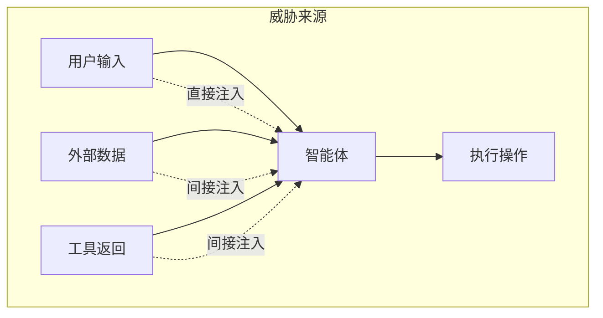

## 11.2 威胁模型：不可信来源与攻击目标

威胁模型回答两个问题：哪些来源能影响模型的判断，攻击者想借智能体达到什么目标。防御需要限定每类来源出问题后可能造成的最大后果，不能仅依赖识别恶意内容。

### 11.2.1 按来源：不可信来源总表

智能体的不可信来源可分为六类：外部内容、工具与技能、记忆与会话历史、其他智能体、模型本身和人。下表对应不可靠执行者模型的第二项要求（盘点来源，见 [11.3](11.3_unreliable_executor.md)），列出不可信来源及其防御方法，也可作为本篇的索引，后续各节分别展开其中一行：

| 不可信的来源 | 从哪里进来 | 主要风险 | 确定性防御 | 主要章节 |
|--------------|------------|----------|------------|----------|
| 外部内容：网页、邮件、文档、检索结果、工具返回 | 工具结果、检索、上传文件 | 间接注入；知识库投毒 | 只交给无权限的隔离模型读，按事先锁定的字段清单（抽取契约）抽取；由代码维护的来源标记；检索前按用户权限过滤 | [第七章](../07_rag_security/README.md)、[12.1](../12_agent_attack_surface/12.1_tool_security.md)、[12.4](../12_agent_attack_surface/12.4_url_exfiltration.md) |
| 工具与技能：MCP Server、插件、技能包 | 工具描述进入上下文；代码在本机执行 | 描述投毒；恶意或仿冒的包；启动命令即代码执行；服务端索取的采样与征询 | 供应链准入、固定版本、描述变更比对后审批；本地 Server 进沙箱 | [12.1.8](../12_agent_attack_surface/12.1_tool_security.md)、[12.2](../12_agent_attack_surface/12.2_agent_skills.md) |
| 记忆与会话历史 | 每一轮从会话与记忆中取上下文 | 一次注入被持久化；摘要把不可信内容洗成可信 | 写入门控；由多个来源派生的内容按其中最不可信的来源标记；可信配置只由用户写入 | [12.3](../12_agent_attack_surface/12.3_memory_poisoning.md) |
| 其他智能体 | 发来的消息、被调用后的返回 | 注入在智能体之间传染；冒充 | 入站门控（身份、去重、记日志）；正文按不可信内容抽取；各自独立身份 | [12.7](../12_agent_attack_surface/12.7_multi_agent_security.md) |
| 模型本身：权重、微调与它的每个输出 | 每一次调用 | 幻觉与错位（随机出错）；后门或被投毒的权重（被人操纵） | 输出只是请求，会造成损失的动作一律过闸：参数只用真实存在的值，策略按参数来源判定，确认绑定参数，不可逆操作先演练后执行；模型来源校验、签名与固定版本 | [11.1](11.1_agent_implementation.md)、[11.6](11.6_typical_failures.md)、[11.8](11.8_dark_code.md)、[11.9](11.9_web3_agents.md)、[12.1.4](../12_agent_attack_surface/12.1_tool_security.md)、[13.1.5](../13_agent_architecture/13.1_agents_rule_of_two.md)、[14.3.8](../14_agent_practice/14.3_coding_agents.md)、[6.2](../06_data_model_attacks/6.2_backdoor_attacks.md)、[8.6](../08_architecture/8.6_supply_chain.md) |
| 人：用户与审批者 | 任务请求；用户粘贴或上传的内容；对高风险动作的确认 | 面向公众时的直接注入与越狱；粘贴或上传的他人内容夹带指令；借智能体越权，即请求超出用户本人的权限；审批疲劳；被智能体的输出操纵 | 认证与任务级授权；智能体的权限不超过用户本人（[13.4](../13_agent_architecture/13.4_agent_identity.md)）；用户提供的他人内容按外部内容处理；确认展示参数与来源，控制确认数量 | 第四、五章、[12.6](../12_agent_attack_surface/12.6_human_layer.md) |

各行的防御都不依赖识别恶意内容，而是限定该来源出问题后可能造成的最大后果，即 [4.5.11](../04_prompt_injection/4.5_injection_defense.md) 所说的确定性防御。检测器与模型审核仍有价值，但只能降低频率。

用户也是表中的一类来源。**委托人**（principal：智能体代其执行任务、且所用权限不超出其本人权限的用户）本人写的任务请求只在一个意义上可信：它规定了任务是什么。用户输入须先确认属于这种请求，并在其余方面照常校验：发出者是否确为委托人（认证是否有效、会话是否被劫持、共享会话里是否混有其他成员的消息），内容中是否夹带他人编写的部分（粘贴、上传、转发），请求是否超出委托人本人的权限，以及内容本身是否有误。

上传、转发等独立通道可由代码标记来源；直接粘贴进输入框的文字，代码无法与本人所写区分，OWASP 把这类情形称为无意的直接注入，其后果只能由权限与确认设上界。智能体持有超出用户本人的权限时（例如面向公众的客服能调用部署方的退款接口、能读到其他用户的数据），就超出的部分而言用户就是他人，其输入按不可信内容处理（直接注入与越狱，见[第四章](../04_prompt_injection/README.md)、[第五章](../05_jailbreak/README.md)）。

### 11.2.2 注入路径与攻击面

总表按来源列出风险；落到具体系统上，攻击面可从注入路径和工程组件两个角度画出。图 11-2 只画出六类来源中与注入相关的三条：

图 11-2：智能体安全威胁模型架构图

将智能体拆分为具体的工程组件后，攻击面比“输入源列表”更立体，上下文、工具和执行环境会共同放大风险：

图 11-3：智能体系统攻击面地图

### 11.2.3 按攻击目标

攻击者借智能体想达到的目标可分为四类：

| 目标 | 描述 | 危害示例 |
|------|------|----------|
| 操作滥用 | 执行未授权操作 | 发送恶意邮件 |
| 数据窃取 | 获取敏感信息 | 读取私密文件 |
| 系统破坏 | 损害系统完整性 | 删除重要数据 |
| 资源消耗 | 耗尽系统资源 | 无限循环任务 |
