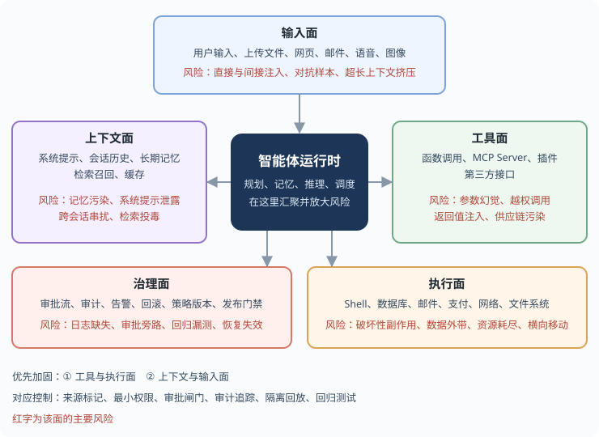

## 11.2 智能体安全威胁模型

智能体的安全威胁可以从多个维度分析。按来源的完整清单见[第十一章](README.md)章首的总表（六类来源），下图只画其中与注入相关的三条：

**按攻击来源**

图 11-3：智能体安全威胁模型架构图

如果把智能体拆成具体工程组件，攻击面会比“输入源列表”更立体，尤其是上下文、工具和执行环境会共同放大风险：

图 11-4：智能体系统攻击面地图

**按攻击目标**
| 目标 | 描述 | 危害示例 |
|------|------|----------|
| 操作滥用 | 执行未授权操作 | 发送恶意邮件 |
| 数据窃取 | 获取敏感信息 | 读取私密文件 |
| 系统破坏 | 损害系统完整性 | 删除重要数据 |
| 资源消耗 | 耗尽系统资源 | 无限循环任务 |
