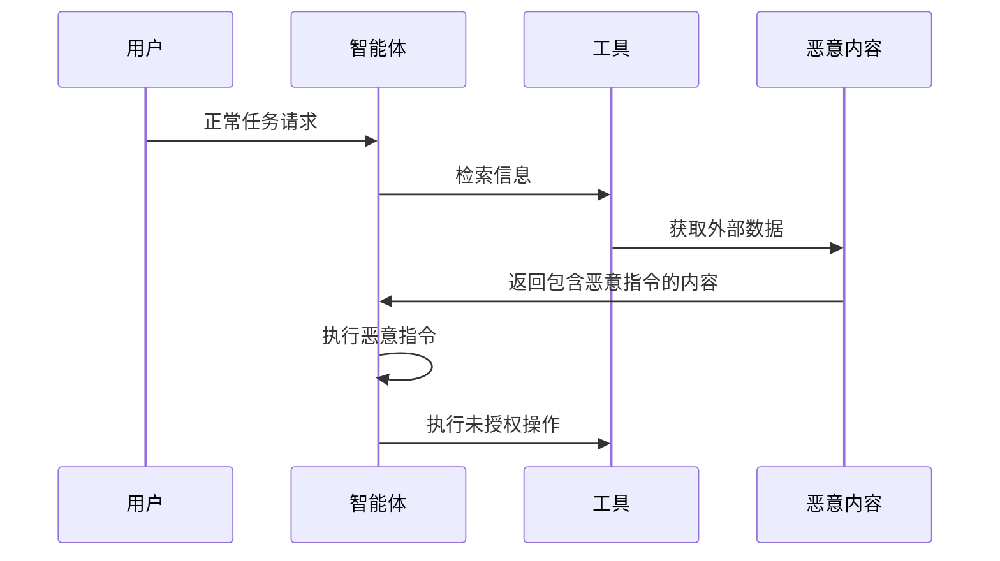

## 11.4 智能体控制流劫持

攻击者可能通过注入指令劫持智能体的控制流。

**劫持场景**

图 11-5：智能体控制流劫持时序图

**劫持后果**
- 智能体偏离原始任务
- 执行攻击者期望的操作
- 形成攻击链

控制流劫持是[第十一章](README.md)总表“外部内容”一行最典型的后果。阻止它的手段是 [14.5](../14_agent_practice/14.5_security_panorama.md) 第 4 步按参数来源做出的确定性判定，而不是识别恶意指令：被劫持的模型可以提出任何请求，但来自外部内容的参数无法到达高风险的出口。

**典型案例模式：被检索内容导致的“零点击”注入**

攻击者可以把恶意提示藏入日后会被检索到的邮件或文档，用户无需打开即可触发，EchoLeak 即是一例（[附录 C-47](../16_appendix/C_references.md)，详见 [9.2](../09_io_protection/9.2_output_moderation.md) 节）；文档中隐藏文本的系统研究见 [7.4.2](../07_rag_security/7.4_ingestion_pipeline.md)。典型过程如下：
1. **投毒**：攻击者发来一封邮件，正文看似写给人的说明，其中夹带给模型的指令。
2. **触发**：用户之后向助手提问，助手检索到这封邮件并放入上下文，指令随之生效。
3. **后果**：模型把用户邮件与文档中的敏感内容拼进一个指向外部的图片链接，客户端自动加载图片时数据即被带出（[13.1.4](../13_agent_architecture/13.1_agents_rule_of_two.md)）。

**“零点击”与间接注入**：此处的“间接提示注入”（Indirect Prompt Injection）或“上下文注入”是指恶意内容经智能体自动处理的外部文档或数据触发，无需用户额外交互即可激活。它不同于移动安全领域的“零点击利用”（Zero-Click Exploitation）：后者是指完全无需用户交互、自动执行的系统级漏洞利用；间接提示注入虽然对最终用户“无感知”，但仍依赖智能体对外部内容的主动处理。
