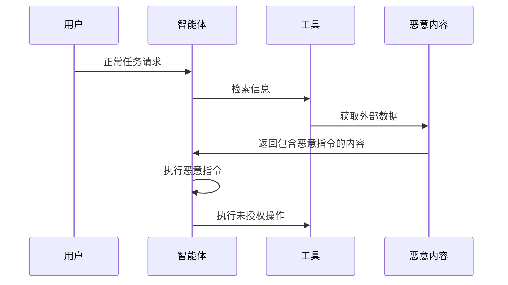

## 11.4 智能体控制流劫持

攻击者可能通过注入指令劫持智能体的控制流。

**劫持场景**

图 11-5：智能体控制流劫持时序图

**劫持后果**
- 智能体偏离原始任务
- 执行攻击者期望的操作
- 形成攻击链

控制流劫持是第十一章总表“外部内容”一行最典型的后果。挡住它的不是识别出恶意指令，而是 14.5 第 4 步按参数来源做的确定性判定：被劫持的模型可以提出任何请求，但来自外部内容的参数到不了高风险的出口。

**典型案例模式：文档隐写导致的“零点击”注入**

攻击者可以在文档中嵌入不可见的恶意提示，实现类似“零点击”的触发——EchoLeak 即是一例（附录 C-47），隐藏文本的系统研究见 7.4.2：
1. **投毒**：在 Word 文档中嵌入不可见的恶意 Prompt。
2. **触发**：当具备文档读取能力的智能体处理该文件时，Prompt 被激活。
3. **后果**：智能体可能泄露文档内容，并进一步执行 API 调用，将凭证/密钥类敏感信息外带。

**关于“零点击”与间接注入的澄清**：此处的“间接提示注入”（Indirect Prompt Injection）或“上下文注入”指的是恶意内容通过被智能体自动处理的外部文档/数据被触发，无需用户额外交互即可激活。这与移动安全领域的“零点击利用”（Zero-Click Exploitation）概念有所不同：移动零点击利用指的是在完全不需要用户交互的情况下自动执行的系统级漏洞利用，而间接提示注入虽然对最终用户来说“无感知”，但仍然依赖于智能体对外部内容的主动处理过程。
