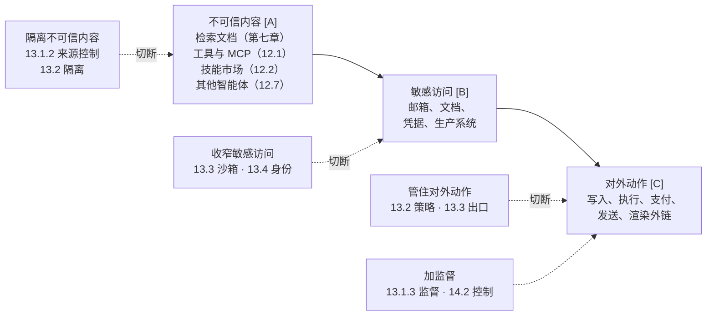

## 11.4 致命三要素与 Rule of Two

判断智能体的最坏情况、从而确定闸的强度，只需考察三个条件：不可信内容、敏感访问、对外动作。三者齐全时攻击链成立，闸必须是硬规则或人工确认；防御就是去掉其中一项，三项都需保留时则加监督。下面先介绍 Simon Willison 的致命三要素，再介绍 Meta 将其推广而成的 Rule of Two，然后说明攻击链与四种防御形态、没有攻击者时的情形，最后说明本篇如何按这条链组织。

### 11.4.1 致命三要素

[11.2](11.2_threat_model.md) 按来源与目标划分了风险；实际评估一个智能体时，需要更简单的判据。Simon Willison 提出的“致命三要素”（[附录 C-99](../16_appendix/C_references.md)）就是这样的判据：只要智能体同时具备以下三项能力，攻击者就能诱使它窃取数据。

| 要素 | 含义 | 常见形态 |
|------|------|----------|
| 访问私有数据 | 能读取用户或组织不公开的信息 | 邮箱、文档、代码仓库、数据库、本机文件 |
| 接触不可信内容 | 攻击者控制的文本或图像能进入模型上下文 | 网页、来信、上传的文件、公开仓库的 Issue、工具返回值 |
| 对外通信 | 存在能把数据送到攻击者手里的通道 | 发邮件、发起网络请求、渲染外部图片、创建公开内容 |

其原理在于模型会遵循内容中的指令，而不区分指令来自操作者还是来自它正在处理的材料。三项同时具备时，攻击链自然成立：不可信内容里的指令让模型读取私有数据，再通过对外通道送出。

### 11.4.2 Rule of Two 的三项性质

闸的强度由 Meta 提出的 Agents **Rule of Two** 判断（[13.1](../13_agent_architecture/13.1_agents_rule_of_two.md)），它在致命三要素的基础上加以推广，把“对外通信”扩展为“改变状态或对外通信”，从而把破坏性操作也纳入其中。该规则从智能体的能力出发，列出三项性质：

- **不可信内容**（[A]）：模型在任务中读取由他人编写的内容，如网页、邮件、文档、检索结果、工具返回和其他智能体的消息，攻击者可借此操纵模型；
- **敏感访问**（[B]）：智能体能访问敏感数据或系统；
- **对外动作**（[C]）：智能体能够改变状态或对外通信，包括写入、执行、删除、支付、发送，也包括渲染外部图片、访问链接等不易察觉的外发。

本书后文将这三项表述为三个条件，并沿用 Meta 的字母记法（[13.1](../13_agent_architecture/13.1_agents_rule_of_two.md)）：

```text
[A] 不可信内容：模型会读到他人编写的内容    ——  攻击的入口（攻击者借此下指令）
[B] 敏感访问：能访问敏感数据或系统          ——  攻击的目标
[C] 对外动作：能改变状态或对外通信          ——  攻击的出口（含渲染外链这类隐性外发）

攻击链：不可信内容 → 敏感访问 → 对外动作
防御：隔离不可信内容、收窄敏感访问、管住对外动作，三者去其一；三者都需保留时，则加监督
```

[A] 与 [B] 最容易混淆：[A] 取决于内容由谁编写，[B] 取决于权限能访问什么。读取用户的收件箱同时满足两项：他人的来信是不可信内容，收件箱本身是敏感数据。

[A] 也不等于用户输入。委托人本人写的任务请求就是任务本身，不属于 [A]；用户转交的他人内容（粘贴、上传、转发）属于 [A]；智能体持有超出用户本人的权限时，就超出的部分而言用户输入也按 [A] 处理（见 [11.2.1](11.2_threat_model.md) 来源总表后的说明）。模型自身的输出本身不算 [A]，但一次调用只要读过 [A]，其输出就按 [A] 染色（[13.2.4](../13_agent_architecture/13.2_architectural_defenses.md)）；即使没有读过，它也不可信，由 [C] 一侧的策略与确认把关。

现有框架对用户输入的处理也有前提。Meta 原文对 [A] 只举了外来邮件与网页内容，也指出满足 Rule of Two 不足以应对攻击者借智能体增强能力（attacker uplift）、权限过大（excessive privileges）等其他威胁。CaMeL 把“用户提示可信、用户没有粘贴来自不可信来源的提示”列为前提假设（[附录 C-97](../16_appendix/C_references.md)），部署时这一前提不会自动成立。

### 11.4.3 攻击链与四种防御形态

三项能力串成一条攻击链，它决定了闸的强度和防御的形态。三项同时具备时，攻击者可通过第一项操纵模型，再通过后两项造成损失，形成攻击链：**不可信内容 → 敏感访问 → 对外动作**。此时闸必须是硬规则或人工确认，不能只依赖模型“大概不会错”。由另一个模型检查也不满足要求：检查模型读取同一份上下文，可能被同一段文字说服。以概率部分检查概率部分，只能降低出错频率，不能为后果设定上界。

缺少任一项，攻击链即无法完成。相应地，防御有四种形态：**隔离不可信内容**（控制来源，或只交给无权限的隔离模型读取）、**收窄敏感访问**（隔离与身份）、**管住对外动作**（出口与策略）；三项都必须保留时，则 **加监督**。

全篇主线汇总在图 11-4 中：攻击链上的三项能力、切断各项的四种防御形态，以及它们在本篇中的位置。



图 11-4：智能体安全篇的主线——攻击链与四种防御

这条攻击链把问题从“如何识别恶意内容”转为“能否去掉三项之一”。对任何新接入的工具或数据源，都可先判断它为智能体增加了哪一项要素、增加之后三项是否齐备。工具可以自由组合时，用户往往在不知情的情况下使三项齐备：分别安装一个能读取内部文档的工具和一个能联网搜索的工具，两者单独看都没有问题。

### 11.4.4 没有攻击者时

只有幻觉而没有攻击者时，Rule of Two 不适用，但不可靠执行者模型第三项要求（[11.3.3](11.3_unreliable_executor.md)）中的闸仍然生效。幻觉不需要攻击者，但造成的损失可能完全相同：随机删除一批数据，与被诱导删除没有区别（[11.1](11.1_agent_implementation.md) 的第四条结论，[11.6](11.6_typical_failures.md)、[11.8](11.8_dark_code.md)、[11.9](11.9_web3_agents.md)）。它也不需要另一套防御：会造成损失的动作一律过闸，闸不区分原因（[13.1.5](../13_agent_architecture/13.1_agents_rule_of_two.md) 的不可逆操作网关即为这道闸）；这条链只决定有攻击者时闸的强度。

### 11.4.5 本篇按攻击链的组织

本篇的结构可用这条链概括（图 11-4）。[第七章](../07_rag_security/README.md)和[第十二章](../12_agent_attack_surface/README.md)讨论不可信内容的入口：检索到的文档（第七章）、工具与协议（[12.1](../12_agent_attack_surface/12.1_tool_security.md)）、技能市场（[12.2](../12_agent_attack_surface/12.2_agent_skills.md)）、记忆（[12.3](../12_agent_attack_surface/12.3_memory_poisoning.md)）、URL（[12.4](../12_agent_attack_surface/12.4_url_exfiltration.md)）、屏幕（[12.5](../12_agent_attack_surface/12.5_computer_use_browser.md)）、人（[12.6](../12_agent_attack_surface/12.6_human_layer.md)）、其他智能体（[12.7](../12_agent_attack_surface/12.7_multi_agent_security.md)）。[第十三章](../13_agent_architecture/README.md)讨论防御：[13.1](../13_agent_architecture/13.1_agents_rule_of_two.md) 介绍如何去掉一项并分析真实事故，[13.2](../13_agent_architecture/13.2_architectural_defenses.md) 介绍如何在系统结构上做到“读得到却做不了”，[13.3](../13_agent_architecture/13.3_sandbox_egress.md) 介绍收窄访问、管住动作的操作系统实现，[13.4](../13_agent_architecture/13.4_agent_identity.md) 介绍如何按身份收窄访问凭据，[13.5](../13_agent_architecture/13.5_tooling_selection.md) 介绍落地这些机制的工具及其边界。[第十四章](../14_agent_practice/README.md)讨论实践：[14.1](../14_agent_practice/14.1_coding_agents.md) 分析三项齐全且后果最重的编码智能体，[14.4](../14_agent_practice/14.4_case_study.md) 将上述方法用于一个完整系统，[14.5](../14_agent_practice/14.5_security_panorama.md) 给出全景；三项都需保留时的监督见 [13.1.3](../13_agent_architecture/13.1_agents_rule_of_two.md) 和 [14.2](../14_agent_practice/14.2_sabotage_ai_control.md)。
