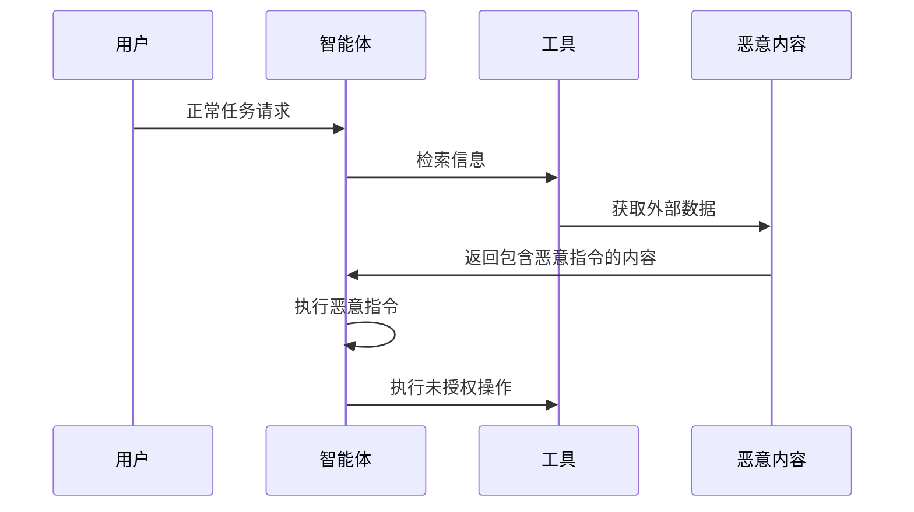

## 11.6 三类典型失效：被操纵、随机出错、权限膨胀

[11.3](11.3_unreliable_executor.md) 指出，模型会被操纵，也会随机出错；系统一侧还会出现权限膨胀，使敏感访问与对外动作在不知不觉中扩大。三类失效的防御都不依赖识别恶意或错误本身，而是让会造成损失的动作经过模型之外的闸。下面依次讨论被操纵（控制流劫持）、随机出错（幻觉驱动的工具调用）和权限膨胀（过度自主权）。

### 11.6.1 被操纵：控制流劫持

攻击者可能通过注入指令劫持智能体的控制流，使它偏离原始任务、执行攻击者期望的操作。

图 11-5：智能体控制流劫持时序图

控制流劫持是 [11.2.1](11.2_threat_model.md) 来源总表“外部内容”一行最典型的后果。阻止它的手段是 [14.5](../14_agent_practice/14.5_security_panorama.md) 第 4 步按参数来源做出的确定性判定，而不是识别恶意指令：被劫持的模型可以提出任何请求，但来自外部内容的参数无法到达高风险的出口。

**典型案例模式：被检索内容导致的“零点击”注入。** 攻击者可以把恶意提示藏入日后会被检索到的邮件或文档，用户无需打开即可触发，EchoLeak 即是一例（[附录 C-47](../16_appendix/C_references.md)，详见 [9.2](../09_io_protection/9.2_output_moderation.md) 节）；文档中隐藏文本的系统研究见 [7.4.2](../07_rag_security/7.4_ingestion_pipeline.md)。典型过程如下：

1. **投毒**：攻击者发来一封邮件，正文看似写给人的说明，其中夹带给模型的指令。
2. **触发**：用户之后向助手提问，助手检索到这封邮件并放入上下文，指令随之生效。
3. **后果**：模型把用户邮件与文档中的敏感内容拼进一个指向外部的图片链接，客户端自动加载图片时数据即被带出（[13.1.4](../13_agent_architecture/13.1_agents_rule_of_two.md)）。

**“零点击”与间接注入**：此处的“间接提示注入”（Indirect Prompt Injection）或“上下文注入”是指恶意内容经智能体自动处理的外部文档或数据触发，无需用户额外交互即可激活。它不同于移动安全领域的“零点击利用”（Zero-Click Exploitation）：后者是指完全无需用户交互、自动执行的系统级漏洞利用；间接提示注入虽然对最终用户“无感知”，但仍依赖智能体对外部内容的主动处理。

### 11.6.2 随机出错：幻觉驱动的工具调用

幻觉也会造成往往不可逆的损失。智能体的工具调用参数由模型生成，而模型会幻觉。在纯对话场景中，幻觉的后果是一段错误的文字；在智能体场景中，幻觉产生的文件路径、收件地址或账户编号会被直接执行，导致删错文件、发错邮件、转错账。这类错误不需要任何攻击者，而且往往不可逆。

参数幻觉的具体形态、检测方法与防护措施在 [12.1.4 节](../12_agent_attack_surface/12.1_tool_security.md)结合工具调用机制展开；与提示注入无关的不可逆操作应如何把关，见 [13.1.5 节](../13_agent_architecture/13.1_agents_rule_of_two.md)的不可逆操作网关。隔离不可信内容这类防御无法覆盖幻觉：一个完全未接触不可信内容的智能体同样会因幻觉造成破坏；但会造成损失的动作仍要过同一道闸（[13.1.5](../13_agent_architecture/13.1_agents_rule_of_two.md)）。

### 11.6.3 权限膨胀：过度自主权

随着功能需求增加，智能体的权限容易逐渐膨胀。OWASP LLM Top 10 将“过度自主权”列为重要风险，智能体是其典型场景。

图 11-6：权限膨胀过程

权限膨胀是指敏感访问 [B] 与对外动作 [C] 在不知不觉中扩大；每增加一项权限，都要按 Rule of Two 重新判断闸的强度。权限的治理方法见 [11.7](11.7_permission_governance.md)。
