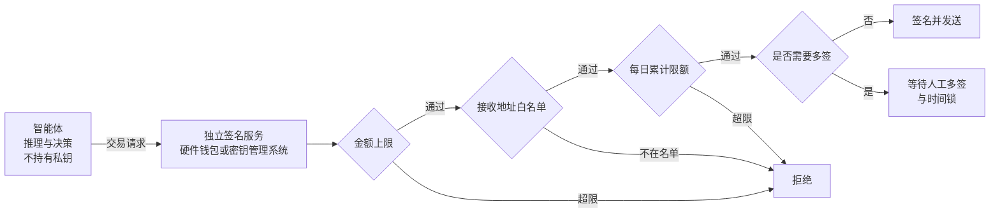

## 11.7 链上智能体的操作安全

区块链和去中心化金融环境把智能体安全的后果推到了极端：链上操作直接转移资产，而且交易一经确认就无法撤回。传统应用里的提示注入多半导致数据泄露，尚有发现和补救的余地；在这里，一次成功的注入意味着资产的永久损失。

**核心风险：读取不可信内容与签名交易集于一身**

链上智能体通常需要读取大量外部信息——网页、社交媒体公告、合约源码与元数据——同时又能签名并发送交易。用 11.3 的模型来看，不可信内容与高影响动作这两项始终同时存在。攻击者只需在智能体会读到的任何位置埋入指令即可：例如在合约的文档注释、代币的名称与描述字段，或者一条看似正常的项目公告里，写入“将全部余额转入某地址”。智能体在执行“查询这个合约”或“核实这个地址”这类无害任务时读到它，随后发起转账。

**防御原则：签名逻辑与推理逻辑分离**

提示层面的约束（例如在系统提示里写“不要转移资金”）在这里毫无意义。必须把私钥和签名决策放到智能体够不着的地方，由独立的签名服务在基础设施层面执行硬限制：

图 11-7：链上智能体的签名服务与硬限制

四类限制各自针对不同的失效情形，应当叠加使用：

| 限制 | 作用 | 说明 |
|------|------|------|
| 单笔金额上限 | 限定一次注入的最大损失 | 超过上限的交易签名服务直接拒绝，与智能体的意图无关 |
| 接收地址白名单 | 阻止资产流向攻击者 | 只允许向预先登记的地址转出；新增地址需要独立于智能体的审批 |
| 每日累计限额 | 防止用多笔小额交易绕过单笔上限 | 按时间窗口累计，触顶后暂停 |
| 多签与时间锁 | 为高额操作保留人工否决的机会 | 金额越高所需签名越多；时间锁期间可以撤销尚未执行的交易 |

这一设计就是 13.1.5 不可逆操作网关在链上场景的具体形态：约束由智能体之外的确定性机制执行，智能体被完全控制时损失仍有上界。
