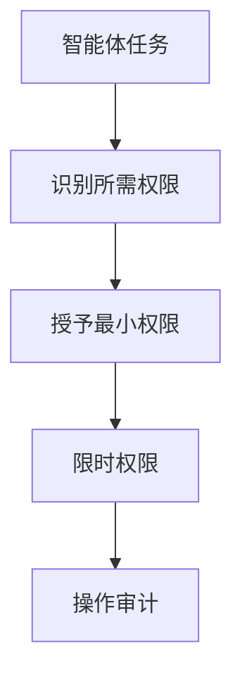

## 11.9 智能体安全设计原则

**最小权限原则**


图 11-8：智能体安全设计原则流程图

**权限控制最佳实践**
| 原则 | 实施方式 |
|------|----------|
| 能力隔离 | 不同任务使用不同权限集 |
| 时间限制 | 权限自动过期 |
| 范围限制 | 限制操作范围 |
| 可撤销 | 支持权限快速回收 |

**工具数量增长后的权限治理**

工具少的时候，逐个工具配置权限并人工审查是可行的。工具增加到几十个之后，问题的性质变了：风险不再来自某一个工具的权限过大，而来自**工具之间的组合**——单独看都合理的“读取内部文档”和“发送邮件”，放在一起就构成了 [11.3](11.3_lethal_trifecta.md) 所说的外泄条件。逐项审查发现不了这类问题，因为需要审查的是组合，而组合的数量随工具数指数增长。

可行的做法是放弃“为每个智能体静态配置一张完整权限表”，改为以下四种机制的组合：

| 机制 | 做法 | 解决的问题 |
|------|------|------------|
| 角色模板 | 预定义少量角色及其工具集，新任务归入已有角色，而不是逐项配置 | 降低配置数量，便于审查 |
| 按任务动态收窄 | 任务开始时由策略引擎根据任务类型确定可用工具子集，任务结束即收回 | 实际生效的权限远小于智能体的全部能力 |
| 短时效授权 | 高风险权限绑定到具体操作，单次有效或分钟级过期 | 被注入后可利用的时间窗口很短 |
| 危险组合规则 | 用规则引擎声明不得同时出现的能力组合，在配置变更和运行时检查 | 直接针对组合风险 |

其中第四项最能体现智能体权限治理与传统做法的区别。规则的写法是声明“哪些能力不得在同一会话中同时出现”，例如：

```text
规则 1：[不可信内容] + [敏感访问] + [对外动作：改变状态或对外通信] 同时启用时，对外动作须经确定性校验或人工确认（见 13.1.3）
规则 2：[删除生产数据] 需要 [人工确认] 作为前置
规则 3：[调用支付接口] 的单次与累计金额不得超过上限
```

这类规则数量很少，却覆盖了数量庞大的危险组合，而且可以在每次工具集变更时自动检查。按任务动态收窄的进一步形式，是 [13.2.4](../13_agent_architecture/13.2_architectural_defenses.md) 介绍的策略化权限控制：权限随任务进展只收窄、不放宽，放宽必须经过批准。

**人机协作模式**
对高风险操作引入人工确认，按可逆性与影响面分级，而不是按工具分级：只读与可逆写入自动执行，影响面有限的不可逆操作走确定性校验、超出范围转人工，高影响不可逆操作先演练再人工确认。同一个“执行命令”在沙箱里可以撤销，在生产环境就不可逆。分级表见 [13.1.5](../13_agent_architecture/13.1_agents_rule_of_two.md)。
