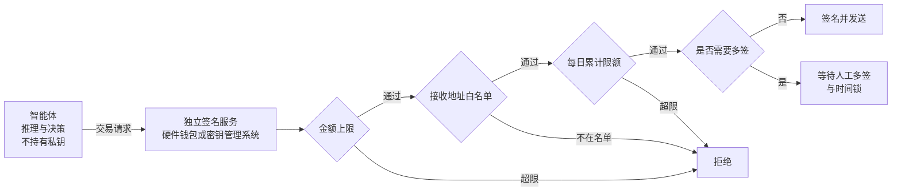

## 11.9 高后果场景：资金操作

资金操作的检查必须发生在付款之前。链上转账与推送式付款很难撤回；卡支付即使支持退款或拒付，也不能用事后追索代替事前授权。模型负责提出交易，独立的签名与支付组件负责核对收款方、金额、授权范围和已占用预算。

### 11.9.1 链上智能体的核心风险

区块链和去中心化金融环境使智能体安全的后果达到极端：链上操作直接转移资产，且交易一经确认即无法撤回。传统应用中的提示注入多半导致数据泄露，尚有发现和补救的余地；在链上，一次成功的注入意味着资产的永久损失。

核心风险在于读取不可信内容与签名交易集于一身。链上智能体通常需要读取大量外部信息（网页、社交媒体公告、合约源码与元数据），同时又能签名并发送交易。按 [11.4](11.4_lethal_trifecta.md) 的模型，不可信内容与高影响动作这两项始终同时存在。攻击者只需在智能体会读到的任何位置埋入指令即可：例如在合约的文档注释、代币的名称与描述字段，或者一条看似正常的项目公告里，写入“将全部余额转入某地址”。智能体在执行“查询这个合约”或“核实这个地址”这类无害任务时读到该指令，随后发起转账。

### 11.9.2 签名逻辑与推理逻辑分离

提示层面的约束（例如在系统提示中写“不要转移资金”）在此毫无作用。私钥和签名决策必须置于智能体无法访问的位置，由独立的签名服务在基础设施层面执行硬限制：

图 11-8：链上智能体的签名服务与硬限制

四类限制各自针对不同的失效情形，应当叠加使用：

| 限制 | 作用 | 说明 |
|------|------|------|
| 单笔金额上限 | 限定一次注入的最大损失 | 超过上限的交易签名服务直接拒绝，与智能体的意图无关 |
| 接收地址白名单 | 阻止资产流向攻击者 | 只允许向预先登记的地址转出；新增地址需要独立于智能体的审批 |
| 每日累计限额 | 防止用多笔小额交易绕过单笔上限 | 按时间窗口累计，触顶后暂停 |
| 多签与时间锁 | 为高额操作保留人工否决的机会 | 金额越高所需签名越多；时间锁期间可以撤销尚未执行的交易 |

这一设计是 [13.1.5](../13_agent_architecture/13.1_agents_rule_of_two.md) 不可逆操作网关在链上场景的具体形态：约束由智能体之外的确定性机制执行，智能体被完全控制时损失仍有上界。

本节以资金操作说明模型提出请求、独立组件掌握签名权限的边界。支付协议如何表达授权、校验交易，以及累计预算如何处理并发请求与未知付款状态，见 [14.5 资金操作：授权凭证与可信预算](../14_agent_practice/14.5_payment_security.md)。
