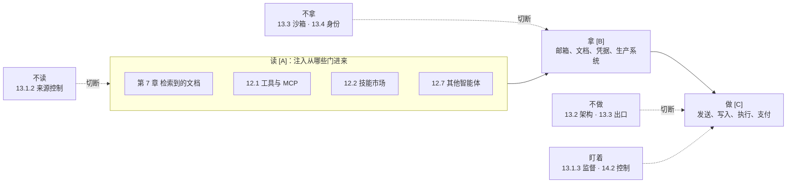

# 第十一章 智能体安全基础

从本章起进入智能体安全篇。智能体把模型接上工具、记忆和外部环境，让它能自主规划和行动，这是能力上的飞跃，也把安全问题从“模型会说什么”变成了“系统会做什么”。本篇用四章讨论这一问题：本章先把智能体的实现结构、威胁模型和一条贯穿全篇的主线讲清楚；第十二章逐一分析攻击者从哪些门进来；第十三章讲怎样划边界；第十四章用编码智能体、综合案例和一张全景图收束。

## 本篇的一条主线

全篇围绕一个模型展开，它只有三项能力和一条链：

- **读**（[A]）：智能体读到攻击者能控制的内容；
- **拿**（[B]）：智能体拿得到敏感数据或系统；
- **做**（[C]）：智能体做得出离开信任边界的动作——发送、写入、执行、支付。

攻击者要得手，必须让这条链 **读 → 拿 → 做** 走完。与此并列的一个前提是：**模型本身就是不可靠的信息源**，它会幻觉、会错位、输出不可复现，所以它的每个输出都只是待校验的请求，决定由模型之外的代码做出。防御因此只有四种形态：**不读**（控制来源）、**不拿**（隔离与身份）、**不做**（出口与策略），三项都必须保留时则 **盯着**（监督）。本篇四章就按这条链展开：第十一章建立结构与主线，第十二章讲攻击者从哪些门“读”进来，第十三章讲四种防御怎样落地，第十四章用典型场景和一张全景图收束。想先看全貌的读者可以直接读 14.5。

图 11-1：智能体安全篇的主线——攻击链与四种防御

## 本章内容

- **11.1 智能体的实现结构与调用过程**：上下文窗口里有什么、循环怎么跑、各家术语落在循环的哪个位置，以及由此推出的四条安全结论
- **11.2 智能体安全威胁模型**：按来源与目标划分的攻击面
- **11.3 致命三要素**：判断最坏情况的三问——读、拿、做
- **11.4 智能体控制流劫持**：攻击者让这条链走通的方式
- **11.5 过度自主权**：权限为什么会膨胀
- **11.6 幻觉驱动的工具调用**：没有攻击者也会出事
- **11.7 链上智能体的操作安全**：后果不可逆的极端场景
- **11.8 暗码：不可追溯的运行时行为**：为什么审查代码的老办法不够用
- **11.9 智能体安全设计原则**：最小权限与权限治理的总纲
- **11.10 智能体监控与审计**：要记什么、才能回答“哪段输入引起了哪个动作”

> **⚠️ 道德边界**：本篇对工具调用滥用、记忆投毒、多智能体信任链破坏的剖析，用于让智能体开发者识别并修复自身系统的安全弱点；针对未经授权的他方系统执行类似攻击违反法律与服务条款。完整声明见 [§4 章首道德边界与负责任披露说明](../04_prompt_injection/README.md)。

## 对照 OWASP 智能体安全威胁清单

OWASP GenAI 安全项目的 [Agentic AI – Threats and Mitigations](https://genai.owasp.org/resource/agentic-ai-threats-and-mitigations/) 提出了 17 项智能体威胁（T1–T17）。该清单 v1.0（2025-02）原本只有 T1–T15，v1.1（2025-12）新增 T16、T17 以与 Agentic Top 10 对齐——注意官方资源页的版本标注一度仍停留在 v1.0，以 PDF 封面与 ASI Top 10 2026 附录 A 的交叉引用为准。本篇（结合相关章节）对这些威胁均有覆盖，便于读者按该清单自查：

| OWASP 威胁 | 本书覆盖位置 |
|------------|--------------|
| T1 记忆投毒 | 12.3、12.7.3 |
| T2 工具滥用 | 12.1 |
| T3 权限提升 | 11.9、12.1.8、12.7.2、13.4.3 |
| T4 资源过载 | 3.1.7（LLM06）、11.2 |
| T5 级联幻觉 | 12.7.2、4.3.9 |
| T6 意图篡改与目标操纵 | 15.3.3、15.3.4、14.3 |
| T7 错位与欺骗行为 | 14.3、14.2、15.3.12 |
| T8 抵赖与不可追溯 | 11.8、11.10、13.1.5、13.4.3 |
| T9 身份伪造与冒充 | 12.7.4、13.4.4 |
| T10 淹没人工审核 | 12.6 |
| T11 意外远程代码执行 | 6.7、12.1.8、12.1.10、13.3、14.1 |
| T12 智能体通信投毒 | 12.7.2、12.7.3 |
| T13 失控智能体 | 12.7.5、14.2 |
| T14 针对多智能体系统的人为攻击 | 12.7.2、13.1.3 |
| T15 人类操纵 | 12.6 |
| T16 智能体间协议滥用 | 12.7.4、12.1.8 |
| T17 供应链攻陷 | 12.2.2、12.2.3、12.2.4、12.1.8、14.1.5 |

## 对照 OWASP Agentic Top 10（2026）

上表的 T1–T17 出自威胁清单；在此之上，OWASP GenAI Security Project 的智能体安全倡议（Agentic Security Initiative）于 **2025-12** 发布了 *OWASP Top 10 For Agentic Applications 2026*（Version 2026），用 `ASI01`–`ASI10` 给出智能体应用的十大风险。它**与 3.1 的 LLM Top 10（2026）并行存在、互不替代**：LLM Top 10 面向「模型驱动的应用」，ASI 清单面向「会规划、会行动、会跨系统调用的智能体」。LLM Top 10 的 2026 版把这条边界写得更明确——**模型作为应用里的一个组件时归 LLM 清单；模型变成能调用工具、跨会话携带记忆、在下游引发后果的行动者时归 ASI 清单**。编号与英文名取自官方 PDF，由 [`data/framework_crosswalk.json`](../data/framework_crosswalk.json) 统一机器校验（见附录 C-94）。

| 官方标识符与英文名 | 中文表述 | 本书覆盖位置 |
|--------------------|----------|--------------|
| ASI01 Agent Goal Hijack | 智能体目标劫持 | 11.4、13.1、13.2、4.3、4.1 |
| ASI02 Tool Misuse and Exploitation | 工具滥用与利用 | 12.1、11.6 |
| ASI03 Identity and Privilege Abuse | 身份与权限滥用 | 13.4、11.9、12.1.8、8.3.4、8.3.6 |
| ASI04 Agentic Supply Chain Vulnerabilities | 智能体供应链漏洞 | 12.2、12.1.8、14.1.4、14.1.5、8.6.5、6.7 |
| ASI05 Unexpected Code Execution (RCE) | 意外代码执行（RCE） | 13.3、14.1、6.7、12.1.10 |
| ASI06 Memory & Context Poisoning | 记忆与上下文投毒 | 12.3、7.2、12.7.3、4.6 |
| ASI07 Insecure Inter-Agent Communication | 智能体间通信不安全 | 12.7.3、12.7.4、12.7.2 |
| ASI08 Cascading Failures | 级联失效 | 12.7.5、12.7.2、4.3.9、10.5 |
| ASI09 Human-Agent Trust Exploitation | 人机信任利用 | 12.6 |
| ASI10 Rogue Agents | 失控智能体 | 12.7.5、14.3、14.2 |

> 两份清单的侧重点不同，不必二选一：T 清单更细、便于逐条自查；ASI 清单更聚合、便于向管理层陈述风险优先级。官方文档本身也给出了 ASI 与 T 编号的对照。
