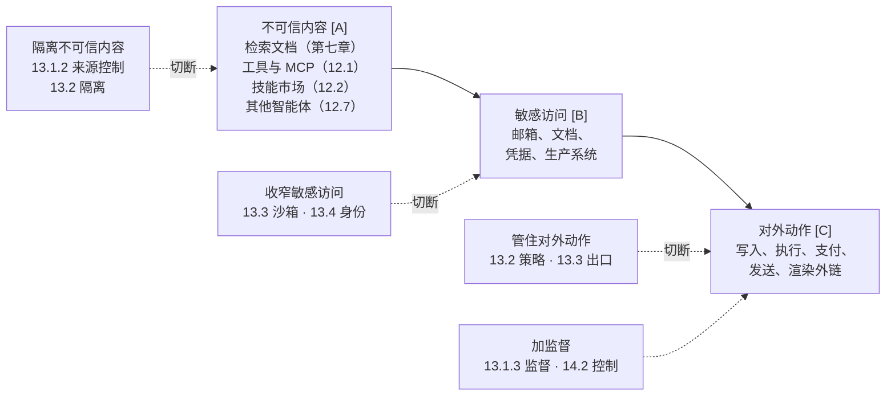

# 第十一章 智能体安全基础

本章起为智能体安全篇。智能体把模型与工具、记忆和外部环境相连，使其能够自主规划和行动；安全问题随之从“模型会输出什么”扩展为“系统会执行什么”。本篇共四章：本章介绍智能体的实现结构、威胁模型和贯穿全篇的主线；[第十二章](../12_agent_attack_surface/README.md)分析攻击入口；[第十三章](../13_agent_architecture/README.md)讨论边界划分与架构防御；[第十四章](../14_agent_practice/README.md)通过编码智能体、综合案例和全景图加以总结。希望先了解全貌的读者可从 [14.5](../14_agent_practice/14.5_security_panorama.md) 读起。

## 本篇主线

智能体系统由确定部分和概率部分组成。确定部分包括 Harness（驱动模型循环、执行模型请求的普通程序，见 [11.1](11.1_agent_implementation.md)）、工具、策略和其他代码，其行为由代码规定，可以测试和审计。确定不等于可信，这一区别在后文的来源总表中讨论。概率部分是模型：模型的下一步取决于它读到的内容，无法事先规定。智能体的能力和它特有的风险都来自这一点：模型可能无故出错，读到的内容也可能改变它的决定。由于二者同源，安全设计的目标不是消除不确定性，而是约束它：**概率的部分出主意，确定的部分拿主意**；规则无法覆盖的决定，交由人确认。

本书据此把智能体安全的各种做法归纳为一个安全模型，称为**不可靠执行者模型**。该模型把模型视为**不可靠的执行者**：它会随机出错（幻觉；错位，即模型追求的目标偏离用户意图），也可能被操纵（注入、后门）。对系统而言，两种情况的后果相同，都是模型提出了错误的请求。两者的差别在于：幻觉相当于不挑目标的攻击者，误删数据与被诱导删除数据后果相同；注入则专门针对价值最高、危险最大的操作，失败后还会改换措辞重试。被操纵也不是随机性导致的：即使把温度设为 0、使输出尽量确定，模型仍可被注入。原因在于，传统软件的控制流由代码决定，数据只提供取值；模型的控制流则由数据决定。

该模型包括三条原则：

1. **不信模型**：模型只提出请求，是否执行由模型之外的代码决定。对下游代码而言，模型输出是不可信输入。
2. **盘点来源**：识别所有能影响模型判断的来源，包括外部内容、工具与技能、记忆、其他智能体、模型本身和人。下文的来源总表逐一列出这些来源及其防御方法。
3. **动作过闸**：可能造成损失的动作，无论起因是幻觉还是攻击，都必须经过闸。闸是位于模型之外、决定动作能否执行的检查点，形式为代码规则或由代码强制执行的人工确认。具体要求是：参数只能取真实存在的值；不可逆操作在确认影响范围后放行；外发内容先经检查；可撤销的操作保留撤销路径。[14.5](../14_agent_practice/14.5_security_panorama.md) 的十二个步骤标出了各个闸的位置。

闸的强度由 Meta 提出的 **Rule of Two** 判断（[13.1](../13_agent_architecture/13.1_agents_rule_of_two.md)）。该规则从智能体的能力出发，列出三项性质：

- **不可信内容**（[A]）：模型在任务中读取由他人编写的内容，如网页、邮件、文档、检索结果、工具返回和其他智能体的消息，攻击者可借此操纵模型。发起任务的用户本人的输入不属于此类；
- **敏感访问**（[B]）：智能体能访问敏感数据或系统；
- **对外动作**（[C]）：智能体能够改变状态或对外通信，包括写入、执行、删除、支付、发送，也包括渲染外部图片、访问链接等不易察觉的外发。

三项同时具备时，攻击者可通过第一项操纵模型，再通过后两项造成损失，形成攻击链：**不可信内容 → 敏感访问 → 对外动作**。此时闸必须是硬规则或人工确认，不能依赖模型不出错。由另一个模型检查也不满足要求：检查模型读取同一份上下文，可能被同一段文字说服。以概率部分检查概率部分，只能降低出错频率，不能为后果设定上界。

缺少任一项，攻击链即无法完成。相应地，防御有四种形态：**隔离不可信内容**（控制来源，或只交给无权限的隔离模型读取）、**收窄敏感访问**（隔离与身份）、**管住对外动作**（出口与策略）；三项都必须保留时，则 **加监督**。只有幻觉而没有攻击者时，Rule of Two 不适用，但第三条原则中的闸仍然生效。

**CAS 原理**。安全有代价。笔者将这一代价概括为 **CAS 原理**：通用性（Complexity）、自主性（Autonomy）、安全性（Security）三者不可兼得。

- **通用性**：任务范围不预先限定，用户正当提出的任意任务，在没有攻击时都能完成。Complexity 指范围不设限，而非难度高，其对立面是限定任务，而非简单任务。限定任务是指智能体只能完成预先限定范围内的任务；接受任务后遇到规则覆盖不到的步骤即拒绝，或只给出建议、交由人执行，也属于限定任务。
- **自主性**：有后果的决定仅由事先制定的规则放行。“事先”指读取不可信内容之前，设计时写定的规则和用户在任务开始时签署的授权都属于这类规则。事后审计不影响自主性；读取不可信内容之后的任何人工确认，无论确认对象是一个动作、一批动作还是一段数据，都使系统失去自主性。
- **安全性**：不可信内容能引发的后果不超出可信方核准的范围，且由模型之外的机制强制保证，而非依赖攻击大概率失败。后果既包括执行的动作，也包括数据流向。可信方是事先制定的规则，或运行中进行确认的人。核准意味着可信方接受该范围内的最坏情况。因此，规则的放行条件只能取自通讯录、余额等可信状态；若放行条件由不可信内容自行决定（例如邮件自称来自上级、已获批准），则等同于一律放行，不构成核准。人核准的是展示给他的内容，即具体的动作与参数（[14.5](../14_agent_practice/14.5_security_panorama.md) 第 5 步），或一批动作、一段数据；人受骗而放行时，后果仍在其核准范围之内。安全性不保证核准者不受骗。

三者冲突的原因是：任意任务必然包括“按这封邮件的要求执行”一类任务，其下一步由运行中读取的不可信内容决定，无法事先划定一个既能容纳真实邮件的全部可能要求、最坏情况又可接受的范围。伪造邮件与真实邮件在文字上可以完全相同，模型能力再强也只能降低出错概率；二者的差别在文字之外，即发件人是谁、是否有权。规则只能核查事先预见的外部事实，人则可以临时核实未预见的事实。因此，任取两项，必须放弃第三项：

- **安全 + 自主**：核准只能依靠事先制定的规则，而规则只能约束事先可划定的后果，任务因而受限，失去通用性。
- **安全 + 通用**：部分后果无法事先划定，规则无法核准，只能由人在运行中确认，失去自主性。
- **通用 + 自主**：对无法划定的后果，规则只能一律放行，又无人确认，只剩概率性防护，失去安全性。

Rule of Two 可视为 CAS 原理在会话能力层面的粗略检查。满足 Rule of Two 不等于满足 CAS 的安全性：它只考察单个会话，而且去掉敏感访问后，不可信内容仍能决定对外动作。用 CAS 原理分析：去掉三项能力中的任一项，或三项齐全但仅依靠事先制定的校验规则放行，都是按能力或后果限定任务，放弃的是通用性；三项都需要且规则无法覆盖时，只能由人确认，放弃的是自主性。

对这类取舍已有一些非形式化的讨论，形式化结果也只覆盖某一类机制（[13.2.5](../13_agent_architecture/13.2_architectural_defenses.md)）；笔者提出的 CAS 原理是首个面向智能体整体、给出严格定义的不可能原理。

放弃通用性最常见的做法是把控制流保留在代码中。Anthropic 在[《构建高效智能体》](https://www.anthropic.com/engineering/building-effective-agents)（附录 C-154）中区分了两类系统：**工作流**由预先编写的代码路径编排模型和工具，**智能体**由模型自行决定流程和工具使用。任务能用工作流完成时，不必把控制流交给模型。

不可靠执行者模型不是一项新技术，它把输入校验、最小权限与委托、Rule of Two、CaMeL 的变量引用等已有做法纳入同一框架。它也可视为零信任（[8.2.6](../08_architecture/8.2_architecture_patterns.md)）在智能体上的延伸。零信任不默认信任任何主体，能够管控身份与凭据（[14.5](../14_agent_practice/14.5_security_panorama.md) 的第 1、7 步）；但被注入的智能体持有合法令牌、在用户权限范围内执行错误操作时，零信任的各项检查都会通过。不可靠执行者模型不信任代表用户执行任务的模型，并追踪每个参数受哪段内容影响。

图 11-1：智能体安全篇的主线——攻击链与四种防御

下表对应第二条原则，列出不可信来源及其防御方法，也可作为本篇的索引，后续各节分别对应其中某一行：

| 不可信的来源 | 从哪里进来 | 主要风险 | 确定性防御 | 主要章节 |
|--------------|------------|----------|------------|----------|
| 外部内容：网页、邮件、文档、检索结果、工具返回 | 工具结果、检索、上传文件 | 间接注入；知识库投毒 | 只交给无权限的隔离模型读，按事先锁定的字段清单（抽取契约）抽取；由代码维护的来源标记；检索前按用户权限过滤 | [第七章](../07_rag_security/README.md)、[12.1](../12_agent_attack_surface/12.1_tool_security.md)、[12.4](../12_agent_attack_surface/12.4_url_exfiltration.md) |
| 工具与技能：MCP Server、插件、技能包 | 工具描述进入上下文；代码在本机执行 | 描述投毒；恶意或仿冒的包；启动命令即代码执行；服务端索取的采样与征询 | 供应链准入、固定版本、描述变更比对后审批；本地 Server 进沙箱 | [12.1.8](../12_agent_attack_surface/12.1_tool_security.md)、[12.2](../12_agent_attack_surface/12.2_agent_skills.md) |
| 记忆与会话历史 | 每一轮从会话与记忆中取上下文 | 一次注入被持久化；摘要把不可信内容洗成可信 | 写入门控；由多个来源派生的内容按其中最不可信的来源标记；可信配置只由用户写入 | [12.3](../12_agent_attack_surface/12.3_memory_poisoning.md) |
| 其他智能体 | 发来的消息、被调用后的返回 | 注入在智能体之间传染；冒充 | 入站门控（身份、去重、记日志）；正文按不可信内容抽取；各自独立身份 | [12.7](../12_agent_attack_surface/12.7_multi_agent_security.md) |
| 模型本身：权重、微调与它的每个输出 | 每一次调用 | 幻觉与错位（随机出错）；后门或被投毒的权重（被人操纵） | 输出只是请求，会造成损失的动作一律过闸：参数只用真实存在的值，策略按参数来源判定，确认绑定参数，不可逆操作先演练后执行；模型来源校验、签名与固定版本 | [11.1](11.1_agent_implementation.md)、[11.5](11.5_excessive_agency.md)–[11.8](11.8_dark_code.md)、[12.1.5](../12_agent_attack_surface/12.1_tool_security.md)、[13.1.5](../13_agent_architecture/13.1_agents_rule_of_two.md)、[14.1.8](../14_agent_practice/14.1_coding_agents.md)、[6.2](../06_data_model_attacks/6.2_backdoor_attacks.md)、[8.6](../08_architecture/8.6_supply_chain.md) |
| 人：用户与审批者 | 任务请求；对高风险动作的确认 | 面向公众时的直接注入与越狱；审批疲劳；被智能体的输出操纵 | 认证与任务级授权；确认展示参数与来源，控制确认数量 | 第四、五章、[12.6](../12_agent_attack_surface/12.6_human_layer.md) |

各行的防御都不依赖识别恶意内容，而是限定该来源出问题后可能造成的最大后果，即 [4.5.11](../04_prompt_injection/4.5_injection_defense.md) 所说的确定性防御。检测器与模型审核仍有价值，但只能降低频率。

表中的来源并非都是概率性的。模型的不确定性不是唯一的风险来源：确定部分本身也可能有漏洞，有些部分确定但不可信，例如第三方 MCP Server 的代码完全确定，其作者却可能怀有恶意。因此，除区分确定与概率外，还需区分可信与不可信，本表按后者划分。

## 本章内容

- **[11.1](11.1_agent_implementation.md) 智能体的实现结构与调用过程**：上下文窗口里有什么、循环怎么跑、各家术语落在循环的哪个位置，以及由此推出的四条安全结论
- **[11.2](11.2_threat_model.md) 智能体安全威胁模型**：按来源与目标划分的攻击面
- **[11.3](11.3_lethal_trifecta.md) 致命三要素**：判断最坏情况的三个条件——不可信内容、敏感访问、对外动作
- **[11.4](11.4_control_flow_hijacking.md) 智能体控制流劫持**：攻击者让这条链走通的方式
- **[11.5](11.5_excessive_agency.md) 过度自主权**：权限为什么会膨胀
- **[11.6](11.6_hallucinated_tool_calls.md) 幻觉驱动的工具调用**：没有攻击者也会出事
- **[11.7](11.7_web3_agents.md) 资金操作：链上智能体与智能体支付**：后果不可逆的极端场景，以及把闸写进协议的支付协议
- **[11.8](11.8_dark_code.md) 暗码：不可追溯的运行时行为**：为什么审查代码的老办法不够用
- **[11.9](11.9_design_principles.md) 智能体安全设计原则**：最小权限与权限治理的总纲
- **[11.10](11.10_monitoring_audit.md) 智能体监控与审计**：要记什么、才能回答“哪段输入引起了哪个动作”

本篇各节与 OWASP 智能体安全威胁清单（T1–T17）和 *OWASP Top 10 For Agentic Applications 2026*（ASI01–ASI10）的逐条对照见[附录 D](../16_appendix/D_owasp_agentic_crosswalk.md)。

> **⚠️ 道德边界**：本篇对工具调用滥用、记忆投毒、多智能体信任链破坏的剖析，用于让智能体开发者识别并修复自身系统的安全弱点；针对未经授权的他方系统执行类似攻击违反法律与服务条款。完整声明见 [§4 章首道德边界与负责任披露说明](../04_prompt_injection/README.md)。
