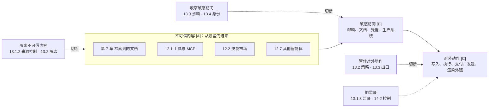

# 第十一章 智能体安全基础

从本章起进入智能体安全篇。智能体把模型接上工具、记忆和外部环境，让它能自主规划和行动，这是能力上的飞跃，也把安全问题从“模型会说什么”变成了“系统会做什么”。本篇用四章讨论这一问题：本章先把智能体的实现结构、威胁模型和一条贯穿全篇的主线讲清楚；第十二章逐一分析攻击者从哪些门进来；第十三章讲怎样划边界；第十四章用编码智能体、综合案例和一张全景图收束。

## 本篇的一条主线

本书从系统角度，把智能体安全的各种做法归纳为一个安全模型，称为**不可靠执行者模型**。从系统的角度看，智能体里有一个特殊的部件：模型。它是一个**不可靠的执行者**——会随机犯错（幻觉、错位），也可能被人操纵（注入、后门）。对系统来说，两种情况的后果是一样的：模型提出了一个错误的请求。幻觉像一个不挑目标的攻击者，碰巧删掉数据和被人诱导删掉数据没有区别；注入则像一个专挑最值钱、最危险的事去做的攻击者，失败了还会换个说法再试。

因此全篇只讲三件事：

1. **不信模型**：模型只提出请求，决定由模型之外的代码做出。对下游代码而言，模型的输出就是不可信的输入。
2. **盘点来源**：哪些东西能影响模型的判断——外部内容、工具与技能、记忆、其他智能体、模型本身、人。下面的总表逐一列出，并给出各自的防法。
3. **动作过闸**：会造成损失的动作，不管原因是幻觉还是攻击，一律过闸——参数只能用真实存在的值，做了收不回的操作先确认影响范围再放行，往外发的东西先检查，能撤销的留好撤销的路。14.5 的十二个步骤就是这些闸的位置。

闸要多硬，由 Meta 的 **Rule of Two** 判断（13.1）。它从智能体的能力出发，列了三项：

- **不可信内容**（[A]）：模型在任务中会读到外人写的内容——网页、邮件、文档、检索结果、工具返回、其他智能体的消息——攻击者借此操纵它。发起任务的用户本人说的话不算；
- **敏感访问**（[B]）：智能体能访问敏感数据或系统；
- **对外动作**（[C]）：智能体能改变状态或对外通信——写入、执行、删除、支付、发送，也包括渲染外部图片、访问链接这类不显眼的外发。

三项同时具备时，外人能借第一项操纵模型，借后两项造成损失：**不可信内容 → 敏感访问 → 对外动作**。这时闸必须是硬规则或人工确认，不能只靠模型“大概不会错”；缺任何一项，攻击链就走不通。防御因此有四种形态：**隔离不可信内容**（控制来源，或只交给无权限的隔离模型读）、**收窄敏感访问**（隔离与身份）、**管住对外动作**（出口与策略），三项都必须保留时则 **加监督**。没有攻击者时（只有幻觉），Rule of Two 不起作用，但第 3 件事的闸照样生效。

这个模型不是一项新技术，而是把输入校验、最小权限与委托、Rule of Two、CaMeL 的变量引用等已有做法放进同一个框架。它也可以看作零信任（8.2.6）向智能体的延伸：零信任不默认信任任何主体，管住了身份与凭据（14.5 的第 1、7 步）；但被注入的智能体拿着合法令牌、在用户权限之内做错事，零信任的每项检查都会通过。不可靠执行者模型连代表用户办事的模型也不信，并且追踪每个参数是被哪段内容影响的。

本篇四章就按这条线展开：第十一章建立结构与主线，第十二章讲不可信内容从哪些门进来，第十三章讲闸与四种防御怎样落地，第十四章用典型场景和一张全景图收束。想先看全貌的读者可以直接读 14.5。

图 11-1：智能体安全篇的主线——攻击链与四种防御

下表是第 2 件事的清单：哪些环节是不可信的来源，各自怎么防。它也是全篇的索引，后面每一节都落在其中某一行：

| 不可信的来源 | 从哪里进来 | 主要风险 | 确定性防御 | 主要章节 |
|--------------|------------|----------|------------|----------|
| 外部内容：网页、邮件、文档、检索结果、工具返回 | 工具结果、检索、上传文件 | 间接注入；知识库投毒 | 只交给无权限的隔离模型读，按锁定的契约抽取字段；来源标记；检索前按用户权限过滤 | 第七章、12.1、12.4 |
| 工具与技能：MCP Server、插件、技能包 | 工具描述进入上下文；代码在本机执行 | 描述投毒；恶意或仿冒的包；启动命令即代码执行；服务端发起的采样与征询 | 供应链准入、固定版本、描述变更比对后审批；本地 Server 进沙箱 | 12.1.8、12.2 |
| 记忆与会话历史 | 每一轮从会话与记忆中取上下文 | 一次注入被持久化；摘要把不可信内容洗成可信 | 写入门控；派生内容继承最低来源等级；可信配置只由用户写入 | 12.3 |
| 其他智能体 | 发来的消息、被调用后的返回 | 注入在智能体之间传染；冒充 | 入站门控（身份、去重、记日志）；正文按不可信内容抽取；各自独立身份 | 12.7 |
| 模型本身：权重、微调与它的每个输出 | 每一次调用 | 幻觉与错位（随机出错）；后门或被投毒的权重（被人操纵） | 输出只是请求，会造成损失的动作一律过闸：参数只用真实存在的值，策略按参数来源判定，确认绑定参数，不可逆操作先演练后执行；模型来源校验、签名与固定版本 | 11.1、11.5–11.8、12.1.5、13.1.5、6.2、8.6 |
| 人：用户与审批者 | 任务请求；对高风险动作的确认 | 面向公众时的直接注入与越狱；审批疲劳；被智能体的输出操纵 | 认证与任务级授权；确认展示参数与来源，控制确认数量 | 第四、五章、12.6 |

每一行的防御都不靠“识别出恶意内容”，而是限定这个来源出了问题之后最多能造成什么——这是 4.5.11 所说的确定性防御。检测与审核仍然有用，但只能降低频率。

## 本章内容

- **11.1 智能体的实现结构与调用过程**：上下文窗口里有什么、循环怎么跑、各家术语落在循环的哪个位置，以及由此推出的四条安全结论
- **11.2 智能体安全威胁模型**：按来源与目标划分的攻击面
- **11.3 致命三要素**：判断最坏情况的三个条件——不可信内容、敏感访问、对外动作
- **11.4 智能体控制流劫持**：攻击者让这条链走通的方式
- **11.5 过度自主权**：权限为什么会膨胀
- **11.6 幻觉驱动的工具调用**：没有攻击者也会出事
- **11.7 链上智能体的操作安全**：后果不可逆的极端场景
- **11.8 暗码：不可追溯的运行时行为**：为什么审查代码的老办法不够用
- **11.9 智能体安全设计原则**：最小权限与权限治理的总纲
- **11.10 智能体监控与审计**：要记什么、才能回答“哪段输入引起了哪个动作”

> **⚠️ 道德边界**：本篇对工具调用滥用、记忆投毒、多智能体信任链破坏的剖析，用于让智能体开发者识别并修复自身系统的安全弱点；针对未经授权的他方系统执行类似攻击违反法律与服务条款。完整声明见 [§4 章首道德边界与负责任披露说明](../04_prompt_injection/README.md)。

## 对照 OWASP 智能体安全威胁清单

OWASP GenAI 安全项目的 [Agentic AI – Threats and Mitigations](https://genai.owasp.org/resource/agentic-ai-threats-and-mitigations/) 提出了 17 项智能体威胁（T1–T17）。该清单 v1.0（2025-02）原本只有 T1–T15，v1.1（2025-12）新增 T16、T17 以与 Agentic Top 10 对齐——注意官方资源页的版本标注一度仍停留在 v1.0，以 PDF 封面与 ASI Top 10 2026 附录 A 的交叉引用为准。本篇（结合相关章节）对这些威胁均有覆盖，便于读者按该清单自查：

| OWASP 威胁 | 本书覆盖位置 |
|------------|--------------|
| T1 记忆投毒 | 12.3、12.7.3 |
| T2 工具滥用 | 12.1 |
| T3 权限提升 | 11.9、12.1.8、12.7.2、13.4.3 |
| T4 资源过载 | 3.1.7（LLM06）、11.2 |
| T5 级联幻觉 | 12.7.2、4.3.9 |
| T6 意图篡改与目标操纵 | 15.3.3、15.3.4、14.3 |
| T7 错位与欺骗行为 | 14.3、14.2、15.3.12 |
| T8 抵赖与不可追溯 | 11.8、11.10、13.1.5、13.4.3 |
| T9 身份伪造与冒充 | 12.7.4、13.4.4 |
| T10 淹没人工审核 | 12.6 |
| T11 意外远程代码执行 | 6.7、12.1.8、12.1.10、13.3、14.1 |
| T12 智能体通信投毒 | 12.7.2、12.7.3 |
| T13 失控智能体 | 12.7.5、14.2 |
| T14 针对多智能体系统的人为攻击 | 12.7.2、13.1.3 |
| T15 人类操纵 | 12.6 |
| T16 智能体间协议滥用 | 12.7.4、12.1.8 |
| T17 供应链攻陷 | 12.2.2、12.2.3、12.2.4、12.1.8、14.1.5 |

## 对照 OWASP Agentic Top 10（2026）

上表的 T1–T17 出自威胁清单；在此之上，OWASP GenAI Security Project 的智能体安全倡议（Agentic Security Initiative）于 **2025-12** 发布了 *OWASP Top 10 For Agentic Applications 2026*（Version 2026），用 `ASI01`–`ASI10` 给出智能体应用的十大风险。它**与 3.1 的 LLM Top 10（2026）并行存在、互不替代**：LLM Top 10 面向「模型驱动的应用」，ASI 清单面向「会规划、会行动、会跨系统调用的智能体」。LLM Top 10 的 2026 版把这条边界写得更明确——**模型作为应用里的一个组件时归 LLM 清单；模型变成能调用工具、跨会话携带记忆、在下游引发后果的行动者时归 ASI 清单**。编号与英文名取自官方 PDF，由 [`data/framework_crosswalk.json`](../data/framework_crosswalk.json) 统一机器校验（见附录 C-94）。

| 官方标识符与英文名 | 中文表述 | 本书覆盖位置 |
|--------------------|----------|--------------|
| ASI01 Agent Goal Hijack | 智能体目标劫持 | 11.4、13.1、13.2、4.3、4.1 |
| ASI02 Tool Misuse and Exploitation | 工具滥用与利用 | 12.1、11.6 |
| ASI03 Identity and Privilege Abuse | 身份与权限滥用 | 13.4、11.9、12.1.8、8.3.4、8.3.6 |
| ASI04 Agentic Supply Chain Vulnerabilities | 智能体供应链漏洞 | 12.2、12.1.8、14.1.4、14.1.5、8.6.5、6.7 |
| ASI05 Unexpected Code Execution (RCE) | 意外代码执行（RCE） | 13.3、14.1、6.7、12.1.10 |
| ASI06 Memory & Context Poisoning | 记忆与上下文投毒 | 12.3、7.2、12.7.3、4.6 |
| ASI07 Insecure Inter-Agent Communication | 智能体间通信不安全 | 12.7.3、12.7.4、12.7.2 |
| ASI08 Cascading Failures | 级联失效 | 12.7.5、12.7.2、4.3.9、10.5 |
| ASI09 Human-Agent Trust Exploitation | 人机信任利用 | 12.6 |
| ASI10 Rogue Agents | 失控智能体 | 12.7.5、14.3、14.2 |

> 两份清单的侧重点不同，不必二选一：T 清单更细、便于逐条自查；ASI 清单更聚合、便于向管理层陈述风险优先级。官方文档本身也给出了 ASI 与 T 编号的对照。
