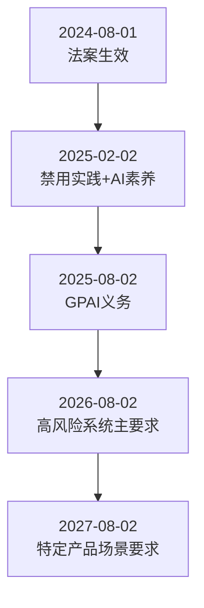
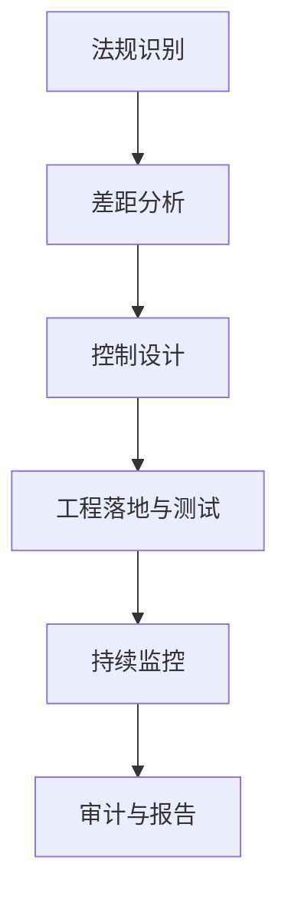

## 11.1 AI 法规与合规要求

全球 AI 监管已进入“持续更新”阶段。组织不能只看“是否有法”，而要按时间线管理义务生效节点。

### 11.1.1 全球监管概览

| 地区 | 代表框架/法规 | 截至 2026 年 2 月状态 | 对 LLM 组织的含义 |
|------|----------------|-----------------------|-------------------|
| 欧盟 | EU AI Act | 已分阶段生效 | 需要按生效批次落地控制 |
| 美国 | 联邦政策 + 州级立法 + 行业监管 | 动态变化 | 需要“联邦+州+行业”并行合规 |
| 中国 | 生成式 AI 服务管理相关规则 | 已实施 | 强调内容安全、备案与数据合规 |
| 国际标准 | NIST AI RMF、ISO/IEC 42001 等 | 持续演进 | 作为跨法域治理底座 |

> 注：监管变化快，建议建立“法规雷达机制”，至少每月复核一次权威来源（附录 C-3、C-36、C-37）。

### 11.1.2 EU AI Act：关键时间线（绝对日期）

欧盟 AI 法案（Regulation (EU) 2024/1689）已于 **2024-08-01** 生效，但义务按阶段落地：

| 日期 | 关键里程碑 | 组织动作建议 |
|------|------------|--------------|
| 2025-02-02 | 禁止类 AI 实践开始适用；AI 素养相关要求开始生效 | 完成“禁止场景”排查与培训 |
| 2025-08-02 | GPAI（通用 AI）相关义务开始适用（按法案规定分层） | 完成模型文档、评估与披露机制 |
| 2026-08-02 | 大部分高风险系统要求开始适用（含 Annex III 类） | 建立全套风险管理与技术文档链路 |
| 2027-08-02 | 部分嵌入受监管产品的高风险系统要求进一步落地 | 补齐行业产品耦合场景控制 |

图 11-1：EU AI Act 分阶段生效时间线

### 11.1.3 美国与中国：合规实践要点

**美国（实践视角）**：
- 联邦政策与机构规则会变动，需持续跟踪白宫与联邦公报更新。
- 州级 AI/隐私法律差异大，跨州业务需按最严格要求收敛。
- 在医疗、金融、教育等行业，还要叠加行业监管规则。

**中国（实践视角）**：
- 面向公众提供生成式 AI 服务时，需要关注备案、内容安全、数据治理与用户权益保护等要求。
- 企业内部 LLM 平台也应将“内容安全+数据合法性+审计留痕”作为基础控制。

### 11.1.4 标准与合规实施

**推荐的控制底座**：
- **ISO/IEC 42001**：建立组织级 AI 管理体系，形成可审计治理流程。
- **NIST AI RMF + GenAI Profile（AI 600-1）**：把“治理-映射-测量-管理”映射到生成式 AI 风险场景。

图 11-2：AI 合规实施闭环流程图

**关键步骤**：
1. 识别适用司法辖区和行业规则。  
2. 建立法规条款到控制项的映射矩阵。  
3. 将控制项转为工程门禁（测试、发布、运营）。  
4. 保留可审计证据（日志、评估报告、变更记录）。  
5. 定期复核法规更新并回灌到控制体系。

### 11.1.5 合规挑战

| 挑战 | 常见表现 | 应对策略 |
|------|----------|----------|
| 生效节奏错配 | 业务上线快于合规落地 | 使用法规时间线驱动项目排期 |
| 跨境差异 | 同一功能在不同法域要求不同 | 建立“最严法域优先”基线 |
| 证据不足 | 做了控制但无法审计证明 | 默认留痕、模板化证据采集 |
| 组织协同弱 | 法务/安全/产品分散 | 设立跨职能 AI 治理委员会 |

理解法规是起点，把法规转成“可执行、可验证、可持续”的工程控制，才是合规落地的核心。
